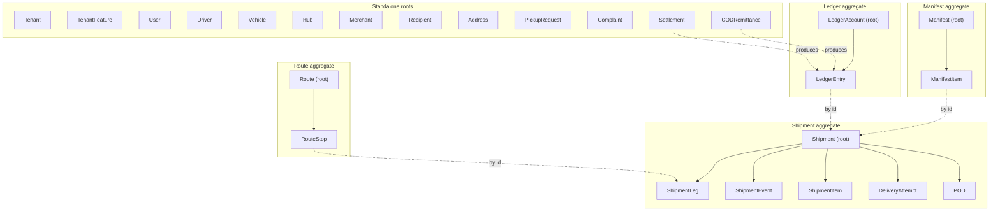
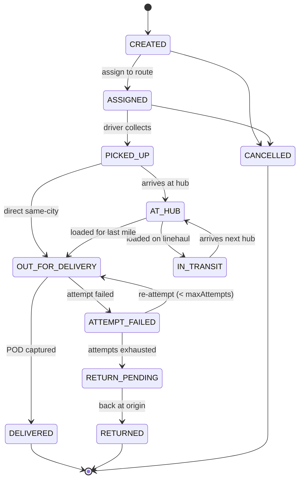
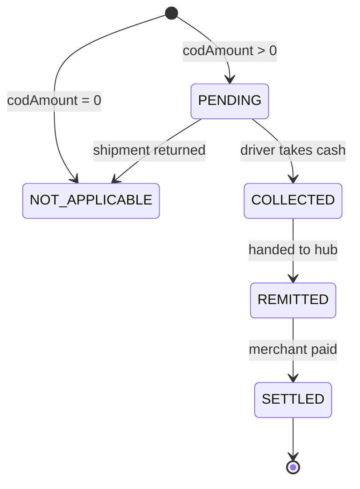

# Domain Model

> The frozen definition of every core entity. **Entities must be stable before the database schema, API contracts, or NestJS modules are written** — everything downstream derives from this document.
> Depends on: [01-mvp-scope.md](./01-mvp-scope.md) · Feeds: [03-event-storming.md](./03-event-storming.md), 04-context-map, 05-api-contracts, [06-database-design.md](./06-database-design.md)
> **Status:** DRAFT — awaiting approval.
> **Date:** 2026-07-22

---

## 1. Conventions

| Convention | Rule |
|---|---|
| Naming | Domain/application layer uses `camelCase`; the database uses `snake_case`. `trackingNumber` ↔ `tracking_number` |
| Identifiers | All `id` fields are **UUIDv7** (time-ordered, safe to expose, non-enumerable) |
| Money | Always a pair: `amountMinor` (integer) + `currency` (ISO 4217). **Minor-unit scale is read from the `Currency` table — TND is 3 decimals, never assume 2** |
| Time | All timestamps are UTC `TIMESTAMPTZ`. Fields ending `At` are instants |
| Tenancy | Every entity except `Tenant` and `Currency` carries `tenantId` and is subject to Row-Level Security |
| Soft delete | Operational entities are **deactivated, never deleted**. Financial and custody entities are **immutable** |
| Optionality | `?` marks a nullable field |

### 1.1 Ubiquitous language

Terms are fixed here and used identically in code, API, UI, and conversation. Where the team works in French or Arabic, the **English term is canonical in code**; translations are UI-layer only.

#### The party hierarchy — three distinct levels, never collapsed

```
Tenant        "Fast Delivery"      the courier company operating on the platform
  └─ Merchant     "Restaurant ABC"     a business that sends shipments through that courier
       └─ Recipient   "Ahmed"              the person who receives the parcel
```

**These are three different concepts and must never share a name, a table, or a variable.** The most common naming disaster in logistics software is calling all three "customer", which then means whatever the reader assumes it means.

| Term | Meaning | Never call it |
|---|---|---|
| **Tenant** | The courier company using the platform. Owns all data. In dedicated-deployment mode there is exactly one | "client", "company", "org", "customer" |
| **Merchant** | A business that ships *through* a Tenant. Has a `MERCHANT_PAYABLE` ledger account and receives settlements | "customer", "client", "sender", "vendor" |
| **Recipient** | The person receiving the parcel. Pays COD. Sees the tracking page. **Has no account** | "customer", "client", "consignee" (in code) |
| **Sender** | The pickup party for a shipment. **Usually the Merchant, but not always** — a Tenant may create shipments with no Merchant at all | Merchant (they coincide often, which is exactly why they must stay separate fields) |
| **User** | A human with web login *inside* a Tenant — dispatcher, hub operator, finance, owner | Driver, Merchant |
| **Driver** | A field courier. Authenticates by phone+OTP, no web access. **Not a `User`** ([§3.2](#32-user)) | User, employee |
| **Carrier** | A third-party delivery company a Tenant sub-contracts to. **V3 only** — modelled now so it is not retrofitted | Tenant, Merchant |

**The word "customer" is banned in code, schema, and API field names.** It is permitted only in user-facing UI copy, where the surrounding screen makes the referent obvious. Enforced by an ESLint/Semgrep rule on identifiers.

**Consequence for the client book:** the entity storing a Merchant's repeat addressees is **`Recipient`**, not `Customer`. A `Recipient` belongs to a `(tenantId, merchantId)` pair — the same physical person shipping from two different merchants is two `Recipient` rows, because merchants must not see each other's address books.

#### Operational terms

| Term | Meaning | Not to be confused with |
|---|---|---|
| **Shipment** | One parcel/consignment moving from a Sender to a Recipient. The unit that is tracked | Order (a Merchant's commercial record — outside our system) |
| **Leg** | One physical movement segment of a shipment (pickup, linehaul, last-mile) | Route (a driver's whole day) |
| **Route** | An ordered sequence of stops assigned to one driver + vehicle for one working period | Leg |
| **Stop** | One physical location visit within a route. May serve several shipments | Leg |
| **Attempt** | One try at completing a delivery. A shipment may have several | Event |
| **Event** | An immutable recorded fact in a shipment's custody chain | Status (a projection of events) |
| **Manifest** | A sealed set of shipments transferred together between two custody holders | Route |
| **Hub** | A facility where shipments are sorted or transferred | Warehouse (inventory — out of scope) |
| **POD** | Proof of Delivery — the evidence a shipment was handed over | Delivery event |
| **COD** | Cash on Delivery — cash the driver collects from the recipient | Shipment price |
| **Remittance** | A driver handing collected cash to a hub | Settlement |
| **Settlement** | The courier paying a merchant the COD it collected on their behalf | Remittance |
| **Custody** | Who is physically responsible for a shipment right now | Ownership |

---

## 2. Aggregate Map

Aggregates define **transactional boundaries**. Entities inside one aggregate are written in a single transaction and are always consistent. References *across* aggregates are by ID only, and consistency between them is eventual, achieved via events.



**The rule that matters:** a `RouteStop` references a `ShipmentLeg` **by ID, not by object**. Sequencing a route does not lock shipment rows, and a shipment's lifecycle does not lock the dispatcher's board. Violating this creates the lock contention that makes dispatch boards slow.

**Deliberate exception:** `POD` is inside the Shipment aggregate rather than standalone, because a POD without its shipment is meaningless and the two must be written atomically at the moment of delivery.

---

## 3. Entity Catalog

### 3.1 Tenant

**Purpose.** A courier company using the platform. The root of all isolation — every other record belongs to exactly one Tenant.

**Fields**

| Field | Type | Notes |
|---|---|---|
| `id` | UUID | |
| `name` | string | Legal company name |
| `slug` | string | URL-safe, globally unique, immutable |
| `status` | enum | `PROVISIONING` · `ACTIVE` · `SUSPENDED` · `CLOSED` |
| `countryCode` | string(2) | ISO 3166-1 alpha-2, e.g. `TN` |
| `defaultCurrency` | string(3) | ISO 4217, e.g. `TND` |
| `defaultTimezone` | string | IANA, e.g. `Africa/Tunis` |
| `defaultLocale` | enum | `ar` · `fr` · `en` |
| `supportedLocales` | enum[] | |
| `weekendDays` | int[] | ISO weekday numbers. Tunisia may use `[6,7]` or `[5,6]` |
| `plan` | enum | `PILOT` · `STANDARD` (billing deferred to V2) |
| `settingsJson` | jsonb | Working hours, SLA templates, failure-reason taxonomy, notification prefs |
| `region` | string | Data-residency region. Drives which data plane serves this tenant |
| `createdAt` / `updatedAt` | timestamptz | |

**Relationships.** Has many: `User`, `Driver`, `Vehicle`, `Hub`, `Merchant`, `Shipment`, `Route`, `LedgerAccount`. Owns everything.

**Business rules**

1. `slug` is globally unique and **immutable after creation** — it appears in tracking URLs.
2. **`defaultCurrency` is immutable once any `LedgerEntry` exists** for this tenant. Changing the currency of a ledger with existing balances is not a currency change; it is data corruption.
3. `SUSPENDED` tenants: reads allowed, all writes rejected with `TENANT_SUSPENDED`. Driver sessions invalidated. Tracking pages disabled.
4. A tenant is never hard-deleted. `CLOSED` triggers the offboarding flow (export → grace period → cryptographic erasure of PII → retain legally-required financial records anonymised).
5. Every query in the system executes with `app.currentTenantId` set. There is no such thing as a cross-tenant query outside Platform Admin tooling, which is separately audited.

**Lifecycle**

```
PROVISIONING → ACTIVE ⇄ SUSPENDED → CLOSED
```
`PROVISIONING` completes when default roles, permissions, failure-reason taxonomy, ledger accounts, and the owner user have all been seeded. It is idempotent and retryable.

---

### 3.2 User

**Purpose.** A human who logs into the web applications. **Drivers are not Users** — see the note below.

**Fields**

| Field | Type | Notes |
|---|---|---|
| `id` | UUID | |
| `tenantId` | UUID | |
| `email` | string | |
| `phone?` | string | E.164 |
| `passwordHash` | string | Argon2id |
| `fullName` | string | |
| `locale` | enum | `ar` · `fr` · `en` |
| `status` | enum | `INVITED` · `ACTIVE` · `DISABLED` |
| `mfaEnabled` | bool | |
| `mfaSecret?` | string | Encrypted at rest |
| `lastLoginAt?` | timestamptz | |
| `failedLoginCount` | int | Lockout counter |
| `lockedUntil?` | timestamptz | |
| `hubScope?` | UUID[] | Restricts a Dispatcher or Hub Operator to specific hubs |
| `merchantId?` | UUID | **Set only for the `MERCHANT` role.** Scopes the user to one merchant's data *within* the tenant (added 2026-07-29) |

**Relationships.** Belongs to `Tenant`. Has many `UserRole` → `Role`. May be linked 1:1 to a `Driver` record if a person is both. May be linked to one `Merchant` when the user is a merchant portal login.

**Business rules**

1. **`email` is unique *per tenant*, not globally.** The same person may work for two courier companies on the platform. Global uniqueness is a common and painful mistake in multi-tenant systems.
2. MFA is **mandatory** for users holding the `OWNER` or `FINANCE` role. Enforced at login, not merely offered.
3. A user with the `OWNER` role cannot be disabled if they are the last active owner of the tenant.
4. Users are disabled, never deleted — `audit_log` and `shipment_event` reference them as actors forever.
5. Role changes are always audited with before/after.
6. Password reset tokens are single-use, expire in 30 minutes, and invalidate all sessions on use.
7. **`merchantId` is required for a `MERCHANT` user and forbidden for every other role** (added 2026-07-29). A merchant login with no merchant would see the whole tenant; a dispatcher carrying one would be silently narrowed. Both are enforced by a DB constraint, not by application discipline — this is the only sub-tenant scope in the system and the one place where a missing `WHERE` clause leaks one merchant's volume, customers, and revenue to a competitor sharing the tenant.
8. **Merchant users are provisioned by the courier company, never self-registered** (2026-07-29). There is a commercial relationship before there is a login; public signup is deferred (01-mvp-scope §5).

**Lifecycle.** `INVITED → ACTIVE ⇄ DISABLED`

> **Why Driver is a separate entity.** A driver authenticates by phone + OTP on Android, has no web access, and carries an entirely different data shape (shifts, vehicle, cash balance, location). Modelling both as one `User` produces a table half of whose columns are always null and a permission model with two incompatible shapes. They are related but distinct.

---

### 3.3 Driver

**Purpose.** A field courier who executes routes, captures proof of delivery, and holds custody of both parcels and cash.

**Fields**

| Field | Type | Notes |
|---|---|---|
| `id` | UUID | |
| `tenantId` | UUID | |
| `userId?` | UUID | Set only if the driver also has web access |
| `employeeCode` | string | Unique per tenant |
| `fullName` | string | |
| `phone` | string | E.164. **Primary auth identity** |
| `nationalId?` | string | **Encrypted.** Commonly required in MENA courier operations |
| `licenceNumber?` | string | Encrypted |
| `licenceExpiryAt?` | date | |
| `status` | enum | `PENDING` · `ACTIVE` · `INACTIVE` · `SUSPENDED` |
| `employmentType` | enum | `EMPLOYEE` · `CONTRACTOR` |
| `homeHubId?` | UUID | Default start/end location |
| `defaultVehicleId?` | UUID | |
| `skills` | string[] | e.g. `REFRIGERATED`, `HEAVY_LIFT`, `HAZMAT` |
| `cashAccountId` | UUID | FK → `LedgerAccount` of type `DRIVER_CASH`. **Created with the driver** |
| `locale` | enum | |
| `deviceId?` | string | Bound device for refresh-token security |
| `appVersion?` | string | Support and rollout diagnostics |

**Relationships.** Belongs to `Tenant`, optionally to `Hub` (home) and `User`. Has many `Shift`, `Route`, `ShipmentEvent` (as actor), `CODRemittance`. Has exactly one `LedgerAccount` (cash).

**Business rules**

1. **A driver has exactly one `DRIVER_CASH` LedgerAccount, created atomically with the driver record.** A driver who can collect cash without an account is an unrecordable liability.
2. **At most one `OPEN` Shift at any time.** Starting a shift while one is open is rejected.
3. **A driver cannot be set `INACTIVE` while holding a non-zero cash balance or having active route stops.** You do not offboard someone still holding company money and parcels.
4. Location is recorded **only during an `OPEN` shift** — enforced in the app *and* rejected server-side. This is the platform's central privacy control.
5. Drivers are deactivated, never deleted.
6. `phone` is unique per tenant and is the authentication identity; changing it requires re-verification.
7. `SUSPENDED` blocks login and new assignments but preserves all history and cash balance.

**Lifecycle.** `PENDING → ACTIVE ⇄ SUSPENDED → INACTIVE`

---

### 3.4 Hub

**Purpose.** A physical facility where shipments are received, sorted, transferred between routes, and where drivers remit cash.

**Fields**

| Field | Type | Notes |
|---|---|---|
| `id` | UUID | |
| `tenantId` | UUID | |
| `code` | string | Short operational code, unique per tenant, e.g. `TUN-01` |
| `name` | string | |
| `type` | enum | `SORTING_CENTER` · `DISTRIBUTION_CENTER` · `PICKUP_POINT` |
| `addressId` | UUID | |
| `location` | geography(Point) | Denormalised for proximity queries |
| `timezone` | string | IANA. **Required** — SLA and cut-off times are local |
| `parentHubId?` | UUID | Network hierarchy (spoke → regional hub) |
| `serviceZoneIds` | UUID[] | Zones this hub delivers to |
| `cutoffTimes` | jsonb | Per-destination linehaul departure cut-offs |
| `cashAccountId` | UUID | FK → `LedgerAccount` of type `HUB_CASH` |
| `status` | enum | `ACTIVE` · `INACTIVE` |

**Relationships.** Belongs to `Tenant`. Has many `Manifest` (outbound/inbound), `Route` (originating), `Driver` (home hub). Has one `LedgerAccount`. References `Address`.

**Business rules**

1. Every hub has exactly one `HUB_CASH` LedgerAccount, created with it.
2. **`timezone` is mandatory.** A Tunisian hub and a future Gulf hub operate in different local days; cut-offs and SLA windows are meaningless without it.
3. A hub cannot be deactivated while it holds shipments in custody, has open manifests, or has a non-zero cash balance.
4. `parentHubId` must not form a cycle.
5. Deactivating a hub does not reassign in-flight shipments — those must be resolved operationally first.

**Lifecycle.** `ACTIVE ⇄ INACTIVE`

---

### 3.5 Vehicle

**Purpose.** A physical transport asset with capacity constraints that bound what a route may carry.

**Fields**

| Field | Type | Notes |
|---|---|---|
| `id` | UUID | |
| `tenantId` | UUID | |
| `plateNumber` | string | Unique per tenant |
| `type` | enum | `MOTORCYCLE` · `CAR` · `VAN` · `TRUCK` |
| `make?` / `model?` / `year?` | string / int | |
| `capacityWeightGrams` | int | |
| `capacityVolumeCm3` | int | |
| `capacityParcels` | int | Often the **real** binding constraint for last-mile |
| `features` | string[] | `REFRIGERATED`, `TAIL_LIFT` |
| `homeHubId?` | UUID | |
| `status` | enum | `ACTIVE` · `MAINTENANCE` · `INACTIVE` |
| `insuranceExpiryAt?` / `inspectionExpiryAt?` | date | Alerting only at MVP; full maintenance module is V3 |

**Relationships.** Belongs to `Tenant`, optionally `Hub`. Has many `Route`. Referenced by `Shift`.

**Business rules**

1. **A vehicle may be assigned to at most one `OPEN` shift at a time.** Two drivers cannot drive one van.
2. A route's planned load must not exceed vehicle capacity on **any** dimension. Weight, volume, and parcel count are checked independently — parcel count is usually what actually binds.
3. `MAINTENANCE` or `INACTIVE` vehicles cannot be assigned to new routes; existing in-progress routes continue.
4. `plateNumber` is unique per tenant and immutable after first use in a completed route (it appears in delivery records).

**Lifecycle.** `ACTIVE ⇄ MAINTENANCE ⇄ INACTIVE`

---

### 3.6 Shipment

**Purpose.** The central entity — one parcel moving from sender to recipient. Everything else exists to move, track, prove, or bill this.

**Fields**

| Field | Type | Notes |
|---|---|---|
| `id` | UUID | |
| `tenantId` | UUID | |
| `trackingNumber` | string | Human-facing. **Unique per tenant**, generated, non-sequential |
| `merchantId?` | UUID | Null for tenant-originated shipments |
| `externalReference?` | string | The merchant's own order ID. Unique per `(tenant, merchant)` |
| `status` | enum | **Projection of `ShipmentEvent` — never written directly.** See §5.1 |
| `serviceLevel` | enum | `EXPRESS` · `STANDARD` · `SCHEDULED` |
| `senderName` | string | |
| `senderPhone` | string | E.164 |
| `originAddressId` | UUID | |
| `recipientName` | string | |
| **`recipientPhone`** | string | **E.164. MANDATORY — see rules** |
| `recipientPhoneAlt?` | string | Second number. Common and useful in MENA |
| `destinationAddressId` | UUID | |
| `promisedFrom?` / `promisedTo?` | timestamptz | The customer promise. SLA measured against these |
| `etaAt?` | timestamptz | Current estimate (OSRM-derived at MVP) |
| `weightGrams` | int | |
| `volumeCm3?` | int | |
| `parcelCount` | int | Default 1 |
| `declaredValueMinor?` / `currency` | bigint / string(3) | |
| **`codAmountMinor`** | bigint | `0` when not COD. **Never a boolean** |
| `codStatus` | enum | `NOT_APPLICABLE` · `PENDING` · `COLLECTED` · `REMITTED` · `SETTLED` |
| `attemptCount` | int | Denormalised for dispatcher filtering |
| `maxAttempts` | int | Per-tenant default, e.g. 3 |
| `priority` | int | Solver input |
| `requiredSkills` | string[] | |
| `currentCustodyType?` | enum | `MERCHANT` · `DRIVER` · `HUB` |
| `currentCustodyId?` | UUID | Who physically holds it right now |
| `customFields` | jsonb | Per-tenant extensions |
| `createdAt` / `updatedAt` | timestamptz | |

**Relationships**

- Belongs to `Tenant`, optionally `Merchant`
- References `Address` (origin, destination)
- **Has many `ShipmentEvent`** (the custody log)
- **Has one-or-more `ShipmentLeg`**
- Has many `ShipmentItem`, `DeliveryAttempt`
- Has zero-or-one `POD`
- Has many `LedgerEntry` (COD movements)
- Reached *through legs* by `RouteStop` — a shipment does **not** belong directly to a Route

**Business rules**

1. **`status` is a projection of `ShipmentEvent`.** No code path writes `status` without appending the corresponding event in the same transaction.
2. **Illegal transitions are rejected**, including the canonical case: `DELIVERED → IN_TRANSIT`. Full matrix in §5.1.
3. **A shipment is never deleted.** It may be `CANCELLED`, which is itself an event. Physical custody history is a legal record.
4. **`recipientPhone` is mandatory and E.164-validated.** In Tunisia and the wider MENA region, the phone is the real addressing mechanism — drivers call before arrival as standard procedure. A shipment without a reachable phone is undeliverable in practice.
5. **`codAmountMinor` is immutable once `status` has passed `PICKED_UP`.** Changing the amount owed after the courier takes custody is a fraud vector.
6. `codAmountMinor > 0` requires `codStatus != NOT_APPLICABLE`, and vice versa. Enforced as a check constraint.
7. A shipment cannot be marked `DELIVERED` without an associated `POD`.
8. A COD shipment cannot be marked `DELIVERED` without a corresponding `CODCollected` event **in the same transaction**.
9. `attemptCount >= maxAttempts` blocks further attempts; the shipment must go to `RETURN_PENDING`.
10. `trackingNumber` is generated (not sequential), unique per tenant, and immutable.
11. Terminal states (`DELIVERED`, `RETURNED`, `CANCELLED`) accept no further lifecycle events — only annotations such as a dispute note.
12. A shipment must have **at least one `ShipmentLeg`** at creation, even for a single-hop same-city delivery.

**Lifecycle.** See the state machine in §5.1.

---

### 3.7 ShipmentLeg

**Purpose.** One physical movement segment. Separating leg from shipment is what makes hub-and-spoke networks work without a schema rewrite (Q2).

**Fields**

| Field | Type | Notes |
|---|---|---|
| `id` | UUID | |
| `tenantId` / `shipmentId` | UUID | |
| `legNumber` | int | 1..n, contiguous |
| `type` | enum | `PICKUP` · `LINEHAUL` · `HUB_TRANSFER` · `LAST_MILE` · `RETURN` |
| `status` | enum | `PLANNED` · `ASSIGNED` · `IN_PROGRESS` · `COMPLETED` · `FAILED` · `CANCELLED` |
| `fromType` / `toType` | enum | `ADDRESS` · `HUB` |
| `fromAddressId?` / `toAddressId?` | UUID | |
| `fromHubId?` / `toHubId?` | UUID | |
| `routeStopId?` | UUID | Set when planned into a route |
| `manifestId?` | UUID | Set when moved under a manifest |
| `plannedStartAt?` / `plannedEndAt?` | timestamptz | |
| `actualStartAt?` / `actualEndAt?` | timestamptz | **Plan-vs-actual — required for SLA reporting** |

**Relationships.** Belongs to `Shipment`. References `Hub`/`Address` at each end. Optionally belongs to one `RouteStop` and one `Manifest`.

**Business rules**

1. Leg numbers are contiguous from 1; no gaps.
2. **Leg *n*'s destination must equal leg *n+1*'s origin.** A shipment cannot teleport between legs. Enforced on write.
3. A leg cannot start before the previous leg completes.
4. Exactly one of `fromAddressId`/`fromHubId` is set (and likewise for `to`), matching `fromType`/`toType`.
5. Completing the final leg is what makes the shipment eligible for `DELIVERED`.
6. A `FAILED` last-mile leg spawns either a re-attempt leg or a `RETURN` leg — never leaves the shipment legless.
7. **MVP simplification:** most shipments have 1–2 legs. The model supports *n* and requires no change to support it.

**Lifecycle.** `PLANNED → ASSIGNED → IN_PROGRESS → COMPLETED | FAILED`, or `CANCELLED` from any non-terminal state.

---

### 3.8 ShipmentEvent

**Purpose.** The immutable custody ledger. **The most important table in the system.** Shipment status, SLA measurement, dispute resolution, and audit all derive from it.

**Fields**

| Field | Type | Notes |
|---|---|---|
| `id` | UUID | |
| `tenantId` / `shipmentId` | UUID | |
| `sequence` | bigint | Monotonic per shipment. Resolves same-timestamp ordering |
| `type` | enum | See [03-event-storming.md](./03-event-storming.md) |
| **`occurredAt`** | timestamptz | **When it physically happened** (device time) |
| **`recordedAt`** | timestamptz | **When the server received it.** Differs by hours for offline capture |
| `actorType` | enum | `DRIVER` · `DISPATCHER` · `HUB_OPERATOR` · `SYSTEM` · `API_CLIENT` |
| `actorId?` | UUID | |
| `location?` | geography(Point) | Where the scan physically occurred |
| `locationAccuracyM?` | float | |
| `hubId?` / `driverId?` / `routeId?` / `legId?` | UUID | Context |
| `reasonCode?` | string | Per-tenant taxonomy, for failures |
| `idempotencyKey` | string | Client-generated. **Unique per `(tenantId, idempotencyKey)`** |
| `metadata` | jsonb | Device model, app version, barcode payload, mock-location flag |

**Relationships.** Belongs to `Shipment`. References `Driver`, `Hub`, `Route`, `ShipmentLeg` as context.

**Business rules**

1. **Append-only. No `UPDATE`, no `DELETE`** — enforced by revoking those grants from the application database role, not by convention.
2. **Corrections are new compensating events**, never edits. An incorrectly recorded delivery is followed by a correction event with a reason, preserving both.
3. `sequence` is unique per shipment and strictly increasing.
4. `idempotencyKey` makes offline retries safe. A duplicate submission returns the original result and creates nothing.
5. **`occurredAt` may be far earlier than `recordedAt`** and this is normal, not an error. SLA is measured on `occurredAt`; sync-health diagnostics use the gap.
6. Events arriving for a terminal shipment are rejected into an **exception queue for dispatcher review** — never silently dropped, never blindly applied.
7. Every event that changes custody must set `location` when produced by a driver device.
8. Writing a `ShipmentEvent` and updating the shipment's `status` projection happen in **one transaction**, together with the `outbox` insert.

**Lifecycle.** None — events are facts and do not change state.

---

### 3.9 Route

**Purpose.** One driver's planned work for one period: an ordered sequence of stops in one vehicle.

**Fields**

| Field | Type | Notes |
|---|---|---|
| `id` | UUID | |
| `tenantId` | UUID | |
| `code` | string | Human-readable, unique per tenant per day |
| `driverId?` | UUID | Null while in `DRAFT` |
| `vehicleId?` | UUID | |
| `startHubId?` / `endHubId?` | UUID | |
| `plannedDate` | date | |
| `status` | enum | `DRAFT` · `OPTIMIZING` · `PUBLISHED` · `IN_PROGRESS` · `COMPLETED` · `CANCELLED` |
| `plannedStartAt?` / `plannedEndAt?` | timestamptz | |
| `actualStartAt?` / `actualEndAt?` | timestamptz | |
| `plannedDistanceM?` / `plannedDurationS?` | int | **Metres and seconds. Never mixed units** |
| `actualDistanceM?` / `actualDurationS?` | int | |
| `stopCount` | int | Denormalised |
| `polyline?` | geography(LineString) | Planned path for map rendering |
| `optimizationJobId?` | UUID | Traceability to the solver run |
| `publishedAt?` | timestamptz | When the driver was notified |

**Relationships.** Belongs to `Tenant`, `Driver`, `Vehicle`, `Hub`. Has many ordered `RouteStop`.

**Business rules**

1. **A route cannot be `PUBLISHED` without a driver and a vehicle.** Publishing is what makes it visible to the driver app.
2. A driver may have **at most one `IN_PROGRESS` route** at a time.
3. Total planned load must not exceed vehicle capacity on any dimension.
4. **Stops already communicated to the driver are `locked`.** Re-optimization may reorder only the unlocked tail. A driver whose sequence reshuffles constantly stops trusting it and ignores it entirely.
5. A route cannot be deleted after `IN_PROGRESS`; it is `CANCELLED`, and its incomplete stops return to the unassigned pool.
6. `COMPLETED` requires every stop to be in a terminal state (`COMPLETED`, `FAILED`, or `SKIPPED`).
7. Route completion does **not** imply shipment delivery — a failed stop completes the route but not the shipment.
8. Optimization has a hard timeout; on expiry a deterministic nearest-neighbour + 2-opt fallback produces the sequence. **A dispatcher never sees an indefinite spinner.**

**Lifecycle**

```
DRAFT → OPTIMIZING → DRAFT (result applied)
DRAFT → PUBLISHED → IN_PROGRESS → COMPLETED
   any non-terminal → CANCELLED
```

---

### 3.10 RouteStop

**Purpose.** One physical location visit in a route. **A single stop may serve several shipment legs** — three parcels to the same building is one stop, not three.

**Fields**

| Field | Type | Notes |
|---|---|---|
| `id` | UUID | |
| `tenantId` / `routeId` | UUID | |
| `sequence` | int | Order within the route |
| `type` | enum | `PICKUP` · `DELIVERY` · `HUB_LOAD` · `HUB_UNLOAD` · `BREAK` |
| `addressId?` / `hubId?` | UUID | One or the other |
| `location` | geography(Point) | Denormalised for map rendering |
| `status` | enum | `PENDING` · `ARRIVED` · `COMPLETED` · `FAILED` · `SKIPPED` |
| `locked` | bool | Protects from re-optimization |
| `plannedArrivalAt?` / `plannedDepartureAt?` | timestamptz | |
| `actualArrivalAt?` / `actualDepartureAt?` | timestamptz | From geofence transitions or manual confirm |
| `serviceDurationS` | int | Estimated dwell time |
| `legIds` | UUID[] | The shipment legs served here |
| `timeWindowFrom?` / `timeWindowTo?` | timestamptz | Constraint for the solver |

**Relationships.** Belongs to `Route`. References many `ShipmentLeg` **by ID**. References `Address` or `Hub`.

**Business rules**

1. `sequence` is unique and contiguous within a route.
2. A stop must serve at least one leg, except `BREAK`.
3. `ARRIVED` is set by geofence entry or driver confirmation; `actualArrivalAt` is never inferred from the plan.
4. A stop cannot be `COMPLETED` while any of its legs is unresolved.
5. `locked` stops cannot be resequenced. Locking is automatic once the route is `PUBLISHED` and the driver has begun.
6. `SKIPPED` requires a reason and raises a dispatcher exception.
7. **Service duration** is estimated from the historical median for that address, falling back to address type, falling back to the tenant default. This is a SQL query, not a model.

**Lifecycle.** `PENDING → ARRIVED → COMPLETED | FAILED`, or `SKIPPED`.

---

### 3.11 Manifest

**Purpose.** A sealed set of shipments transferred together between custody holders — hub→hub linehaul, hub→driver dispatch, driver→hub return. **The custody handover record.**

**Fields**

| Field | Type | Notes |
|---|---|---|
| `id` | UUID | |
| `tenantId` | UUID | |
| `code` | string | Scannable, unique per tenant |
| `type` | enum | `LINEHAUL` · `DISPATCH` · `RETURN` · `TRANSFER` |
| `status` | enum | `OPEN` · `SEALED` · `IN_TRANSIT` · `RECEIVED` · `RECONCILED` |
| `fromHubId?` / `toHubId?` | UUID | |
| `fromDriverId?` / `toDriverId?` | UUID | |
| `vehicleId?` | UUID | |
| `itemCount` | int | |
| `sealedAt?` / `sealedBy?` | timestamptz / UUID | |
| `dispatchedAt?` / `receivedAt?` / `receivedBy?` | timestamptz / UUID | |
| `discrepancyCount` | int | Items expected but not scanned on receipt, or vice versa |

**Relationships.** Belongs to `Tenant`, references two `Hub`s and/or `Driver`s. Has many `ManifestItem` → `ShipmentLeg`.

**Business rules**

1. **Contents are immutable once `SEALED`.** Adding a parcel to a sealed manifest breaks the custody chain — a new manifest is created instead.
2. Sealing requires at least one item.
3. **Receipt is a physical scan operation**, not a bulk confirm button. Each item is scanned; unscanned expected items and unexpected scanned items both raise discrepancies.
4. `RECEIVED` with `discrepancyCount > 0` cannot become `RECONCILED` until every discrepancy is resolved with a reason and an actor.
5. **Custody transfers atomically at receipt**, not at seal — the sender remains responsible while the parcels are in transit.
6. Every item scan appends a `ShipmentEvent`.

**Lifecycle**

```
OPEN → SEALED → IN_TRANSIT → RECEIVED → RECONCILED
```

---

### 3.12 POD (Proof of Delivery)

**Purpose.** The evidence a shipment was handed over. The artifact that resolves disputes and defends against chargebacks.

**Fields**

| Field | Type | Notes |
|---|---|---|
| `id` | UUID | |
| `tenantId` / `shipmentId` | UUID | |
| `attemptId` | UUID | Which attempt succeeded |
| `type` | enum | `SIGNATURE` · `PHOTO` · `OTP` · `ID_CHECK` · `CONTACTLESS` |
| `recipientName` | string | Who actually received it |
| `recipientRelationship?` | enum | `SELF` · `FAMILY` · `NEIGHBOUR` · `RECEPTIONIST` · `SECURITY` |
| `signatureObjectKey?` | string | Object-storage reference |
| `photoObjectKeys` | string[] | |
| `contentHashes` | string[] | SHA-256 per artifact. **Tamper evidence** |
| `otpVerified?` | bool | |
| `capturedLocation` | geography(Point) | |
| `capturedAccuracyM` | float | |
| **`distanceFromDestinationM`** | int | **Computed on write. >150 m raises a fraud flag** |
| `capturedAt` | timestamptz | Device time |
| `deviceMetadata` | jsonb | Model, OS, app version, mock-location flag |

**Relationships.** Belongs to `Shipment` (0..1) and `DeliveryAttempt` (1:1).

**Business rules**

1. **Immutable once written.** A POD that can be edited is not proof.
2. Exactly one POD per successfully delivered shipment.
3. **A `Delivered` event without a POD is rejected.**
4. Artifacts are stored in object storage with a content hash recorded in the row; the row never holds the binary.
5. `distanceFromDestinationM` is computed server-side from `capturedLocation` and the destination geocode — never trusted from the client.
6. Which POD types are acceptable is per-tenant configuration; high-value or COD shipments may require `SIGNATURE` or `OTP` rather than `CONTACTLESS`.
7. Photos are EXIF-stripped on upload but capture location is retained separately in the row.

**Lifecycle.** Created once, never modified.

---

### 3.13 CODRemittance

**Purpose.** The record of a driver handing collected cash to a hub. **The point where cash custody transfers** — and where shrinkage is detected.

**Fields**

| Field | Type | Notes |
|---|---|---|
| `id` | UUID | |
| `tenantId` | UUID | |
| `code` | string | Receipt number, unique per tenant |
| `driverId` / `hubId` | UUID | |
| `receivedByUserId` | UUID | Hub operator who counted it |
| `status` | enum | `DRAFT` · `SUBMITTED` · `CONFIRMED` · `DISPUTED` · `RESOLVED` |
| **`expectedAmountMinor`** | bigint | Sum of `CODCollected` not yet remitted. **System-computed** |
| **`declaredAmountMinor`** | bigint | What the driver says they are handing over |
| **`countedAmountMinor?`** | bigint | What the hub operator actually counted |
| **`varianceMinor`** | bigint | `counted − expected`. Signed |
| `currency` | string(3) | |
| `shipmentIds` | UUID[] | Which collections this covers |
| `varianceReason?` | string | Mandatory when variance ≠ 0 |
| `submittedAt?` / `confirmedAt?` | timestamptz | |
| `notes?` | string | |

**Relationships.** Belongs to `Tenant`, `Driver`, `Hub`. References many `Shipment`. **Produces `LedgerEntry` records.**

**Business rules**

1. **Three separate amounts are recorded — expected, declared, counted.** Collapsing them into one destroys the ability to distinguish a driver's mistake from a hub's miscount from theft. This is the entire point of the entity.
2. `expectedAmountMinor` is computed by the system from unremitted `CODCollected` events. It is never entered by a human.
3. **`varianceReason` is mandatory when `varianceMinor != 0`.** Unexplained variance cannot be confirmed.
4. **Confirmation writes the ledger entries atomically** with the status change: credit driver cash, debit hub cash.
5. **A driver cannot remit more than they hold.** `declaredAmountMinor > expectedAmountMinor` is permitted only with an explicit over-remittance reason (it happens — a driver may repay a prior shortfall).
6. Remittances are **never deleted**. A wrong remittance is corrected by a reversing adjustment.
7. All amounts share one currency — the tenant's. Mixed-currency remittance is out of scope until V3.
8. `DISPUTED` freezes the driver's ability to take new COD shipments until resolved.

**Lifecycle**

```
DRAFT → SUBMITTED → CONFIRMED
                 ↘ DISPUTED → RESOLVED
```

---

### 3.14 LedgerAccount

**Purpose.** A named container of monetary balance in the double-entry system. Every party holding or owing money has one.

**Fields**

| Field | Type | Notes |
|---|---|---|
| `id` | UUID | |
| `tenantId` | UUID | |
| `type` | enum | `DRIVER_CASH` · `HUB_CASH` · `MERCHANT_PAYABLE` · `PLATFORM_REVENUE` · `BANK` · `WRITE_OFF` |
| `ownerType?` | enum | `DRIVER` · `HUB` · `MERCHANT` · `TENANT` |
| `ownerId?` | UUID | |
| `currency` | string(3) | |
| `balanceMinor` | bigint | **Cached** running balance |
| `normalBalance` | enum | `DEBIT` · `CREDIT` — the accounting direction that increases this account |
| `status` | enum | `ACTIVE` · `FROZEN` · `CLOSED` |

**Relationships.** Belongs to `Tenant`. Has many `LedgerEntry`. Linked 1:1 to `Driver`, `Hub`, or `Merchant`.

**Business rules**

1. **One account per `(ownerType, ownerId, currency)`.** Multi-currency means multiple accounts, never a converted balance.
2. **`balanceMinor` is a cache, not the truth.** The truth is `SUM(entries)`. A scheduled reconciliation job compares them; **any drift is a P1 alert**, because it means either a bug or fraud.
3. **`currency` is immutable.**
4. An account cannot be `CLOSED` with a non-zero balance.
5. `FROZEN` blocks new entries — used during dispute investigation.
6. Accounts are created automatically with their owner (driver, hub, merchant), never manually.

**Lifecycle.** `ACTIVE ⇄ FROZEN → CLOSED`

---

### 3.15 LedgerEntry

**Purpose.** One side of one money movement. **The atomic unit of financial truth.** Immutable.

**Fields**

| Field | Type | Notes |
|---|---|---|
| `id` | UUID | |
| `tenantId` | UUID | |
| **`transactionId`** | UUID | **Groups the two-or-more sides of one movement** |
| `accountId` | UUID | |
| `direction` | enum | `DEBIT` · `CREDIT` |
| `amountMinor` | bigint | **Always positive.** Direction carries the sign |
| `currency` | string(3) | |
| `entryType` | enum | `COD_COLLECTED` · `COD_REMITTED` · `SETTLEMENT` · `ADJUSTMENT` · `WRITE_OFF` · `REVERSAL` |
| `shipmentId?` | UUID | |
| `remittanceId?` / `settlementId?` | UUID | Source document |
| `reversalOfEntryId?` | UUID | Set on correcting entries |
| `occurredAt` | timestamptz | Business time |
| `recordedAt` | timestamptz | System time |
| `createdByUserId?` | UUID | |
| `description` | string | |

**Relationships.** Belongs to `LedgerAccount` and `Tenant`. Grouped by `transactionId`. References `Shipment`, `CODRemittance`, `Settlement`.

**Business rules**

1. **Every `transactionId` group must sum to zero per currency** — total debits equal total credits. Enforced by a deferred constraint checked at commit, so a partially-written transaction cannot exist.
2. **Append-only. No `UPDATE`, no `DELETE`** — grants revoked at the database level. Financial records that can be edited are not records.
3. **Corrections are `REVERSAL` entries** referencing the original. The original always remains visible.
4. `amountMinor` is always positive; `direction` carries the sign. Signed amounts plus directions produce double-negative bugs.
5. All entries in a transaction share one currency.
6. **Minor-unit scale comes from the `Currency` table.** For TND the scale is 3 — 12.500 TND is `12500`, not `1250`. A hardcoded ×100 is a 1,000× error.
7. Entries are only ever created by domain operations (collection, remittance, settlement, adjustment), never by direct API write.

**Canonical transactions**

| Business moment | Debit | Credit |
|---|---|---|
| Driver collects 12.500 TND COD | `DRIVER_CASH` 12500 | `MERCHANT_PAYABLE` 12500 |
| Driver remits to hub | `HUB_CASH` 12500 | `DRIVER_CASH` 12500 |
| Courier pays merchant | `MERCHANT_PAYABLE` 12500 | `BANK` 12500 |
| Confirmed shortfall of 0.500 | `WRITE_OFF` 500 | `DRIVER_CASH` 500 |

**Lifecycle.** Created once, never modified.

---

### 3.16 Settlement

**Purpose.** The courier paying a merchant the COD collected on their behalf, less fees. Closes the commercial loop.

**Fields**

| Field | Type | Notes |
|---|---|---|
| `id` | UUID | |
| `tenantId` / `merchantId` | UUID | |
| `code` | string | Unique per tenant |
| `status` | enum | `DRAFT` · `APPROVED` · `PAID` · `DISPUTED` · `CANCELLED` |
| `periodFrom` / `periodTo` | date | Settlement window |
| `grossCodAmountMinor` | bigint | Total COD collected in period |
| `deliveryFeesMinor` | bigint | Courier's charges |
| `adjustmentsMinor` | bigint | Signed |
| **`netPayableMinor`** | bigint | `gross − fees + adjustments` |
| `currency` | string(3) | |
| `shipmentCount` | int | |
| `paymentMethod?` | enum | `BANK_TRANSFER` · `CHEQUE` · `CASH` |
| `paymentReference?` | string | |
| `approvedByUserId?` / `approvedAt?` | UUID / timestamptz | |
| `paidAt?` | timestamptz | |

**Relationships.** Belongs to `Tenant`, `Merchant`. References many `Shipment`. Produces `LedgerEntry`.

**Business rules**

1. **Only `REMITTED` COD is settleable.** Cash still in a driver's pocket has not been collected by the company and cannot be paid out.
2. A shipment appears in **at most one** settlement. Enforced by a unique index on the settlement-line join.
3. `netPayableMinor` is computed, never entered.
4. **`APPROVED` requires a user with the `FINANCE` or `OWNER` role, and it must not be the user who created the draft** — separation of duties.
5. Ledger entries post on `PAID`, not on `APPROVED`.
6. **Negative `netPayableMinor` is valid** (fees exceed COD) and becomes a receivable, not a payment.
7. Settlements are never deleted; `CANCELLED` before payment, reversed by adjustment after.

**Lifecycle**

```
DRAFT → APPROVED → PAID
     ↘ CANCELLED        ↘ DISPUTED
```

---

### 3.17 TenantFeature

**Purpose.** A per-tenant capability toggle. **The entity that prevents `if (tenantId === '...')` from spreading through the codebase.** Courier A wants COD and multi-hub; Courier B is a same-city bike courier who wants neither. Without this entity, that difference becomes conditional logic scattered across every module and nobody can ever answer "what does this tenant actually have?"

**Fields**

| Field | Type | Notes |
|---|---|---|
| `id` | UUID | |
| `tenantId` | UUID | |
| `featureKey` | enum | **From a fixed registry, never free text.** See table below |
| `enabled` | bool | |
| `source` | enum | `PLAN` · `OVERRIDE` · `TRIAL` — *why* the tenant has it |
| `configJson?` | jsonb | Per-feature parameters, e.g. `{ "maxAttempts": 3 }` |
| `expiresAt?` | timestamptz | For `TRIAL`. Expiry disables automatically |
| `enabledAt?` / `disabledAt?` | timestamptz | |
| `updatedByUserId?` | UUID | |
| `reason?` | string | Mandatory for `OVERRIDE` — why this tenant got a manual exception |

**Relationships.** Belongs to `Tenant`. Unique on `(tenantId, featureKey)`. Read by every context.

**Business rules**

1. **`featureKey` comes from a compile-time registry constant.** A typo must be a build error, not a silently-disabled feature. This is what makes "list every flag and who has it" answerable.
2. **Fail-closed.** If the flag cannot be resolved — cache miss and database unreachable — the answer is **disabled**, never enabled. A billing or availability failure must not hand out paid capability.
3. **A feature cannot be disabled while it has live data depending on it.** Concretely: `COD_ENABLED` cannot be turned off while any driver holds a non-zero cash balance or any COD shipment is un-settled. Silently disabling COD with money in the field orphans that money in the ledger.
4. **Feature dependencies are declared and validated.** `LINEHAUL_ENABLED` requires `MULTI_HUB_ENABLED`. Enabling a feature whose prerequisite is off is rejected.
5. Every change is audited and emits `tenant.feature_changed`, so consumers can invalidate caches and adjust behaviour.
6. Resolved flags are cached in Valkey per tenant with **explicit invalidation on change** — not TTL-only expiry, which would leave a tenant paying for something they cannot use for the length of the TTL.
7. **Enforcement happens in three places**, and fewer is a leak:
   - **API guard** — rejects with `403 FEATURE_NOT_ENTITLED`. This is the security boundary.
   - **UI** — hides or shows an upgrade prompt. Cosmetic only, never the boundary.
   - **Event consumers and jobs** — check before acting, because events fire regardless of a tenant's plan. This is the one most often forgotten.
8. **`TenantFeature` is not a config store.** See the distinction below.

**MVP feature registry**

| Key | Gates | Default |
|---|---|---|
| `COD_ENABLED` | COD fields, collection, remittance, settlement, cash dashboards | **on** (Tunisia) |
| `MULTI_HUB_ENABLED` | Hub management, hub scanning, multi-leg routing | on |
| `LINEHAUL_ENABLED` | Inter-hub manifests and transfers. *Requires `MULTI_HUB_ENABLED`* | on |
| `ROUTE_OPTIMIZATION_ENABLED` | Automatic stop sequencing. Off = manual ordering only | on |
| `SMS_ENABLED` | Customer SMS notifications. **Off = real cost saving** for price-sensitive tenants | on |
| `PUSH_ENABLED` | Driver push notifications | on |
| `TRACKING_PAGE_ENABLED` | Public customer tracking page and token issuance | on |
| `BULK_IMPORT_ENABLED` | CSV/Excel import | on |
| `RETURN_MANAGEMENT_ENABLED` | RTO lifecycle | on |
| `GEOFENCE_ARRIVAL_ENABLED` | Automatic arrival detection vs manual driver tap | on |
| `FRAUD_RULES_ENABLED` | Rule-based fraud flagging and review queue | on |
| `POD_PHOTO_REQUIRED` | Forces photo capture at delivery | off |
| `POD_SIGNATURE_REQUIRED` | Forces signature capture | off |
| `POD_OTP_REQUIRED` | Forces OTP verification (high-value / COD) | off |

**Three things that are *not* the same — keeping them separate is what stops this table becoming a junk drawer**

| Concept | Where it lives | Lifetime | Example |
|---|---|---|---|
| **Feature flag** | `TenantFeature` | Long-lived, commercial or operational | `COD_ENABLED` — does this courier do cash on delivery at all? |
| **Configuration** | `Tenant.settingsJson` / `configJson` | Long-lived, a *value* not a switch | `maxAttempts: 3`, geofence radius, cut-off times |
| **Release toggle** | Environment variable, global | **Temporary — deleted after rollout** | `USE_NEW_SEQUENCER` |

A release toggle that outlives its rollout becomes permanent conditional logic — exactly the mould this entity exists to prevent. **Release toggles carry a removal date and are deleted, not left on.**

**Lifecycle.** Rows are created at tenant provisioning from the plan template, then toggled. Never deleted — a disabled row with its history is more useful than a missing row, because "was this ever on, and who turned it off?" is a real support question.

---

### 3.18 PickupRequest

**Purpose.** A Merchant asks the Tenant to collect parcels. **This sits upstream of everything else in the model** — before this entity existed, shipments simply appeared ready to collect, which is not how a courier actually operates.

**Fields**

| Field | Type | Notes |
|---|---|---|
| `id` | UUID | |
| `tenantId` / `merchantId` | UUID | |
| `code` | string | Human/scannable reference, unique per tenant |
| `status` | enum | `REQUESTED` · `ACCEPTED` · `ASSIGNED` · `COLLECTED` · `COMPLETED` · `CANCELLED` |
| `pickupAddressId` | UUID | Where to collect |
| `contactName` / `contactPhone` | string | Who to call on arrival. E.164 |
| `requestedWindowFrom` / `requestedWindowTo` | timestamptz | Merchant's preferred window |
| `estimatedParcelCount` | int | **What the merchant claims** |
| `actualParcelCount?` | int | **What the driver actually collected** |
| `requestedAt` / `requestedByUserId` | timestamptz / UUID | |
| `acceptedAt?` / `acceptedByUserId?` | timestamptz / UUID | |
| `assignedDriverId?` / `assignedRouteStopId?` | UUID | |
| `collectedAt?` | timestamptz | Custody transfer moment |
| `completedAt?` | timestamptz | All parcels registered as shipments |
| `cancelledAt?` / `cancellationReason?` | timestamptz / string | |
| `notes?` | string | |

**Relationships.** Belongs to `Tenant` and `Merchant`. References `Address`, `Driver`, `RouteStop`. **Produces 0..n `Shipment`.**

**Business rules**

1. `ACCEPTED` requires an active (non-suspended) Merchant.
2. Cannot be `ASSIGNED` before `ACCEPTED`, nor `COLLECTED` before `ASSIGNED`. The lifecycle is strictly ordered.
3. **`actualParcelCount` is recorded at collection and compared to `estimatedParcelCount`.** A variance is surfaced to the dispatcher — a merchant who consistently under-declares is a billing and capacity problem, and it is only visible if both numbers are stored.
4. **Cannot be cancelled once `COLLECTED`** — custody has transferred; the parcels are physically in a van. Cancelling then requires a return flow, not a status change.
5. A pickup request may yield **zero** shipments (driver arrives, nothing ready). That is `COMPLETED` with `actualParcelCount = 0`, not `CANCELLED` — the trip still cost money and must be reportable.
6. `requestedWindowTo` must be after `requestedWindowFrom`, and the window must fall inside the Tenant's working hours for that day.
7. Collection appends a `ShipmentEvent` for every parcel registered against it.

**Lifecycle**

```
REQUESTED → ACCEPTED → ASSIGNED → COLLECTED → COMPLETED
     ↘           ↘          ↘
              CANCELLED (not permitted after COLLECTED)
```

---

### 3.19 Recipient

**Purpose.** A reusable address book of parcel receivers. Removes re-typing, and — more valuably — lets address quality and delivery history **accumulate per person** instead of being thrown away after every shipment.

**Fields**

| Field | Type | Notes |
|---|---|---|
| `id` | UUID | |
| `tenantId` | UUID | |
| `fullName` | string | |
| `phone` | string | **E.164. The natural key** — in MENA the phone identifies the person |
| `phoneAlt?` | string | |
| `defaultAddressId?` | UUID | Most recently successful address |
| `preferredLanguage?` | enum | `ar` · `fr` · `en` — drives notification language |
| `notes?` | string | "Ne répond pas avant 17h" |
| `totalShipments` | int | Maintained projection |
| `successfulDeliveries` / `failedDeliveries` | int | Maintained projection |
| `lastShipmentAt?` | timestamptz | |
| `isBlocked` | bool | |
| `blockReason?` | string | |

**Relationships.** Belongs to `Tenant`. Has many `Address` (people move, and both addresses stay valid history). Referenced by `Shipment`.

**Business rules**

1. **Unique on `(tenantId, phone)`.** Phone is the identity; two rows with the same phone in one tenant is a duplicate to be merged.
2. **A `Shipment` references `recipientId` *and* keeps its own `recipientName` / `recipientPhone` snapshot.** This is deliberate: editing a Recipient must never retroactively alter what a past delivery record says. The book is for convenience; the shipment is the legal record.
3. Delivery counters are projections rebuilt from `shipment_events`, never incremented ad hoc.
4. **`isBlocked` prevents new shipments** to that recipient. Repeat refusers are a real and costly problem in COD markets — every refused delivery is a wasted trip plus a return leg.
5. Merging duplicates re-points shipment references and sums the counters; the merge is audited and reversible.
6. A Recipient is never hard-deleted while any shipment references it.

✅ **RESOLVED (RM-R1), 2026-07-29: the book stays scoped to the Tenant.**
_Original question: is the book scoped to the Tenant or to `(Tenant, Merchant)`? Recorded because if merchants ever got their own logins, tenant scoping would mean Merchant A could see that Merchant B ships to the same person._

Merchant logins shipped, so the question came due. The answer is **tenant-scoped, and merchants never read this table.**

Scoping the rows per merchant was rejected on three grounds: it breaks invariant I19 by making one human several rows; it destroys the entity's stated purpose, since history would stop accumulating per person; and it splits the `isBlocked` list (rule 4), which is the defence against repeat refusers and the single most expensive problem in a COD market. A per-merchant block-list defends nobody.

It is also not implementable as RLS without a `BYPASSRLS` identity the platform deliberately does not have. Measured against PostgreSQL 18: with the conflicting row hidden by a SELECT policy, `INSERT` raises `23505`, `ON CONFLICT DO UPDATE … RETURNING` raises `42501`, `ON CONFLICT DO NOTHING … RETURNING` yields no id, and `UPDATE … WHERE phone = …` matches zero rows. A merchant could never create a parcel for anyone already in the book — broken for exactly the buyers who order most.

**What was built instead** is what this entry always asked for — _"access filtered to recipients the requesting merchant has actually shipped to"_ — sourced from the merchant's own shipments, which RLS already narrows by `merchant_id`. Every shipment carries its own recipient snapshot (rule 2), so the projection needs no join back to this table. Merchants hold no `recipient:*` permission; they use `GET /v1/address-book`. See migration `0021_address_book.sql`.

**Lifecycle.** Created on first shipment or manually; `isBlocked` toggled; merged into another Recipient.

---

### 3.20 Complaint

**Purpose.** Operational complaint and claim tracking (*réclamation*). The record of something going wrong and what was done about it.

**Fields**

| Field | Type | Notes |
|---|---|---|
| `id` | UUID | |
| `tenantId` | UUID | |
| `code` | string | Unique per tenant |
| `type` | enum | `DAMAGED` · `LOST` · `LATE` · `WRONG_ITEM` · `DRIVER_CONDUCT` · `COD_DISPUTE` · `OTHER` |
| `status` | enum | `OPEN` · `INVESTIGATING` · `RESOLVED` · `REJECTED` · `ESCALATED` |
| `severity` | enum | `LOW` · `MEDIUM` · `HIGH` |
| `shipmentId?` / `merchantId?` / `recipientId?` / `driverId?` | UUID | Subject context |
| `raisedByType` / `raisedById?` | enum / UUID | `MERCHANT` · `RECIPIENT` · `STAFF` |
| `description` | string | |
| `attachmentKeys` | string[] | Object-storage references (photos of damage) |
| `assignedToUserId?` | UUID | |
| `slaDueAt?` | timestamptz | |
| `resolution?` | string | |
| `resolvedAt?` / `resolvedByUserId?` | timestamptz / UUID | |

**Relationships.** Belongs to `Tenant`. Optionally references `Shipment`, `Merchant`, `Recipient`, `Driver`. Has many activity entries (append-only).

**Business rules**

1. A complaint referencing a shipment must reference one **in the same tenant** — enforced by RLS plus an explicit check.
2. **Cannot reach `RESOLVED` or `REJECTED` without a non-empty `resolution`.** A closed complaint with no recorded outcome is not a record of anything.
3. **`type = COD_DISPUTE` links to the ledger** and may trigger a reversing `LedgerEntry` on resolution. This is the mechanism that answers hotspot **H8** (what happens to collected COD when a delivery is later disputed) — the reversal is a new balanced transaction, never an edit.
4. `type = LOST` on a shipment still in custody raises a `FraudFlag` for investigation.
5. The activity log is **append-only**; status changes and comments are entries, never overwrites.
6. `slaDueAt` is computed from tenant configuration per `type`; breaches are surfaced on the dashboard.
7. Complaints are never deleted.

**Lifecycle**

```
OPEN → INVESTIGATING → RESOLVED | REJECTED
                    ↘ ESCALATED → RESOLVED | REJECTED
```

---

### 3.21 Supporting entities (specified in [06-database-design.md](./06-database-design.md))

| Entity | One-line purpose |
|---|---|
| `Address` | Normalised address + geocode + confidence + access notes + timezone |
| `Merchant` | The business sending shipments; owns a `MERCHANT_PAYABLE` account |
| `Shift` | A driver's working period; **gates all location collection** |
| `ShipmentItem` | Line items within a shipment |
| `DeliveryAttempt` | One try at a delivery; links to POD or failure reason |
| `Zone` / `Geofence` | Territory polygons; arrival detection |
| `Currency` | ISO 4217 code + **minor-unit exponent** (the TND-3-decimals source of truth) |
| `Outbox` | Transactional event publication |
| `AuditLog` | Append-only actor/action/resource record |
| `TrackingToken` | Expiring, unguessable public tracking access |
| `FraudFlag` | Rule-triggered review item |

---

## 4. Cross-Entity Invariants

Invariants that span aggregates. Each is enforced by a database constraint, a domain service, or a reconciliation job — **never by developer memory**.

| # | Invariant | Enforced by |
|---|---|---|
| I1 | Every `LedgerEntry` group by `transactionId` sums to zero per currency | Deferred DB constraint |
| I2 | `LedgerAccount.balanceMinor` equals `SUM(entries)` | Scheduled reconciliation job → P1 alert on drift |
| I3 | A `DELIVERED` shipment has exactly one `POD` | Domain service + DB check |
| I4 | A `DELIVERED` COD shipment has a `COD_COLLECTED` ledger transaction | Same transaction as the delivery |
| I5 | Sum of unremitted `COD_COLLECTED` per driver equals `DRIVER_CASH` balance | Reconciliation job |
| I6 | Leg *n*'s destination equals leg *n+1*'s origin | Domain service on write |
| I7 | A driver has at most one `OPEN` shift | Partial unique index |
| I8 | A driver has at most one `IN_PROGRESS` route | Partial unique index |
| I9 | A vehicle is in at most one `OPEN` shift | Partial unique index |
| I10 | `shipment.status` always equals the projection of its events | Written in one transaction; verified by an audit job |
| I11 | Location data exists only for periods covered by an `OPEN` shift | Server-side rejection + retention job |
| I12 | Every tenant-scoped row is reachable only under its own `tenantId` | Forced RLS + blocking CI test suite |
| I13 | A shipment appears in at most one settlement | Unique index |
| I14 | `Manifest` contents are unchanged after `SEALED` | Domain service + DB trigger |
| I15 | `COD_ENABLED` is off ⟹ no non-zero `DRIVER_CASH` balance and no un-settled COD shipment for that tenant | Domain service on disable + reconciliation job |
| I16 | A feature is enabled ⟹ all its declared prerequisite features are enabled | Domain service on enable |
| I17 | No business logic branches on a literal `tenantId` | **ESLint rule failing CI** — the whole point of `TenantFeature` |
| I18 | The identifier `customer` never appears in schema, code, or API field names | **Semgrep rule failing CI** — Tenant / Merchant / Recipient are three distinct concepts (§1.1) |
| I19 | A `Recipient` is unique on `(tenantId, phone)` | Unique index — phone is the identity in MENA. See RM-R1 in §3.19 for the merchant-scoping consequence |
| I20 | A `Shipment` stores its own `recipientName`/`recipientPhone` snapshot even when `recipientId` is set | Editing the address book must never rewrite a past delivery record |
| I21 | A `PickupRequest` cannot be `CANCELLED` after `COLLECTED` | State machine — custody has already transferred |
| I22 | A `Complaint` cannot be `RESOLVED`/`REJECTED` with an empty `resolution` | DB check constraint |
| I23 | A `User` holds `merchantId` **if and only if** they have the `MERCHANT` role | DB check constraint + role-assignment guard. A merchant login without a merchant sees the whole tenant; any other role with one is silently narrowed |
| I24 | A `MERCHANT` user can read and write only rows whose `merchantId` matches their own | Enforced in the data layer, not per query. The only sub-tenant scope in the system — a missed `WHERE` here leaks a competitor's volume, customers, and revenue |

---

## 5. State Machines

### 5.1 Shipment



**Transition matrix — the rejections matter more than the permissions**

| From ↓ To → | ASSIGNED | PICKED_UP | AT_HUB | IN_TRANSIT | OUT_FOR_DEL | DELIVERED | ATTEMPT_FAILED | RETURN_PENDING | RETURNED | CANCELLED |
|---|:--:|:--:|:--:|:--:|:--:|:--:|:--:|:--:|:--:|:--:|
| **CREATED** | ✅ | ❌ | ❌ | ❌ | ❌ | ❌ | ❌ | ❌ | ❌ | ✅ |
| **ASSIGNED** | ✅ | ✅ | ❌ | ❌ | ❌ | ❌ | ❌ | ❌ | ❌ | ✅ |
| **PICKED_UP** | ❌ | ❌ | ✅ | ❌ | ✅ | ❌ | ❌ | ❌ | ❌ | ⚠️ |
| **AT_HUB** | ❌ | ❌ | ❌ | ✅ | ✅ | ❌ | ❌ | ✅ | ❌ | ⚠️ |
| **IN_TRANSIT** | ❌ | ❌ | ✅ | ❌ | ❌ | ❌ | ❌ | ❌ | ❌ | ⚠️ |
| **OUT_FOR_DELIVERY** | ❌ | ❌ | ✅ | ❌ | ❌ | ✅ | ✅ | ❌ | ❌ | ⚠️ |
| **ATTEMPT_FAILED** | ❌ | ❌ | ✅ | ❌ | ✅ | ❌ | ❌ | ✅ | ❌ | ⚠️ |
| **RETURN_PENDING** | ❌ | ❌ | ✅ | ✅ | ❌ | ❌ | ❌ | ❌ | ✅ | ❌ |
| **DELIVERED** | ❌ | ❌ | ❌ | ❌ | **❌** | ❌ | ❌ | ❌ | ❌ | ❌ |
| **RETURNED** | ❌ | ❌ | ❌ | ❌ | ❌ | ❌ | ❌ | ❌ | ❌ | ❌ |
| **CANCELLED** | ❌ | ❌ | ❌ | ❌ | ❌ | ❌ | ❌ | ❌ | ❌ | ❌ |

✅ allowed · ❌ rejected with `SHIPMENT_INVALID_TRANSITION` · ⚠️ allowed only with `OWNER` role + reason + audit

**`DELIVERED → OUT_FOR_DELIVERY` is bolded because it is the canonical illegal transition** and the one most likely to be attempted by a late-arriving offline event. It is rejected into the exception queue, never applied.

**Terminal states accept no lifecycle events.** A genuine mistake is corrected by a compensating event that records both the error and the correction — the history never becomes a lie.

### 5.2 COD status



Each transition writes a ledger transaction. `codStatus` is a **projection of the ledger**, exactly as `shipment.status` is a projection of events — it is never the source of truth.

---

## 6. Open Items

| # | Question | Impacts | Needed by |
|---|---|---|---|
| DM1 | Is a shipment ever split into multiple parcels tracked separately, or is `parcelCount` sufficient? | `ShipmentItem` design; scanning workflow | Before S1 |
| DM2 | Do pilot couriers charge merchants per shipment, per weight bracket, or per zone? | `Settlement` fee model | Before S4 |
| DM3 | Is partial COD collection (recipient pays some) a real scenario in-market? | `CODRemittance`, ledger | Before S4 |
| DM4 | Should re-attempts create a new `ShipmentLeg` or reuse the failed one? | Leg model. **Recommendation: new leg** — preserves plan-vs-actual per attempt | Before S1 |
| DM5 | Confirm the tenant failure-reason taxonomy with a real courier | `reasonCode` enum | Before S1 |
| DM6 | Do drivers ever remit cash to another driver (supervisor collection) rather than a hub? | `CODRemittance` party model | Before S4 |
