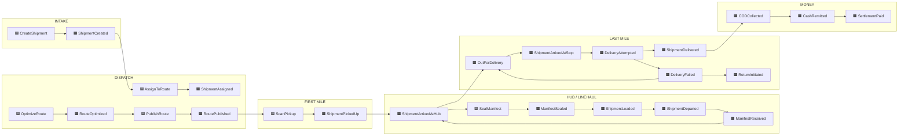
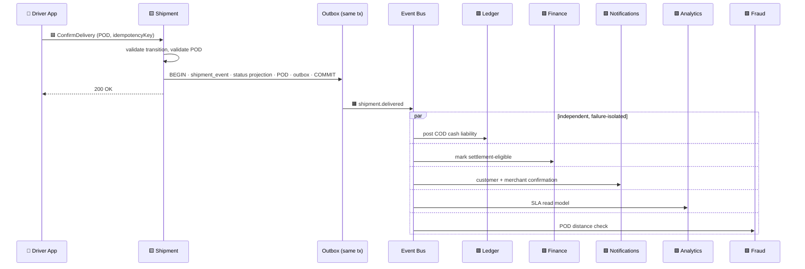

# Event Storming

> **The source of truth for the event-driven design.** Every event the system produces, who produces it, who consumes it, and what it carries.
> Depends on: [02-domain-model.md](./02-domain-model.md) · Implements: [ADR-004](./architecture-blueprint.md#54-event-driven-architecture--adr-004) · Feeds: 04-context-map, 05-api-contracts
> **Status:** DRAFT — awaiting approval.
> **Date:** 2026-07-22

---

## 1. Notation

Standard event-storming colours, rendered as labels since this is a text document.

| Symbol | Element | Meaning |
|---|---|---|
| 🟧 **Event** | Domain Event | A fact that happened. Past tense. Immutable |
| 🟦 **Command** | Command | An intent to change something. Imperative. May be rejected |
| 🟨 **Aggregate** | Aggregate | The entity that decides whether a command is legal |
| 🟪 **Policy** | Policy / Reaction | "Whenever ⟨event⟩, then ⟨command⟩" — the glue of the system |
| 🟩 **Read Model** | Read Model | A projection built from events for querying |
| 🟫 **External** | External System | Something outside our boundary (SMS gateway, maps, bank) |
| 🟥 **Hotspot** | Hotspot | Unresolved question, risk, or disagreement. Deliberately visible |
| 👤 **Actor** | Actor | Human or system issuing a command |

---

## 2. Governing Rules

### 2.1 Naming

Two names for every event, and both are canonical in their own layer:

| Layer | Form | Example |
|---|---|---|
| Code (class, handler, type) | `PascalCase` | `ShipmentDelivered` |
| Wire (`event_type` field, topic, webhook) | `domain.fact` lowercase | `shipment.delivered` |

The mapping is mechanical and one-to-one. This resolves the naming inconsistency between the domain layer and [api-strategy.md §5](./api-strategy.md#5-event-contracts) — neither is wrong, they belong to different layers.

**Hard rules:**
- **Past tense, always.** `ShipmentDelivered`, never `DeliverShipment` (that is a command) or `SendDeliveryEmail` (that is a job).
- Events state **facts**, never instructions. A consumer decides what to do; the publisher never implies it.
- An event is never renamed. A changed meaning requires a new `eventVersion`.

### 2.2 Envelope

Every event carries the envelope from [ADR-004](./architecture-blueprint.md#54-event-driven-architecture--adr-004). Payload tables below list **only the `payload` object** — these fields are always present and are not repeated per event:

```
eventId · eventType · eventVersion · tenantId · aggregateType · aggregateId
occurredAt · publishedAt · correlationId · causationId · actor
```

### 2.3 Guarantees

| Property | Guarantee |
|---|---|
| Publication | Transactional outbox — the event is written in the **same transaction** as the state change it describes |
| Delivery | **At-least-once.** Duplicates are normal operation |
| Ordering | Guaranteed **per `aggregateId`** only. `shipment.picked_up` always precedes `shipment.delivered` for the same shipment. No global ordering |
| Idempotency | Every consumer records processed `eventId`s and no-ops on repeats |
| Failure | Capped exponential backoff → per-consumer, per-tenant DLQ → alert. Never silently dropped |

### 2.4 ⚠️ What is deliberately NOT an event

**This is the single most important rule in this document.**

| Not an event | Why | What it is instead |
|---|---|---|
| **`DriverLocationUpdated`** (GPS ping) | **~40/sec at MVP, ~10,000/sec at Tier 3.** Putting raw telemetry on the business event bus would swamp every consumer, destroy the outbox, and bankrupt the event store | Written directly to the TimescaleDB hypertable and pushed to Valkey pub/sub for live dispatcher fan-out. **Never touches the outbox** |
| `NotificationSendRequested` | This is a command with a known owner, not a fact | A BullMQ job |
| `WebhookDeliveryRequested` | Same | A BullMQ job |
| `ShipmentQueried` / any read | Reads are not facts about state change | A synchronous REST call |
| `RouteOptimizationRequested` | An intent, not a fact | A command → job |

**Only meaningful transitions cross from the telemetry plane to the business plane.** A driver's geofence entry becomes `shipment.arrived_at_stop`; the 400 GPS points that preceded it do not. At Tier 3 this is a **170:1 reduction** — 864 M telemetry points per day producing roughly 5 M business events. See [Blueprint §5.2](./architecture-blueprint.md#52-request-path-separation-the-critical-diagram).

---

## 3. The Big Picture



---

## 4. Event Catalog

### 4.1 Shipment lifecycle

---

#### 🟧 `shipment.created` — ShipmentCreated

| | |
|---|---|
| **Aggregate** | Shipment |
| **Trigger** | `CreateShipment` accepted — CSV import, manual entry, or API |
| **Producer** | Shipment context (`core-api`) |
| **Consumers** | Tracking (create tracking token) · Notifications (merchant confirmation) · Analytics · Webhooks *(V2)* |
| **Ordering** | First event for this `aggregateId` |

**Payload**
```
shipmentId, trackingNumber, merchantId?, externalReference?,
serviceLevel, senderName, senderPhone, originAddressId,
recipientName, recipientPhone, destinationAddressId, destinationCity,
promisedFrom?, promisedTo?, parcelCount, weightGrams,
codAmountMinor, currency, legCount, source
```

**Notes.** `source` (`CSV` · `MANUAL` · `API`) matters for support — "how did this bad record get in?" must be answerable.

---

#### 🟧 `shipment.assigned` — ShipmentAssigned

| | |
|---|---|
| **Aggregate** | Shipment (caused by a Route command) |
| **Trigger** | A shipment leg is placed on a published route stop |
| **Producer** | Dispatch context |
| **Consumers** | Notifications (driver push) · Tracking (ETA available) · Analytics |

**Payload**
```
shipmentId, legId, routeId, routeStopId, driverId, vehicleId,
sequence, plannedArrivalAt?, etaAt?, assignedByUserId, assignmentMode
```

**Notes.** `assignmentMode` is `MANUAL` at MVP; `AUTO` from V2. Recording it from day one makes the eventual auto-assignment A/B comparison possible without a migration.

---

#### 🟧 `shipment.picked_up` — ShipmentPickedUp

| | |
|---|---|
| **Aggregate** | Shipment |
| **Trigger** | Driver scans the parcel barcode at the origin |
| **Producer** | Driver App → Shipment context |
| **Consumers** | Tracking · Notifications (customer: "your parcel is on its way") · Analytics · Custody |

**Payload**
```
shipmentId, legId, driverId, routeId, routeStopId,
location {lat, lon}, locationAccuracyM, scannedBarcode,
occurredAt (device), custodyFrom: MERCHANT, custodyTo: DRIVER
```

**Notes.** **This event freezes `codAmountMinor`** ([02-domain-model §3.6 rule 5](./02-domain-model.md#36-shipment)). After this point the amount owed cannot change.

---

#### 🟧 `shipment.arrived_at_hub` — ShipmentArrivedAtHub

| | |
|---|---|
| **Aggregate** | Shipment |
| **Trigger** | Scan at hub inbound, or manifest receipt |
| **Producer** | Hub context (`core-api`) |
| **Consumers** | Tracking · Analytics · Dispatch (now available for onward planning) |

**Payload**
```
shipmentId, legId, hubId, hubCode, manifestId?,
scannedByUserId, custodyTo: HUB, occurredAt
```

---

#### 🟧 `shipment.loaded` — ShipmentLoaded

| | |
|---|---|
| **Aggregate** | Shipment |
| **Trigger** | Parcel scanned onto a sealed manifest for onward movement |
| **Producer** | Hub context |
| **Consumers** | Tracking · Analytics |

**Payload**
```
shipmentId, legId, manifestId, manifestCode, manifestType,
fromHubId, toHubId?, toDriverId?, vehicleId?, occurredAt
```

---

#### 🟧 `shipment.departed` — ShipmentDeparted

| | |
|---|---|
| **Aggregate** | Shipment |
| **Trigger** | Manifest dispatched from origin hub |
| **Producer** | Hub context |
| **Consumers** | Tracking · Notifications (customer: "in transit") · Analytics |

**Payload**
```
shipmentId, legId, manifestId, fromHubId, toHubId,
vehicleId?, driverId?, estimatedArrivalAt?, occurredAt
```

---

#### 🟧 `shipment.out_for_delivery` — OutForDelivery

| | |
|---|---|
| **Aggregate** | Shipment |
| **Trigger** | Last-mile route started with this shipment aboard |
| **Producer** | Dispatch context |
| **Consumers** | **Notifications (the highest-value customer message)** · Tracking · Analytics |

**Payload**
```
shipmentId, legId, routeId, driverId, driverName, driverPhone?,
sequence, stopsAhead, etaAt?, trackingUrl, occurredAt
```

**Notes.** 🟥 **Hotspot H4:** does the customer see the driver's real phone number, or a masked proxy? Direct exposure invites harassment in both directions; masking needs telephony infrastructure. **Decision needed before S4.**

---

#### 🟧 `shipment.arrived_at_stop` — ShipmentArrivedAtStop

| | |
|---|---|
| **Aggregate** | Shipment |
| **Trigger** | **Geofence entry** detected by the telemetry module, or driver taps "arrived" |
| **Producer** | Telemetry module → Dispatch context |
| **Consumers** | Notifications ("arriving now") · Tracking · Analytics |

**Payload**
```
shipmentId, legId, routeStopId, driverId,
location, distanceFromDestinationM, detectionMethod, occurredAt
```

**Notes.** **This is the one place where the telemetry plane crosses into the business plane** (§2.4). `detectionMethod` is `GEOFENCE` or `MANUAL`. The geofence radius is per-tenant configurable — too tight and it never fires in dense areas, too loose and "arriving now" fires three streets away.

---

#### 🟧 `delivery.attempted` — DeliveryAttempted

| | |
|---|---|
| **Aggregate** | Shipment |
| **Trigger** | Driver completes an attempt, successful or not |
| **Producer** | Driver App → Shipment context |
| **Consumers** | Analytics · Fraud (attempt-validity check) |

**Payload**
```
shipmentId, legId, attemptId, attemptNumber, maxAttempts,
driverId, outcome: SUCCESS | FAILED, reasonCode?,
location, dwellTimeSeconds, occurredAt
```

**Notes.** Emitted for **both** outcomes, always, before the more specific `delivered` / `delivery_failed`. This separation lets attempt-rate analytics and fraud checks run on one uniform stream. `dwellTimeSeconds` is a strong fraud signal — a 4-second "customer not available" is not a real attempt.

---

#### 🟧 `shipment.delivered` — ShipmentDelivered ⭐

**The most consumed event in the system.**

| | |
|---|---|
| **Aggregate** | Shipment |
| **Trigger** | POD captured and validated; delivery attempt succeeded |
| **Producer** | **Driver App** → Shipment context |
| **Consumers** | **Ledger** (COD cash liability) · **Finance** (settlement eligibility) · **Notifications** (customer + merchant confirmation) · **Tracking** (terminal status) · **Analytics** (SLA measurement) · **Fraud** (POD distance check) · Webhooks *(V2)* |
| **Ordering** | Must follow `picked_up` for the same `aggregateId` — guaranteed by partition key |

**Payload**
```
shipmentId, legId, attemptId, podId, podType,
recipientName, recipientRelationship,
driverId, routeId, routeStopId,
location, distanceFromDestinationM,
codAmountMinor, codCollected: bool, currency,
promisedTo?, occurredAt, recordedAt, wasOnTime: bool
```

**Notes.**
- `wasOnTime` is computed at publication from `occurredAt` vs `promisedTo`. Computing it once, at the source, prevents six consumers deriving it six slightly different ways.
- **`occurredAt` and `recordedAt` may differ by hours** for an offline delivery. Every consumer must use `occurredAt` for business meaning.
- **The driver's request returns as soon as the transaction commits.** Twilio being down or the merchant's webhook timing out cannot delay a delivery confirmation.



---

#### 🟧 `delivery.failed` — DeliveryFailed

| | |
|---|---|
| **Aggregate** | Shipment |
| **Trigger** | Attempt completed unsuccessfully |
| **Producer** | Driver App → Shipment context |
| **Consumers** | **Re-attempt policy** · Notifications (customer + merchant) · Tracking · Analytics · Fraud |

**Payload**
```
shipmentId, legId, attemptId, attemptNumber, maxAttempts,
reasonCode, reasonNotes?, driverId,
location, distanceFromDestinationM, dwellTimeSeconds,
attemptsRemaining, nextAttemptAt?, occurredAt
```

**Notes.** `reasonCode` comes from the **per-tenant taxonomy** — free text cannot drive automation or be counted. Expected MENA-market values: `CUSTOMER_UNAVAILABLE`, `CUSTOMER_REFUSED`, `INSUFFICIENT_CASH`, `WRONG_ADDRESS`, `PHONE_UNREACHABLE`, `ACCESS_DENIED`, `RESCHEDULED_BY_CUSTOMER`. 🟥 **Hotspot H5:** taxonomy must be validated with a real courier (DM5).

---

#### 🟧 `shipment.return_initiated` — ReturnInitiated

| | |
|---|---|
| **Trigger** | Attempts exhausted, or customer refused, or merchant recalled |
| **Producer** | Shipment context (usually via re-attempt policy) |
| **Consumers** | Dispatch (plan return leg) · Notifications (merchant) · Analytics · Finance (COD will not be collected) |

**Payload**
```
shipmentId, reason, finalAttemptCount, returnToAddressId,
returnHubId?, codAmountMinor (now uncollectible), occurredAt
```

---

#### 🟧 `shipment.returned` — ShipmentReturned

| | |
|---|---|
| **Trigger** | Parcel physically back at origin/merchant, scanned |
| **Producer** | Hub context |
| **Consumers** | Finance (return fee) · Notifications · Analytics · Tracking (terminal) |

**Payload**
```
shipmentId, returnedToType, returnedToId, receivedByUserId,
totalAttempts, daysInSystem, occurredAt
```

---

#### 🟧 `shipment.cancelled` — ShipmentCancelled

| | |
|---|---|
| **Trigger** | Merchant or dispatcher cancels before delivery |
| **Producer** | Shipment context |
| **Consumers** | Dispatch (remove from routes) · Notifications · Finance · Analytics |

**Payload**
```
shipmentId, cancelledByUserId, actorType, reason,
statusAtCancellation, wasInCustody: bool, occurredAt
```

**Notes.** Cancelling a shipment already in custody (`wasInCustody = true`) requires `OWNER` role and creates a physical-recovery task — the parcel is in a van somewhere.

---

### 4.2 Route & dispatch

---

#### 🟧 `route.optimized` — RouteOptimized

| | |
|---|---|
| **Producer** | Optimization module (OSRM + heuristic sequencer at MVP) |
| **Consumers** | Dispatch board (WebSocket push) · Analytics (plan-vs-actual baseline) |

**Payload**
```
routeId, jobId, stopCount, plannedDistanceM, plannedDurationS,
solver: OSRM_NN_2OPT | VROOM, solveDurationMs, usedFallback: bool,
constraintsViolated[]
```

**Notes.** **`usedFallback` is monitored.** A rising fallback rate means the solver is silently degrading route quality — invisible in ordinary system metrics.

---

#### 🟧 `route.published` — RoutePublished

| | |
|---|---|
| **Trigger** | Dispatcher publishes; route becomes visible to the driver |
| **Producer** | Dispatch context |
| **Consumers** | Notifications (driver push) · Driver App sync · Analytics |

**Payload**
```
routeId, routeCode, driverId, vehicleId, plannedDate,
startHubId?, stopCount, shipmentCount, codShipmentCount,
totalCodAmountMinor, plannedStartAt, publishedByUserId
```

**Notes.** `totalCodAmountMinor` tells the driver up front how much cash they will be carrying — a real safety and planning concern.

---

#### 🟧 `route.started` / `route.completed`

| | |
|---|---|
| **Producer** | Driver App → Dispatch context |
| **Consumers** | Analytics · Dispatch board · Finance (`completed` triggers remittance expectation) |

**Payload (`completed`)**
```
routeId, driverId, actualDistanceM, actualDurationS,
stopsCompleted, stopsFailed, stopsSkipped,
codCollectedMinor, plannedVsActualDurationDeltaS, occurredAt
```

---

#### 🟧 `stop.arrived` / `stop.completed`

| | |
|---|---|
| **Producer** | Telemetry (geofence) or Driver App |
| **Consumers** | Dispatch board · Analytics (service-time samples) |

**Payload (`completed`)**
```
routeStopId, routeId, driverId, legIds[],
arrivedAt, departedAt, serviceDurationS, outcome
```

**Notes.** `serviceDurationS` accumulates the **historical-median service time** per address that improves future route planning — a SQL aggregate, not a model.

---

### 4.3 Driver & shift

---

#### 🟧 `driver.shift_started` / `driver.shift_ended`

| | |
|---|---|
| **Producer** | Driver App → Driver context |
| **Consumers** | **Telemetry module (enables/disables location ingest)** · Dispatch (availability) · Analytics · Finance (`ended` expects remittance) |

**Payload**
```
driverId, shiftId, vehicleId?, hubId?, occurredAt, location?
```

**Notes.** ⚠️ **`shift_ended` is a privacy control, not merely an operational one.** It terminates location collection server-side. A driver's location is never recorded outside an open shift — enforced by rejecting telemetry, not by trusting the app.

---

#### 🟧 `driver.went_offline` — DriverWentOffline

| | |
|---|---|
| **Trigger** | Presence TTL expiry (no telemetry batch for 90 s during an open shift) |
| **Producer** | Telemetry module |
| **Consumers** | Dispatch board (alert) · Notifications (dispatcher) |

**Payload**
```
driverId, shiftId, lastSeenAt, lastLocation,
activeRouteId?, stopsRemaining, offlineDurationS
```

**Notes.** Not a business fact about a shipment, but genuinely operationally significant — a driver with 14 undelivered parcels who has been dark for 20 minutes is an incident. **Debounced** to avoid alert storms in tunnels and basements.

---

### 4.4 Hub & manifest

---

#### 🟧 `manifest.sealed` — ManifestSealed

| | |
|---|---|
| **Producer** | Hub context |
| **Consumers** | Analytics · Tracking (per-shipment `loaded`) · Destination hub (expectation) |

**Payload**
```
manifestId, code, type, fromHubId, toHubId?, toDriverId?,
vehicleId?, itemCount, shipmentIds[], sealedByUserId, occurredAt
```

**Notes.** Sealing makes contents **immutable** ([02-domain-model §3.11](./02-domain-model.md#311-manifest)).

---

#### 🟧 `manifest.received` — ManifestReceived

| | |
|---|---|
| **Producer** | Hub context |
| **Consumers** | Custody (transfer) · Analytics · per-shipment `arrived_at_hub` |

**Payload**
```
manifestId, receivedAtHubId, receivedByUserId,
expectedCount, scannedCount, missingShipmentIds[], unexpectedShipmentIds[],
discrepancyCount, occurredAt
```

**Notes.** **Custody transfers here, not at seal.** The sender remains responsible while parcels are in transit.

---

#### 🟧 `manifest.discrepancy_raised`

| | |
|---|---|
| **Trigger** | Receipt scan count ≠ expected |
| **Consumers** | Dispatch (exception queue) · Notifications (both hub managers) · Fraud · Analytics |

**Payload**
```
manifestId, fromHubId, toHubId, missingShipmentIds[],
unexpectedShipmentIds[], discrepancyCount, raisedByUserId
```

**Notes.** 🟥 **Hotspot H2:** a missing parcel is potential loss or theft. Who is accountable — origin hub, transport, or destination? **Policy decision needed before S2.**

---

### 4.5 Money — the COD chain

---

#### 🟧 `cod.collected` — CODCollected

| | |
|---|---|
| **Trigger** | Driver records cash receipt (**always inside the delivery transaction**) |
| **Producer** | Driver App → Ledger context |
| **Consumers** | **Ledger (writes the double-entry transaction)** · Finance (driver balance) · Fraud · Analytics |

**Payload**
```
shipmentId, driverId, amountMinor, currency, currencyExponent,
expectedAmountMinor, method: CASH,
routeId, location, occurredAt
```

**Ledger effect**
```
DEBIT  driver_cash        amountMinor
CREDIT merchant_payable   amountMinor
```

**Notes.**
- **`currencyExponent` is carried explicitly in the payload.** For TND it is `3` — 12.500 TND is `12500` minor units. A consumer that assumes 2 decimals produces a **1,000× error**. Making the exponent explicit on the wire means a consumer cannot get this wrong silently.
- `amountMinor != expectedAmountMinor` indicates partial collection — 🟥 **Hotspot H3** (DM3): is partial COD a real in-market scenario? **Decision needed before S4.**

---

#### 🟧 `cod.remittance_submitted` — RemittanceSubmitted

| | |
|---|---|
| **Producer** | Driver App or Hub Operator → Finance context |
| **Consumers** | Finance (hub review queue) · Notifications (hub operator) |

**Payload**
```
remittanceId, code, driverId, hubId,
expectedAmountMinor, declaredAmountMinor, currency,
shipmentIds[], shipmentCount, occurredAt
```

---

#### 🟧 `cod.cash_remitted` — CashRemitted ⭐

| | |
|---|---|
| **Trigger** | Hub operator counts and confirms the cash |
| **Producer** | Finance context |
| **Consumers** | **Ledger** · Finance (settlement eligibility) · Fraud · Analytics · Notifications (driver receipt) |

**Payload**
```
remittanceId, driverId, hubId, receivedByUserId,
expectedAmountMinor, declaredAmountMinor, countedAmountMinor,
varianceMinor, varianceReason?, currency, currencyExponent,
shipmentIds[], occurredAt
```

**Ledger effect**
```
DEBIT  hub_cash      countedAmountMinor
CREDIT driver_cash   countedAmountMinor
(if varianceMinor != 0, an additional balanced adjustment transaction)
```

**Notes.** **All three amounts travel together.** Expected, declared, and counted distinguish a driver's arithmetic error from a hub miscount from theft — collapsing them into one number destroys the platform's most important financial control.

---

#### 🟧 `cod.variance_detected` — CODVarianceDetected

| | |
|---|---|
| **Trigger** | `varianceMinor != 0` on remittance confirmation |
| **Producer** | Finance context |
| **Consumers** | **Fraud (review queue)** · Notifications (owner + finance) · Analytics |

**Payload**
```
remittanceId, driverId, hubId, varianceMinor, currency,
varianceDirection: SHORTAGE | SURPLUS, varianceReason?,
driverHistoricalVarianceCount, driverHistoricalVarianceMinor
```

**Notes.** Historical context is included so the consumer can distinguish a first-time 0.500 TND rounding issue from a pattern. **Scores for review — never auto-suspends a driver.** A false positive here costs someone their livelihood.

---

#### 🟧 `settlement.approved` / `settlement.paid`

| | |
|---|---|
| **Producer** | Finance context |
| **Consumers** | **Ledger (on `paid` only)** · Notifications (merchant) · Analytics |

**Payload (`paid`)**
```
settlementId, code, merchantId, periodFrom, periodTo,
grossCodAmountMinor, deliveryFeesMinor, adjustmentsMinor,
netPayableMinor, currency, currencyExponent,
shipmentCount, paymentMethod, paymentReference, paidAt
```

**Ledger effect (on `paid`)**
```
DEBIT  merchant_payable   netPayableMinor
CREDIT bank               netPayableMinor
```

**Notes.** Ledger entries post on **`paid`**, not `approved`. Approval is an intent; payment is the fact.

---

### 4.6 Supporting

---

#### 🟧 `pod.captured` — PODCaptured

Emitted with `shipment.delivered` in the same transaction. Separate because the **Fraud** context cares about POD specifics and should not parse the delivery payload.

**Payload**
```
podId, shipmentId, attemptId, type, recipientName, recipientRelationship,
capturedLocation, capturedAccuracyM, distanceFromDestinationM,
artifactCount, contentHashes[], deviceMetadata { model, os, appVersion, mockLocation }
```

---

#### 🟧 `pickup.requested` / `.accepted` / `.assigned` / `.collected` / `.completed` / `.cancelled`

| | |
|---|---|
| **Aggregate** | PickupRequest |
| **Producer** | Tenant dashboard (staff) or Merchant request → Dispatch context |
| **Consumers** | Dispatch (planning pool) · Notifications (merchant + driver) · Analytics · Shipment (on `collected`, registers parcels) |

**Payload (`collected`)**
```
pickupRequestId, code, merchantId, driverId, routeStopId,
pickupAddressId, estimatedParcelCount, actualParcelCount, countVariance,
shipmentIds[], location, occurredAt
```

**Notes.** `countVariance` is emitted rather than left to be derived — a merchant who habitually declares 20 parcels and hands over 8 is a capacity and billing problem, and it is only visible if both numbers travel together. `actualParcelCount = 0` with status `COMPLETED` is valid: the trip happened and cost money.

---

#### 🟧 `recipient.created` / `recipient.blocked`

| | |
|---|---|
| **Aggregate** | Recipient |
| **Producer** | Directory context |
| **Consumers** | Analytics · Dispatch (blocked recipients rejected at shipment creation) · Notifications |

**Payload (`blocked`)**
```
recipientId, phone, fullName, reason, blockedByUserId,
totalShipments, failedDeliveries, occurredAt
```

**Notes.** Blocking carries the failure history so the consumer can distinguish a one-off dispute from a serial refuser — the latter is a genuine cost centre in COD markets.

---

#### 🟧 `complaint.raised` / `complaint.resolved`

| | |
|---|---|
| **Aggregate** | Complaint |
| **Producer** | Tenant dashboard → Support/Ops |
| **Consumers** | Notifications · Analytics · **Finance (on `COD_DISPUTE` resolution)** · Fraud (on `LOST`) |

**Payload (`resolved`)**
```
complaintId, code, type, severity, shipmentId?, merchantId?, recipientId?, driverId?,
outcome: RESOLVED | REJECTED, resolution, resolvedByUserId,
ledgerReversalRequired: bool, reversalAmountMinor?, currency?, currencyExponent?,
slaBreached: bool, occurredAt
```

**Notes.** `ledgerReversalRequired` is what closes hotspot **H8**. When a COD dispute resolves in the recipient's favour, Finance posts a **reversing** balanced transaction — the original entries always remain visible. A ledger that can be edited is not a ledger.

---

#### 🟧 `address.geocode_corrected` — AddressGeocodeCorrected

| | |
|---|---|
| **Producer** | Driver App → Address context |
| **Consumers** | Address quality pipeline · Analytics · Dispatch (future routing) |

**Payload**
```
addressId, oldLocation, newLocation, distanceMovedM,
correctedByDriverId, confidenceBefore, confidenceAfter, occurredAt
```

**Notes.** **Compounding asset.** Each correction permanently improves every future delivery to that address — significant in Tunisia where formal street addressing is inconsistent. Elevated to MVP for this reason.

---

#### 🟧 `fraud.flag_raised` — FraudFlagRaised

| | |
|---|---|
| **Producer** | Fraud context (rules engine) |
| **Consumers** | Dispatch (review queue) · Notifications (owner) · Analytics |

**Payload**
```
flagId, ruleCode, severity, subjectType, subjectId,
shipmentId?, driverId?, evidence {}, occurredAt
```

MVP rule codes: `POD_LOCATION_MISMATCH` · `NO_ATTEMPT_TRACE` · `MOCK_LOCATION` · `IMPOSSIBLE_SPEED` · `COD_VARIANCE` · `RAPID_COMPLETIONS` · `OFF_SHIFT_ACTIVITY`.

**Notes.** `NO_ATTEMPT_TRACE` — a `CUSTOMER_UNAVAILABLE` failure with no GPS trace within 200 m of the address — is the **highest-value single rule** in the MVP fraud suite.

---

#### 🟧 `tenant.provisioned` / `tenant.suspended`

**Consumers.** All contexts (feature cache invalidation) · Notifications · Analytics.

```
tenantId, name, slug, plan, defaultCurrency, defaultTimezone,
supportedLocales[], region, enabledFeatures[], occurredAt
```

---

#### 🟧 `tenant.feature_changed` — TenantFeatureChanged

| | |
|---|---|
| **Aggregate** | TenantFeature |
| **Trigger** | A feature is enabled, disabled, reconfigured, or a trial expires |
| **Producer** | Platform context |
| **Consumers** | **Every context (cache invalidation)** · Driver App sync · Dispatcher UI · Notifications (owner) · Audit |

**Payload**
```
tenantId, featureKey, enabled, previousEnabled, source,
configJson?, expiresAt?, reason?, changedByUserId?, occurredAt
```

**Notes.**
- **Cache invalidation must be explicit**, not TTL-based. A tenant who just enabled `SMS_ENABLED` should not wait out a TTL before customers get messages — and a tenant who disabled it should not keep paying for messages.
- **Disabling is validated before the event fires**, not after ([02-domain-model I15](./02-domain-model.md#4-cross-entity-invariants)). `COD_ENABLED → false` is rejected while any driver holds cash.
- The **driver app receives this on sync** and adapts its UI — a driver on a non-COD tenant never sees a cash-collection screen at all, rather than seeing one that errors.

---

## 5. Command Catalog

Commands are **intents that may be rejected**. Each is validated by its aggregate before any event is emitted.

| 🟦 Command | Actor | 🟨 Aggregate | Emits on success | Key rejections |
|---|---|---|---|---|
| `CreateShipment` | Merchant, Dispatcher, API | Shipment | `shipment.created` | Missing recipient phone · unresolvable address · duplicate external reference |
| `AssignShipmentToRoute` | Dispatcher | Route | `shipment.assigned` | Route not `DRAFT` · vehicle capacity exceeded · driver lacks required skill |
| `OptimizeRoute` | Dispatcher | Route | `route.optimized` | Route not `DRAFT` · no stops |
| `PublishRoute` | Dispatcher | Route | `route.published` | No driver · no vehicle · driver already has an `IN_PROGRESS` route |
| `StartShift` | Driver | Driver | `driver.shift_started` | Shift already open · vehicle in another open shift |
| `ScanPickup` | Driver | Shipment | `shipment.picked_up` | Wrong barcode · not on this driver's route · illegal transition |
| `ScanAtHub` | Hub Operator | Shipment | `shipment.arrived_at_hub` | Unknown barcode · shipment terminal |
| `SealManifest` | Hub Operator | Manifest | `manifest.sealed`, `shipment.loaded`×n | Empty manifest · already sealed |
| `ReceiveManifest` | Hub Operator | Manifest | `manifest.received`, `manifest.discrepancy_raised?` | Not `IN_TRANSIT` |
| `ConfirmDelivery` | Driver | Shipment | `delivery.attempted`, `pod.captured`, `shipment.delivered`, `cod.collected?` | **Missing POD** · illegal transition · **COD amount mismatch** |
| `RecordFailedDelivery` | Driver | Shipment | `delivery.attempted`, `delivery.failed` | Missing reason code · attempts exhausted |
| `SubmitRemittance` | Driver | CODRemittance | `cod.remittance_submitted` | Nothing to remit |
| `ConfirmRemittance` | Hub Operator | CODRemittance | `cod.cash_remitted`, `cod.variance_detected?` | **Variance without reason** · not `SUBMITTED` |
| `ApproveSettlement` | Finance/Owner | Settlement | `settlement.approved` | **Approver is the creator** (separation of duties) |
| `MarkSettlementPaid` | Finance | Settlement | `settlement.paid` | Not `APPROVED` |
| `CorrectAddressGeocode` | Driver | Address | `address.geocode_corrected` | Moved > 2 km (requires dispatcher review) |
| `CancelShipment` | Dispatcher, Owner | Shipment | `shipment.cancelled` | Terminal state · in custody without `OWNER` role |

---

## 6. Policies (Reactions)

🟪 A policy is "**whenever** ⟨event⟩ **then** ⟨command⟩". These are where the system's behaviour actually lives.

| # | Whenever | Then | Owner context | Notes |
|---|---|---|---|---|
| P1 | `shipment.created` | Generate tracking token; geocode address | Shipment | Low geocode confidence → dispatcher review, **blocks auto-dispatch** |
| P2 | `shipment.assigned` | Push notification to driver | Notifications | |
| P3 | `shipment.out_for_delivery` | SMS customer with tracking link | Notifications | Highest-value customer message |
| P4 | `shipment.arrived_at_stop` | SMS "arriving now" | Notifications | Rate-limited: max 1 per shipment |
| P5 | `shipment.delivered` | Post COD ledger transaction | Ledger | Same-transaction where COD present |
| P6 | `shipment.delivered` | SMS customer + merchant confirmation | Notifications | |
| P7 | `shipment.delivered` | Mark settlement-eligible **once remitted** | Finance | Not eligible while cash is with the driver |
| P8 | `shipment.delivered` | Evaluate POD distance rule | Fraud | >150 m → `fraud.flag_raised` |
| P9 | `delivery.failed` | If attempts remain → schedule re-attempt; else → `ReturnInitiated` | Dispatch | **The core exception policy** |
| P10 | `delivery.failed` | SMS customer with reason + reschedule option | Notifications | |
| P11 | `delivery.failed` with `reasonCode = CUSTOMER_UNAVAILABLE` | Check GPS trace within 200 m | Fraud | Highest-value fraud rule |
| P12 | `driver.shift_started` | Enable telemetry ingest for this driver | Telemetry | |
| P13 | `driver.shift_ended` | **Disable telemetry ingest**; expect remittance if COD held | Telemetry, Finance | Privacy control |
| P14 | `driver.went_offline` | Alert dispatcher if active route has remaining stops | Dispatch | Debounced |
| P15 | `route.completed` | If driver holds cash → prompt remittance | Finance | |
| P16 | `cod.cash_remitted` | Mark covered shipments settlement-eligible | Finance | |
| P17 | `cod.variance_detected` | Create fraud review item; notify owner | Fraud | **Never auto-suspends** |
| P18 | `manifest.discrepancy_raised` | Create exception; notify both hub managers | Dispatch | |
| P19 | `settlement.paid` | Post ledger transaction; notify merchant | Ledger, Notifications | |
| P20 | `address.geocode_corrected` | Update address confidence; invalidate cached matrices | Address, Dispatch | |
| P21 | Any event on a **terminal** shipment | Route to exception queue | Shipment | **Never silently dropped** |

---

## 7. Read Models

🟩 Projections built from events. All are **rebuildable** — this is the main reason we chose a log over a queue.

| Read model | Built from | Serves | Freshness |
|---|---|---|---|
| `shipment_status` | All shipment events | Dispatcher list, tracking page | **Synchronous** (same transaction) — money and operational screens never read stale data |
| `dispatch_board` | assigned, out_for_delivery, arrived_at_stop, delivered, failed | Dispatcher board | <1 s via WebSocket |
| `driver_live_position` | Telemetry (Valkey, **not** the event bus) | Live map | <2 s |
| `customer_tracking` | created, picked_up, departed, out_for_delivery, arrived_at_stop, delivered | Public tracking page | <5 s |
| `driver_cash_balance` | Ledger entries | Remittance screen, cash-in-field | **Synchronous** — it is money |
| `cash_in_field` | Ledger, `DRIVER_CASH` accounts | Owner dashboard | Synchronous |
| `sla_performance` | delivered + promised windows | Analytics | Eventual, ~5 min |
| `driver_daily_summary` | route.completed, delivered, failed, cod events | Driver + ops reporting | Eventual, ~5 min |
| `address_service_time` | stop.completed | Route planning input | Nightly aggregate |
| `failure_reasons` | delivery.failed | Ops reporting | Eventual |

**Design rule:** anything showing **money** or driving an **operational decision right now** reads from the transactional store. Only genuinely analytical views tolerate eventual consistency.

---

## 8. Hotspots 🟥

Deliberately visible unresolved questions. Each blocks a specific stage.

| # | Hotspot | Why it matters | Needed by |
|---|---|---|---|
| **H1** | **Does a re-attempt create a new `ShipmentLeg` or reuse the failed one?** | Affects leg model, plan-vs-actual, and every route query. *Recommendation: new leg* — preserves per-attempt history | S1 (DM4) |
| **H2** | **Who is accountable for a manifest discrepancy?** | Origin hub, transport, or destination. Determines the loss-liability workflow | S2 |
| **H3** | **Is partial COD collection real in-market?** | If yes, `cod.collected` needs partial-payment semantics and the ledger needs a receivable | S4 (DM3) |
| **H4** | **Does the customer see the driver's real phone number?** | Direct exposure invites harassment; masking needs telephony infrastructure | S4 |
| **H5** | **Is the failure-reason taxonomy correct for Tunisian operations?** | Drives re-attempt automation, fraud rules, and reporting. Must be validated with a real courier, not invented | S1 (DM5) |
| **H6** | **What is the correct geofence radius for `arrived_at_stop`?** | Too tight never fires in dense medina streets; too loose fires three streets early. Likely per-zone, not global | S2 |
| **H7** | **Can a driver remit to a supervisor rather than a hub?** | Adds a party to the custody chain | S4 (DM6) |
| **H8** | **What happens to COD already collected when a shipment is later disputed?** | Reversal path through the ledger is undefined | S4 |

---

## 9. Versioning

Events are the **most durable contract in the system** — harder to change than REST, because consumers are numerous and eventually will not all be ours.

| Change | Allowed in-version? |
|---|---|
| Add an optional payload field | ✅ |
| Add a new event type | ✅ |
| Make a required field optional | ✅ |
| Remove a field | ❌ New `eventVersion` |
| Rename or retype a field | ❌ New `eventVersion` |
| **Change the meaning of a field** | ❌ New `eventVersion` — **the most dangerous change**, because it passes every automated check |

Breaking changes publish **both versions in parallel** until every consumer migrates, tracked in a consumer registry. A JSON Schema per event type lives in `contracts/events/` and is validated in CI.

---

## 10. Open Items

| # | Item | Blocked on |
|---|---|---|
| ES1 | Resolve hotspots H1–H8 | Design-partner observation (MVP-O4) |
| ES2 | Confirm the event catalog covers every screen in 08-frontend-architecture | After wireframes |
| ES3 | Decide whether `shipment.arrived_at_stop` should also fire for pickups, not just deliveries | Product |
| ES4 | Define per-tenant configurability of notification policies P3/P4/P6/P10 (SMS cost is a real constraint) | Cost model + MVP-O1 |
