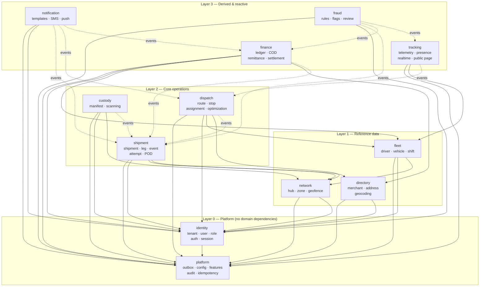

# Bounded Contexts & Context Map

> How the domain divides into modules, what each owns, and how they may talk to each other. **This maps one-to-one onto NestJS modules** and is enforced by lint rules, not convention.
> Depends on: [02-domain-model.md](./02-domain-model.md), [03-event-storming.md](./03-event-storming.md) · Feeds: [05-api-contracts.md](./05-api-contracts.md), [06-database-design.md](./06-database-design.md)
> **Status:** DRAFT — awaiting approval.
> **Date:** 2026-07-22

---

## 1. Why This Document Exists

[ADR-001](./architecture-blueprint.md#4-phase-2--architecture-decision-adr-001) chose a modular monolith. A modular monolith without **mechanically enforced** boundaries degrades into a big ball of mud within a year, at which point it has all the drawbacks of a monolith and none of the benefits ([Blueprint risk A2](./architecture-blueprint.md#111-architectural-risks)).

This document defines those boundaries. Three rules make them real:

1. **Each context owns its tables exclusively.** No other module reads or writes them directly — not even a `SELECT`.
2. **Cross-context calls go through a published interface**, exported from a single barrel file. Internals are unreachable.
3. **Cross-context reactions go through events**, never direct calls.

Violations fail CI. That is what separates this from a naming convention.

---

## 2. The Context Map



**Solid arrows = compile-time dependency (allowed direct call). Dotted arrows = event subscription only (no compile-time dependency).**

### 2.1 The layering rule

**A module may depend only on modules in a strictly lower layer.** Same-layer and upward dependencies are forbidden at compile time; those relationships are expressed as events.

This is what keeps the graph acyclic. `dispatch` needs to know a shipment was delivered, but it does **not** import `shipment` — it subscribes to `shipment.delivered`. The reverse direction (`shipment` needing route context) is satisfied by the event payload carrying `routeId`, not by a back-reference.

🟥 **The one deliberate tension:** `shipment` sits in Layer 2 and `dispatch` also sits in Layer 2, yet dispatch must write shipment assignment. This is resolved by **dispatch publishing a command result and shipment owning the transition** — `dispatch` calls `ShipmentService.assignToRoute()` through the published interface, which is a lower-layer-style call within the same layer. This is the single sanctioned same-layer dependency, documented here so it does not become a precedent.

---

## 3. Context Catalog

Each context below maps to exactly one NestJS module directory.

---

### 3.1 `platform`

**Purpose.** Cross-cutting mechanics every other module needs. Contains **no business rules whatsoever** — if a rule about parcels or money appears here, it is in the wrong place.

| | |
|---|---|
| **Owns data** | `outbox`, `idempotency_keys`, `tenant_features`, `tenant_config`, `audit_log`, `currencies` |
| **Publishes** | `tenant.feature_changed` |
| **Consumes** | Nothing (Layer 0) |
| **Depends on** | Nothing |

**Public interface**
```
OutboxService.publish(event)                     // called inside the caller's transaction
FeatureService.isEnabled(tenantId, featureKey)   // fail-closed, Valkey-cached
FeatureService.requireEnabled(featureKey)        // guard decorator
ConfigService.get(tenantId, key)
AuditService.record(actor, action, resource, diff)
IdempotencyService.claim(tenantId, key)
CurrencyService.exponentOf(code)                 // the TND-3-decimals source of truth
```

**Notes.** `CurrencyService.exponentOf()` lives here because **every** money-touching module needs it and none should own it. A hardcoded `×100` anywhere else is a 1,000× error on Tunisian dinars.

---

### 3.2 `identity`

**Purpose.** Who is asking, which tenant they belong to, and what they may do.

| | |
|---|---|
| **Owns data** | `tenants`, `users`, `roles`, `permissions`, `role_permissions`, `user_roles`, `sessions`, `refresh_tokens` |
| **Publishes** | `tenant.provisioned`, `tenant.suspended`, `user.invited`, `user.role_changed` |
| **Consumes** | Nothing |
| **Depends on** | `platform` |

**Public interface**
```
AuthService.authenticate(credentials) → Principal
AuthService.issueDriverToken(driverId, deviceId)
TenantService.getById(id) / .resolveBySlug(slug)
TenantContext.current()                      // AsyncLocalStorage — the RLS source
AccessService.can(principal, permission, resource?)
UserService.getById(id)
```

**Notes.** **`TenantContext.current()` is the most security-critical function in the codebase.** It feeds `SET LOCAL app.current_tenant_id` on every transaction. Drivers authenticate here but are *not* stored here — `Driver` lives in `fleet` ([02-domain-model §3.2](./02-domain-model.md#32-user)).

---

### 3.3 `directory`

**Purpose.** Commercial counterparties and physical addressing. Owns the **address-quality pipeline**, which quietly determines routing and ETA quality.

| | |
|---|---|
| **Owns data** | `merchants`, `addresses` |
| **Publishes** | `address.geocode_corrected`, `merchant.created` |
| **Consumes** | `shipment.delivered` (marks an address geocode verified) |
| **Depends on** | `platform`, `identity` |

**Public interface**
```
AddressService.resolve(rawInput, countryCode) → { addressId, confidence }
AddressService.getById(id)
AddressService.applyDriverCorrection(addressId, location, driverId)
AddressService.serviceTimeMedian(addressId)      // SQL aggregate, not a model
MerchantService.getById(id)
```

**Notes.** `AddressService.resolve()` encapsulates normalisation → geocoding → confidence scoring → caching. **Low confidence blocks auto-dispatch.** Isolating the geocoding provider here means the geocoder can be swapped without touching any other module.

**Bound implementation.** `GEOCODER=nominatim` selects a chain: a **self-hosted Nominatim** first — on the same OpenStreetMap extract OSRM uses, so there is one dataset to keep current — then a commercial provider for what it cannot place. Three properties of that ordering are deliberate:

- **A customer's home address does not leave the deployment** for the common case. Every geocode is personal data about someone who never agreed to a foreign provider's terms.
- **No per-request cost** on the common case, so a bulk CSV import is not a bill.
- **The chain falls through on LOW CONFIDENCE, not only on `null`.** A geocoder returning a governorate centroid for a street address has "succeeded" and produced a coordinate that sends a driver into the middle of a city. Below `AUTO_DISPATCH_CONFIDENCE_FLOOR` the next provider is tried; the best answer is still returned, and its confidence is what blocks auto-dispatch.

Confidence is derived from **match granularity** (building / house number > street > boundary), never from Nominatim's `importance`, which is a prominence score — a famous city ranks high on a vague query, which is exactly the wrong signal. Every request is constrained by `countrycodes`; without it "Ariana" matches a town in Iran and returns a perfectly plausible coordinate.

`GEOCODER=manual` remains the default, and a geocoder outage degrades to an unlocated address rather than failing shipment creation.

---

### 3.4 `network`

**Purpose.** The physical topology the courier operates: facilities, territories, arrival boundaries.

| | |
|---|---|
| **Owns data** | `hubs`, `zones`, `geofences` |
| **Publishes** | `hub.created`, `zone.updated` |
| **Consumes** | Nothing |
| **Depends on** | `platform`, `identity`, `directory` |

**Public interface**
```
HubService.getById(id) / .listActive(tenantId)
HubService.resolveForAddress(addressId) → hubId       // which hub serves this address
ZoneService.containing(location) → zoneId
GeofenceService.evaluate(location, candidateIds) → transitions[]
```

**Notes.** `GeofenceService.evaluate()` is called by `tracking` on every telemetry batch. It must be **pure and fast** — no I/O, geofences preloaded into memory per tenant. Geofence radius is per-zone configurable (hotspot H6): dense medina streets need a tighter radius than suburban ones.

---

### 3.5 `fleet`

**Purpose.** The people and vehicles that execute work, and the shift that gates location collection.

| | |
|---|---|
| **Owns data** | `drivers`, `vehicles`, `shifts` |
| **Publishes** | `driver.shift_started`, `driver.shift_ended`, `driver.created`, `vehicle.status_changed` |
| **Consumes** | `route.completed` (availability), `cod.cash_remitted` (clears cash-hold on deactivation) |
| **Depends on** | `platform`, `identity`, `network` |

**Public interface**
```
DriverService.getById(id)
DriverService.listAvailable(tenantId, at, skills?) → Driver[]
DriverService.hasOpenShift(driverId) → bool
ShiftService.start(driverId, vehicleId) / .end(shiftId)
ShiftService.isWithinOpenShift(driverId, at) → bool     // the privacy gate
VehicleService.capacityOf(vehicleId) → Capacity
```

**Notes.** **`ShiftService.isWithinOpenShift()` is a privacy control, not a convenience.** `tracking` calls it on every telemetry batch and **rejects** location data outside an open shift. This is enforced server-side precisely because the app cannot be trusted to enforce it.

---

### 3.6 `shipment`

**Purpose.** The core aggregate — lifecycle, custody chain, proof of delivery. **The system's centre of gravity.**

| | |
|---|---|
| **Owns data** | `shipments`, `shipment_events`, `shipment_legs`, `shipment_items`, `delivery_attempts`, `pod`, `pod_artifacts`, `tracking_tokens` |
| **Publishes** | `shipment.created`, `.assigned`, `.picked_up`, `.arrived_at_hub`, `.loaded`, `.departed`, `.out_for_delivery`, `.arrived_at_stop`, `.cancelled`, `delivery.attempted`, `delivery.failed`, `shipment.delivered`, `shipment.return_initiated`, `.returned`, `pod.captured` |
| **Consumes** | `manifest.received` (custody transfer), `manifest.sealed` (loaded) |
| **Depends on** | `platform`, `identity`, `directory`, `network` |

**Public interface**
```
ShipmentService.create(dto) → Shipment
ShipmentService.getById(id) / .getByTracking(number)
ShipmentService.assignToRoute(shipmentId, legId, routeStopId)   // called by dispatch
ShipmentService.recordScan(shipmentId, scanType, context)
ShipmentService.confirmDelivery(shipmentId, pod, cod?)
ShipmentService.recordFailure(shipmentId, reasonCode, context)
ShipmentService.cancel(shipmentId, reason)
LegService.listUnassigned(tenantId, filters) → Leg[]            // what dispatch plans
```

**Notes.**
- **This module is the only writer of `shipment_events`.** Every other context that wants to record a custody fact calls `recordScan()`.
- The state machine ([02-domain-model §5.1](./02-domain-model.md#51-shipment)) lives here and nowhere else. A transition validated in two places will eventually disagree with itself.
- `confirmDelivery()` writes shipment event, status projection, POD, COD ledger call, and outbox row **in one transaction**.

---

### 3.7 `dispatch`

**Purpose.** Planning work: which driver, which vehicle, which order. Owns the dispatcher board's write side.

| | |
|---|---|
| **Owns data** | `routes`, `route_stops`, `optimization_jobs` |
| **Publishes** | `route.optimized`, `route.published`, `route.started`, `route.completed`, `stop.arrived`, `stop.completed` |
| **Consumes** | `shipment.created` (planning pool), `shipment.cancelled` (remove), `delivery.failed` (re-attempt policy P9), `driver.went_offline` (alert), `address.geocode_corrected` (invalidate matrices) |
| **Depends on** | `platform`, `identity`, `fleet`, `network`, `shipment` *(sanctioned same-layer — §2.1)* |

**Public interface**
```
RouteService.create(tenantId, date, driverId?, vehicleId?)
RouteService.addStops(routeId, legIds[])
RouteService.optimize(routeId) → jobId
RouteService.publish(routeId)
RouteService.getForDriver(driverId, date)
StopService.markArrived(stopId, source) / .complete(stopId)
AssignmentService.suggestDrivers(legId) → ScoredDriver[]
```

**Notes.**
- Owns the **OSRM client and the sequencing heuristic**. If VROOM is added at V2 it slots in behind the same interface with no caller changes.
- **Every optimization call has a hard timeout and a deterministic fallback** (nearest-neighbour + 2-opt). A dispatcher never sees an indefinite spinner.
- Owns **re-attempt policy P9** — the most consequential policy in the system.

---

### 3.8 `custody`

**Purpose.** Bulk custody transfer between holders: manifests, sealing, scanning, discrepancy detection.

| | |
|---|---|
| **Owns data** | `manifests`, `manifest_items` |
| **Publishes** | `manifest.sealed`, `manifest.dispatched`, `manifest.received`, `manifest.discrepancy_raised` |
| **Consumes** | Nothing |
| **Depends on** | `platform`, `identity`, `network`, `shipment` |

**Public interface**
```
ManifestService.open(type, fromHubId, toHubId?) 
ManifestService.addItem(manifestId, shipmentId)
ManifestService.seal(manifestId)
ManifestService.dispatch(manifestId, vehicleId?, driverId?)
ManifestService.receiveScan(manifestId, barcode)
ManifestService.finaliseReceipt(manifestId) → DiscrepancyReport
```

**Notes.** Small module, but isolating it keeps `shipment` from absorbing hub-operations logic. **Contents are immutable after seal** — enforced here, at the aggregate root.

---

### 3.9 `tracking`

**Purpose.** Everything real-time and location: telemetry ingest, driver presence, WebSocket fan-out, public customer tracking.

| | |
|---|---|
| **Owns data** | `driver_positions` (TimescaleDB hypertable), Valkey presence keys, continuous aggregates |
| **Publishes** | `shipment.arrived_at_stop` (via geofence), `driver.went_offline` |
| **Consumes** | `driver.shift_started` / `.shift_ended` (enable/disable ingest), `route.published` (load geofences), `shipment.delivered` (terminal tracking state) |
| **Depends on** | `platform`, `fleet`, `network` |

**Public interface**
```
TelemetryService.ingestBatch(driverId, positions[])   // rejects outside open shift
PresenceService.lastKnown(driverId) → Position | null
PresenceService.onlineDrivers(tenantId) → DriverId[]
RealtimeGateway.broadcast(tenantId, channel, payload)
PublicTrackingService.getByToken(token) → TrackingView
```

**Notes.**
- ⚠️ **This module bridges the telemetry plane and the business plane, and that boundary is its entire reason for existing.** It writes ~40/sec (MVP) to ~10,000/sec (Tier 3) to TimescaleDB through a **dedicated connection pool**, and emits **only** geofence transitions to the business event bus ([03-event-storming §2.4](./03-event-storming.md#24--what-is-deliberately-not-an-event)).
- **This is the module ADR-005 extracts to Go first.** Its interface is deliberately narrow so extraction is reimplementing one endpoint, not untangling business logic.
- `PublicTrackingService` is the only interface reachable without authentication and is therefore the most exposed surface in the system.

---

### 3.10 `finance`

**Purpose.** All money. Double-entry ledger, COD custody, remittance, merchant settlement.

| | |
|---|---|
| **Owns data** | `ledger_accounts`, `ledger_entries`, `cod_remittances`, `settlements`, `settlement_lines` |
| **Publishes** | `cod.collected`, `cod.remittance_submitted`, `cod.cash_remitted`, `cod.variance_detected`, `settlement.approved`, `settlement.paid` |
| **Consumes** | `shipment.delivered` (post COD), `shipment.returned` (uncollectible), `driver.shift_ended` (expect remittance), `route.completed` (prompt remittance) |
| **Depends on** | `platform`, `identity`, `fleet`, `directory` |

**Public interface**
```
LedgerService.post(transaction: Entry[])          // rejects if not zero-sum
LedgerService.balanceOf(accountId) → Money
LedgerService.cashInField(tenantId) → Money
CodService.recordCollection(shipmentId, amountMinor)   // called inside delivery tx
RemittanceService.submit(driverId, hubId, declaredMinor)
RemittanceService.confirm(remittanceId, countedMinor, reason?)
SettlementService.draft(merchantId, periodFrom, periodTo)
SettlementService.approve(id, userId) / .markPaid(id, ref)
```

**Notes.**
- **`LedgerService.post()` is the only way money moves.** No other module writes `ledger_entries`. It rejects any transaction that does not sum to zero per currency.
- **Reads are synchronous, never eventually consistent.** A cash-in-field figure that is 30 seconds stale is a figure someone can steal against.
- Separation of duties (`approve` ≠ creator) is enforced here, not in the controller.

---

### 3.11 `notification`

**Purpose.** Getting messages to humans — customers, drivers, merchants, staff.

| | |
|---|---|
| **Owns data** | `notification_templates`, `notification_log`, `notification_preferences` |
| **Publishes** | `notification.failed` (for alerting) |
| **Consumes** | `shipment.assigned`, `.out_for_delivery`, `.arrived_at_stop`, `.delivered`, `delivery.failed`, `route.published`, `cod.cash_remitted`, `cod.variance_detected`, `manifest.discrepancy_raised`, `settlement.paid` |
| **Depends on** | `platform`, `identity` |

**Public interface**
```
NotificationService.send(recipient, templateKey, locale, params)   // enqueues a job
```

**Notes.**
- **Purely reactive** — it consumes many events and exposes almost nothing. Nobody calls it to trigger business behaviour.
- **Gated by `SMS_ENABLED`** per tenant. SMS is a real cost in Tunisia and some tenants will switch it off (see `TenantFeature`).
- Templates are per-tenant **per-locale** (`ar` / `fr` / `en`).
- A provider outage must never block a delivery — this is why it is event-driven and job-queued.
- 🟥 Blocked on **MVP-O1** (Tunisian SMS aggregator selection).

---

### 3.12 `fraud`

**Purpose.** Rule-based detection of POD forgery, fake delivery attempts, GPS spoofing, and cash discrepancies. **Rules only — no ML** (decision 2026-07-22).

| | |
|---|---|
| **Owns data** | `fraud_rules`, `fraud_flags` |
| **Publishes** | `fraud.flag_raised` |
| **Consumes** | `pod.captured`, `shipment.delivered`, `delivery.failed`, `cod.variance_detected`, `driver.shift_started` |
| **Depends on** | `platform`, `identity`, `tracking` (read-only trace queries) |

**Public interface**
```
FraudService.evaluate(eventType, payload) → Flag[]
FraudService.listOpenFlags(tenantId) → Flag[]
FraudService.resolve(flagId, outcome, userId)
```

**Notes.** **Scores for human review; never auto-suspends anyone.** A false positive here costs a driver their income. Gated by `FRAUD_RULES_ENABLED`.

---

## 4. Relationship Patterns

Standard DDD context-mapping patterns, applied.

| Upstream → Downstream | Pattern | Meaning |
|---|---|---|
| `identity` → all | **Shared Kernel** | `TenantContext` and `Principal` are shared types every module depends on. Changes require coordinated review — the one place tight coupling is accepted |
| `platform` → all | **Open Host Service** | Stable published interface; many consumers |
| `shipment` → `finance`, `notification`, `fraud`, `tracking` | **Published Language (events)** | Downstream reacts to events; upstream is unaware they exist. Adding a consumer requires zero upstream change |
| `directory` → `shipment` | **Conformist** | `shipment` accepts `directory`'s address model as-is rather than translating |
| `dispatch` → OSRM | **Anti-Corruption Layer** | OSRM's API shape never leaks past the client. Swapping to Valhalla or GraphHopper touches one adapter |
| `notification` → Twilio/aggregator | **Anti-Corruption Layer** | Provider swap (likely — MVP-O1) touches one adapter |
| `tracking` → `dispatch` | **Customer/Supplier** | `tracking` emits `arrived_at_stop`; `dispatch` depends on its shape and the contract is negotiated between them |

---

## 5. NestJS Module Structure

Every context is one directory following an identical shape. Uniformity here is worth more than local cleverness — it means any module is navigable by someone who has read one.

```
src/modules/<context>/
├── <context>.module.ts        # NestJS module definition
├── index.ts                   # ★ THE PUBLIC BARREL — the only legal import path
├── api/                       # controllers, DTOs, request/response schemas
├── domain/                    # entities, value objects, state machines, domain services
├── application/               # use-case services (the published interface impl)
├── infrastructure/            # repositories, external clients, adapters
├── events/
│   ├── published/             # event classes this context emits
│   └── handlers/              # subscribers to other contexts' events
└── __tests__/
```

**Import rules, enforced by ESLint and failing CI:**

| Rule | Rationale |
|---|---|
| `import { X } from '@modules/finance'` ✅ | Barrel only |
| `import { X } from '@modules/finance/domain/ledger.entity'` ❌ | Reaching into internals is how boundaries die |
| A module may import only from strictly lower layers (§2.1) | Keeps the graph acyclic |
| No module imports another's repositories or entities | Data ownership is exclusive |
| No cross-context database joins | The database cannot enforce module boundaries; the lint rule must |
| No literal `tenantId` comparisons in business logic | Invariant I17 — use `TenantFeature` |

**On cross-context joins.** The rule above has a real cost: the dispatcher board needs shipment, address, driver, and route data together. The answer is a **purpose-built read model owned by `dispatch`**, populated from events — not a four-table join across module boundaries. This costs more code and buys the ability to ever extract a module. Accepting the cost is the whole point of the modular monolith.

---

## 6. Extraction Readiness

If ADR-005's triggers fire, these are the extraction candidates in order. The ordering reflects how cleanly each boundary is already drawn.

| Order | Context | Difficulty | Why |
|---|---|---|---|
| 1 | `tracking` | **Low** | Narrow interface, own datastore, only one event crosses into the business plane. Designed for this |
| 2 | `notification` | **Low** | Purely reactive, no synchronous callers, own tables |
| 3 | `fraud` | Low | Reactive, small, own tables |
| 4 | Optimization (part of `dispatch`) | Medium | Already behind an ACL; extract the OSRM/solver client, keep route state |
| 5 | `finance` | Medium | Own tables and clean interface, but synchronous read consistency requirements make a network hop consequential |
| 6 | `shipment` + `dispatch` | **Very high** | Share transactional boundaries. **Should never be split** — this is exactly what ADR-001 rejected |

---

## 7. Open Items

| # | Item | Blocked on |
|---|---|---|
| CTX1 | Confirm `dispatch → shipment` same-layer call (§2.1) is the *only* sanctioned exception; add lint allowlist entry | Before S1 |
| CTX2 | Decide whether `directory` should split into `partners` (merchant) and `addressing` (address) if the address pipeline grows | Review at V2 |
| CTX3 | Define the `dispatch` board read model schema — the main consequence of the no-cross-context-joins rule | Before S2 |
| CTX4 | Confirm geofence evaluation stays in `network` rather than moving into `tracking` for latency | After telemetry load test |
