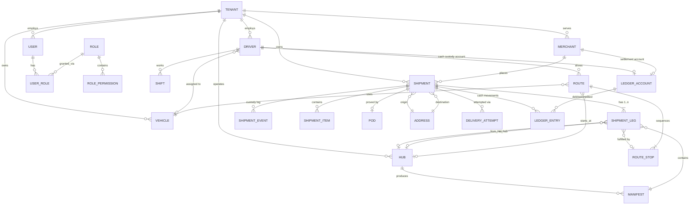
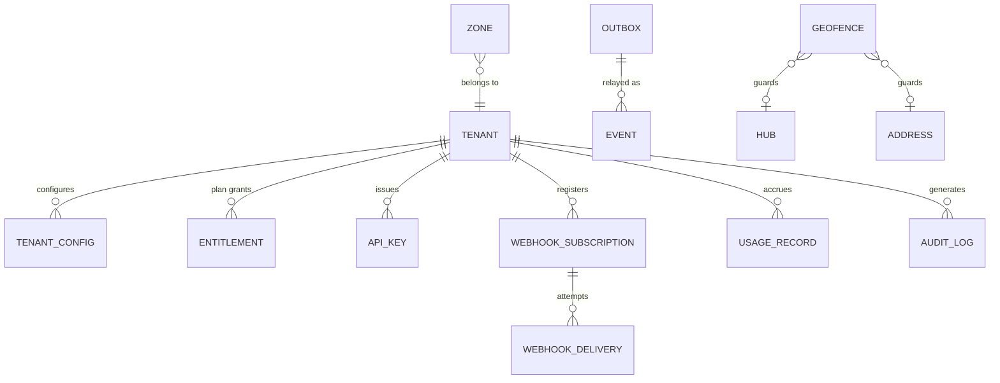

# Database Design

> Covers **Phase 5** — production database architecture.
> Parent: [architecture-blueprint.md](./architecture-blueprint.md) · Stack rationale: [technology-decisions.md](./technology-decisions.md)
> **Status:** DRAFT — awaiting approval. No schema has been created.

---

## 1. Design Principles

1. **One system of record.** PostgreSQL holds every fact the business depends on. Other stores are derived, cacheable, and rebuildable. If a store cannot be rebuilt from PostgreSQL plus the event log, it is a liability.
2. **Custody is an append-only event log; everything else is CRUD.** `shipment_events` is immutable and authoritative; `shipments.status` is a maintained projection. We do **not** event-source the whole system.
3. **Tenant isolation is enforced by the database**, not by the application alone. Every tenant-scoped table has `tenant_id` and a forced RLS policy.
4. **The telemetry plane never shares tables, indexes, or connection pools with the transaction plane.**
5. **Money is integer minor units plus an explicit currency code.** Never floating point, never a bare number.
6. **All timestamps are `TIMESTAMPTZ` stored in UTC.** Every location entity carries an IANA timezone for local-time rendering and delivery-window evaluation.
7. **External identifiers are UUIDv7**; internal joins may use them directly. Sequential integers are never exposed in an API (enumeration risk — see Blueprint §9.5).
8. **Every table carries `created_at`, `updated_at`; soft delete only where business-justified**, with a partial unique index excluding deleted rows.

---

## 2. SQL vs NoSQL — Analysis

| Data class | Characteristics | Store | Why |
|---|---|---|---|
| Shipments, orders, legs | Relational, transactional, queried many ways, legally significant | **PostgreSQL** | ACID, foreign keys, complex joins |
| Custody/scan events | Append-only, high read, moderate write, permanent | **PostgreSQL** (partitioned) | Must be transactionally consistent with the shipment write |
| Money — COD, settlements, payouts | Absolute correctness required, auditable | **PostgreSQL** | Constraints and serialisable isolation; a ledger in an eventually-consistent store is indefensible |
| GPS telemetry | ~10k writes/sec, time-ordered, rarely read individually, aggressively compressible, short-lived at full resolution | **TimescaleDB** | Hypertable partitioning + columnar compression + continuous aggregates |
| Driver presence / last-known position | Sub-ms reads, TTL semantics, disposable | **Valkey** | Postgres cannot serve this rate without becoming the bottleneck; losing it is harmless |
| Distance-matrix cache | Large, computed, disposable, high hit rate | **Valkey** | Pure cache |
| Sessions, rate-limit counters, job queues | Ephemeral, high churn | **Valkey** | Correct tool |
| Full-text shipment/address search, audit investigation | Relevance ranking, faceting, fuzzy matching | **OpenSearch** *(V2)* | Postgres FTS is adequate to ~10M rows; beyond that a search engine is required |
| POD photos, signatures, exports, ML artifacts | Large binaries, write-once, read-rarely | **Object storage** | Blobs never belong in a relational database |
| Tenant custom fields, raw integration payloads | Schema-varying | **PostgreSQL `JSONB`** | Gives document flexibility without a second database |
| Event log (durable, replayable) | Append-only stream, multi-consumer, months of retention | **Redpanda** *(V2)* | See [ADR-004](./architecture-blueprint.md#54-event-driven-architecture--adr-004) |

**MongoDB is not used.** Full rationale in [technology-decisions.md §6.1](./technology-decisions.md#61-why-not-mongodb-as-the-primary-store--explicitly) — briefly: no Row-Level Security equivalent (our primary tenant-isolation control), weaker multi-document transactional ergonomics for a domain where cross-entity transactions are the normal case, and PostGIS has no MongoDB equal for geospatial work. Its one real advantage, schema flexibility, is covered by `JSONB`.

---

## 3. Entity Relationship Model

### 3.1 Core domain

### 3.2 Platform & supporting

---

## 4. Key Table Specifications

Presented as design specifications, not DDL. Types are PostgreSQL.

### 4.1 `shipments` — the central entity

| Column | Type | Notes |
|---|---|---|
| `id` | `UUID` PK | UUIDv7 — time-ordered, index-friendly, safe to expose |
| `tenant_id` | `UUID` NOT NULL | RLS discriminator; leading column of most indexes |
| `reference` | `TEXT` NOT NULL | Human/tracking reference. Unique **per tenant**, never globally |
| `merchant_id` | `UUID` FK | Nullable for tenant-originated shipments |
| `status` | `TEXT` NOT NULL | **Projection** of `shipment_events`, never mutated independently |
| `service_level` | `TEXT` | `express` \| `standard` \| `scheduled` — drives SLA |
| `origin_address_id` / `destination_address_id` | `UUID` FK | |
| `promised_from` / `promised_to` | `TIMESTAMPTZ` | The customer promise; SLA is measured against these |
| `eta_at` | `TIMESTAMPTZ` | Current predicted arrival, refreshed by ML/routing |
| `eta_confidence` | `NUMERIC(4,3)` | Model confidence; drives whether we show a window or a point |
| `weight_grams` / `volume_cm3` | `INTEGER` | Integers, not floats |
| `declared_value_minor` / `currency` | `BIGINT` / `CHAR(3)` | Minor units + ISO 4217 |
| `cod_amount_minor` | `BIGINT` | `0` when not COD. Never a boolean |
| `cod_status` | `TEXT` | `not_applicable` \| `pending` \| `collected` \| `remitted` \| `settled` |
| `attempt_count` | `SMALLINT` | Denormalised for dispatcher filtering |
| `priority` | `SMALLINT` | Solver input |
| `required_skills` | `TEXT[]` | e.g. `{refrigerated, heavy_lift}` |
| `custom_fields` | `JSONB` | Per-tenant extensions; GIN-indexed |
| `created_at` / `updated_at` | `TIMESTAMPTZ` | |

**Constraints:** `UNIQUE (tenant_id, reference)`; `CHECK (cod_amount_minor >= 0)`; `CHECK (promised_to >= promised_from)`.

### 4.2 `shipment_events` — the immutable custody log

**The most important table in the system.** Append-only. No `UPDATE` or `DELETE` grants for the application role.

| Column | Type | Notes |
|---|---|---|
| `id` | `UUID` PK | UUIDv7 |
| `tenant_id` | `UUID` NOT NULL | |
| `shipment_id` | `UUID` NOT NULL FK | |
| `sequence` | `BIGINT` NOT NULL | Monotonic per shipment; resolves same-timestamp ordering |
| `event_type` | `TEXT` NOT NULL | `created`, `assigned`, `picked_up`, `arrived_at_hub`, `sorted`, `out_for_delivery`, `arrived_at_stop`, `delivered`, `failed`, `returned`, `cancelled` |
| `occurred_at` | `TIMESTAMPTZ` NOT NULL | **Device/physical time** — when it actually happened |
| `recorded_at` | `TIMESTAMPTZ` NOT NULL | **Server receipt time** — may be much later for offline events |
| `actor_type` / `actor_id` | `TEXT` / `UUID` | `driver` \| `dispatcher` \| `system` \| `api_client` \| `hub_operator` |
| `location` | `GEOGRAPHY(POINT,4326)` | Where the scan physically occurred — critical for POD fraud detection |
| `location_accuracy_m` | `REAL` | |
| `hub_id` / `driver_id` / `route_id` | `UUID` | Nullable context |
| `reason_code` | `TEXT` | Per-tenant failure taxonomy for `failed`/`returned` |
| `idempotency_key` | `TEXT` | Client-generated; `UNIQUE (tenant_id, idempotency_key)` — makes offline retries safe |
| `metadata` | `JSONB` | Scan device, app version, barcode payload |

**Partitioned by `RANGE (occurred_at)`, monthly.** Constraints: `UNIQUE (shipment_id, sequence)`.

**Why both `occurred_at` and `recorded_at`:** a driver delivers in a basement at 14:02 and the event uploads at 14:47. SLA must be measured against 14:02; fraud detection and debugging need 14:47. Collapsing these into one column loses information that cannot be recovered.

### 4.3 `shipment_legs` — multi-hop journeys

Modelled from MVP even though MVP uses a single leg, because retrofitting is a schema-wide migration (Blueprint risk D8).

| Column | Type | Notes |
|---|---|---|
| `id` / `tenant_id` / `shipment_id` | `UUID` | |
| `leg_number` | `SMALLINT` | 1..n |
| `leg_type` | `TEXT` | `pickup` \| `linehaul` \| `hub_transfer` \| `last_mile` \| `return` |
| `from_hub_id` / `to_hub_id` | `UUID` | Nullable for first/last mile |
| `from_address_id` / `to_address_id` | `UUID` | |
| `status` | `TEXT` | |
| `route_stop_id` | `UUID` | Set when planned into a route |
| `planned_start` / `planned_end` / `actual_start` / `actual_end` | `TIMESTAMPTZ` | Plan-vs-actual is the core analytics input |

### 4.4 `addresses` — quality is infrastructure

| Column | Type | Notes |
|---|---|---|
| `id` / `tenant_id` | `UUID` | |
| `raw_input` | `TEXT` | Exactly what the merchant sent — never overwritten |
| `normalised_line1/2`, `city`, `region`, `postal_code`, `country_code` | `TEXT` | Output of the normalisation pipeline |
| `location` | `GEOGRAPHY(POINT,4326)` | GIST-indexed |
| `geocode_confidence` | `NUMERIC(4,3)` | **Low confidence blocks auto-dispatch and flags for dispatcher review** (Blueprint risk D2) |
| `geocode_source` | `TEXT` | `mapbox` \| `google` \| `manual` \| `driver_corrected` |
| `timezone` | `TEXT` | IANA — required for delivery-window evaluation |
| `access_notes` | `TEXT` | Gate codes, floor, landmark — enormous real-world value |
| `verified_at` | `TIMESTAMPTZ` | Set when a successful delivery confirms the geocode |

**Driver-corrected geocodes are a compounding asset.** When a driver marks "actual location is 80 m from the pin," that correction improves every future delivery to that address. This feedback loop is a genuine long-term moat and must exist from MVP.

### 4.5 `routes` and `route_stops`

| `routes` | Type | Notes |
|---|---|---|
| `id` / `tenant_id` | `UUID` | |
| `driver_id` / `vehicle_id` / `start_hub_id` | `UUID` | |
| `planned_date` | `DATE` | |
| `status` | `TEXT` | `draft` \| `optimizing` \| `published` \| `in_progress` \| `completed` |
| `planned_distance_m` / `planned_duration_s` | `INTEGER` | Metres and seconds — never mixed units |
| `actual_distance_m` / `actual_duration_s` | `INTEGER` | Feeds ETA model training |
| `optimization_job_id` | `UUID` | Traceability to the solver run |
| `polyline` | `GEOGRAPHY(LINESTRING,4326)` | Planned path for map rendering |

| `route_stops` | Type | Notes |
|---|---|---|
| `route_id` / `tenant_id` | `UUID` | |
| `sequence` | `SMALLINT` | Solver output |
| `stop_type` | `TEXT` | `pickup` \| `dropoff` \| `hub` \| `break` |
| `address_id` | `UUID` | |
| `planned_arrival` / `planned_departure` | `TIMESTAMPTZ` | |
| `actual_arrival` / `actual_departure` | `TIMESTAMPTZ` | From geofence transitions |
| `service_duration_s` | `INTEGER` | Learned per location type — a major ETA accuracy factor |
| `locked` | `BOOLEAN` | Prevents re-optimization from reshuffling communicated stops |

### 4.6 `pod` — proof of delivery

| Column | Type | Notes |
|---|---|---|
| `shipment_id` / `tenant_id` | `UUID` | |
| `pod_type` | `TEXT` | `signature` \| `photo` \| `otp` \| `id_check` \| `contactless` |
| `signature_object_key` / `photo_object_keys` | `TEXT` / `TEXT[]` | Object-storage references, never blobs in the row |
| `content_hash` | `TEXT` | SHA-256 of each artifact — tamper evidence |
| `recipient_name` / `recipient_relationship` | `TEXT` | |
| `otp_verified` | `BOOLEAN` | |
| `captured_location` | `GEOGRAPHY(POINT,4326)` | |
| `distance_from_destination_m` | `INTEGER` | **Computed on write; >150 m raises a fraud flag** |
| `captured_at` | `TIMESTAMPTZ` | Device time |
| `device_metadata` | `JSONB` | Model, OS, app version, mock-location flag |

### 4.7 Ledger — double-entry cash custody

The design that separates a real logistics platform from a prototype.

| `ledger_accounts` | Type | Notes |
|---|---|---|
| `id` / `tenant_id` | `UUID` | |
| `account_type` | `TEXT` | `driver_cash` \| `hub_cash` \| `merchant_payable` \| `platform_revenue` \| `bank` \| `customer_receivable` |
| `owner_type` / `owner_id` | `TEXT` / `UUID` | Driver, hub, or merchant |
| `currency` | `CHAR(3)` | One account per currency; never mix |
| `balance_minor` | `BIGINT` | Cached running balance, reconciled against entries |

| `ledger_entries` | Type | Notes |
|---|---|---|
| `id` / `tenant_id` | `UUID` | |
| `transaction_id` | `UUID` | **Groups the two-or-more sides of one transaction** |
| `account_id` | `UUID` | |
| `direction` | `TEXT` | `debit` \| `credit` |
| `amount_minor` / `currency` | `BIGINT` / `CHAR(3)` | |
| `shipment_id` | `UUID` | Nullable link |
| `entry_type` | `TEXT` | `cod_collected` \| `cod_remitted` \| `settlement` \| `adjustment` \| `write_off` |
| `occurred_at` | `TIMESTAMPTZ` | |
| `created_by` | `UUID` | |

**Invariants enforced in-database:**
- Every `transaction_id` group sums to zero per currency (deferred constraint or trigger).
- `ledger_entries` is append-only — corrections are new reversing entries, never updates. Financial records that can be edited are not records.
- `balance_minor` is reconciled by a scheduled job against the sum of entries; drift raises a P1 alert.

Example — driver collects 500.00 MAD COD:
`DEBIT driver_cash 50000` / `CREDIT merchant_payable 50000`.
On hub remittance: `CREDIT driver_cash 50000` / `DEBIT hub_cash 50000`.
"How much cash is in the field right now?" becomes `SUM(balance) WHERE account_type='driver_cash'` — instantly answerable, which is the entire point.

### 4.8 `outbox` — transactional event publication

| Column | Type | Notes |
|---|---|---|
| `id` | `BIGSERIAL` PK | Publication order |
| `event_id` | `UUID` | UUIDv7; consumer idempotency key |
| `tenant_id` | `UUID` NOT NULL | Mandatory ([ADR-004](./architecture-blueprint.md#54-event-driven-architecture--adr-004)) |
| `event_type` / `event_version` | `TEXT` / `SMALLINT` | |
| `aggregate_type` / `aggregate_id` | `TEXT` / `UUID` | Partition key — guarantees per-shipment ordering |
| `correlation_id` / `causation_id` | `UUID` | |
| `payload` | `JSONB` | |
| `occurred_at` / `published_at` | `TIMESTAMPTZ` | `published_at` NULL until relayed |
| `attempts` | `SMALLINT` | |

**Relay claims rows with `SELECT ... FOR UPDATE SKIP LOCKED`** so multiple relay instances scale without coordination. Published rows are archived and pruned after 7 days. **Alert on the age of the oldest unpublished row** — a stalled relay is silent and severe.

### 4.9 `audit_log`

Append-only, no application `UPDATE`/`DELETE` grants. Captures actor, tenant, action, resource type/ID, before/after diff for sensitive fields, IP, user agent, request ID, timestamp. Partitioned monthly. Retained **7 years** for financial-adjacent actions.

---

## 5. Telemetry Design — TimescaleDB

### 5.1 `driver_positions` hypertable

| Column | Type | Notes |
|---|---|---|
| `time` | `TIMESTAMPTZ` NOT NULL | Partitioning dimension |
| `tenant_id` | `UUID` NOT NULL | |
| `driver_id` | `UUID` NOT NULL | Space-partitioning dimension |
| `route_id` | `UUID` | Nullable |
| `location` | `GEOGRAPHY(POINT,4326)` | |
| `speed_mps` / `heading_deg` / `accuracy_m` | `REAL` | |
| `battery_pct` | `SMALLINT` | Fleet-health signal and a driver-support diagnostic |
| `is_moving` | `BOOLEAN` | Device activity recognition |
| `source` | `SMALLINT` | GPS / network / fused — accuracy weighting |

**Configuration:**
- Hypertable chunked at **1 day** (at Tier 3, ~864 M rows/day; smaller chunks keep index maintenance and compression jobs bounded).
- Space partitioning on `driver_id` for parallel writes and driver-scoped query pruning.
- **Columnar compression after 7 days**, segmented by `driver_id`, ordered by `time DESC`. Expected 90–95 % reduction on this data shape.
- Writes arrive via **batched `COPY` from `tracking-gateway`** (flushed every 1 s or 1,000 rows) — never row-at-a-time `INSERT`. This single decision is the difference between 10k/sec working and not.

### 5.2 Continuous aggregates

Precomputed rollups so dashboards and ML never scan raw telemetry:

| Aggregate | Bucket | Contents | Consumers |
|---|---|---|---|
| `driver_activity_5m` | 5 min | distance, moving time, idle time, avg speed, max speed | Driver performance, ML features |
| `route_progress_15m` | 15 min | stops completed, distance vs plan, schedule delta | Dispatcher analytics |
| `zone_traffic_1h` | 1 hour | median segment speed per zone | ETA model traffic feature |
| `fleet_utilisation_1d` | 1 day | active hours, distance, stops per driver | Tenant reporting, billing |

### 5.3 Why the "hot" path does not read this table

Live dispatcher views read **last-known position from Valkey** (`tenant:{id}:driver:{id}:pos`, TTL 90 s), not from TimescaleDB. The hypertable is for history, playback, analytics, and ML training. Confusing these two access patterns is how telemetry stores get overloaded.

---

## 6. Index Strategy

**Governing rule:** every tenant-scoped index leads with `tenant_id`. Query patterns are enumerated first; indexes follow. Unused indexes are removed — each one taxes every write.

### 6.1 Primary indexes

| Table | Index | Serves |
|---|---|---|
| `shipments` | `(tenant_id, status, promised_to)` | Dispatcher board: "open shipments due today" — the single hottest query |
| `shipments` | `(tenant_id, reference)` UNIQUE | Reference lookup |
| `shipments` | `(tenant_id, merchant_id, created_at DESC)` | Merchant portal listing |
| `shipments` | `(tenant_id, cod_status) WHERE cod_amount_minor > 0` | **Partial** — COD reconciliation touches a fraction of rows |
| `shipments` | GIN on `custom_fields` | Tenant custom-field filtering |
| `shipment_events` | `(shipment_id, sequence)` UNIQUE | Custody replay |
| `shipment_events` | `(tenant_id, occurred_at DESC)` | Time-range investigation |
| `shipment_events` | `(tenant_id, idempotency_key)` UNIQUE | Offline retry safety |
| `addresses` | GIST on `location` | Nearest-driver, geofence, zone containment |
| `addresses` | `(tenant_id, country_code, postal_code)` | Zone assignment |
| `route_stops` | `(route_id, sequence)` | Driver manifest ordering |
| `routes` | `(tenant_id, driver_id, planned_date)` | "Today's route for this driver" |
| `ledger_entries` | `(tenant_id, account_id, occurred_at DESC)` | Statement generation |
| `ledger_entries` | `(transaction_id)` | Balanced-transaction verification |
| `outbox` | `(published_at NULLS FIRST, id) WHERE published_at IS NULL` | **Partial** — relay scans only unpublished rows, keeping the index tiny regardless of table size |
| `audit_log` | `(tenant_id, resource_type, resource_id, created_at DESC)` | "What happened to this shipment?" |
| `driver_positions` | Timescale default `(time DESC)` + `(driver_id, time DESC)` | Playback and per-driver history |

### 6.2 Index principles applied

- **Partial indexes wherever a predicate is stable** (`WHERE cod_amount_minor > 0`, `WHERE published_at IS NULL`, `WHERE deleted_at IS NULL`). Dramatically smaller and cheaper to maintain.
- **Covering indexes (`INCLUDE`)** for the dispatcher board's list query, to enable index-only scans on the hottest read path.
- **BRIN, not B-tree**, on append-only time columns of very large tables (`shipment_events.occurred_at`) — orders of magnitude smaller with naturally correlated data.
- **GIST** for all geography columns; **GIN** for `JSONB` and array columns.
- **No index on low-cardinality columns alone** — `status` is only useful as part of a composite led by `tenant_id`.

---

## 7. Partitioning & Scaling Strategy

| Table | Strategy | Trigger |
|---|---|---|
| `driver_positions` | Timescale hypertable, 1-day chunks + compression | From day one |
| `shipment_events` | Declarative `RANGE` by `occurred_at`, monthly | From day one — retrofitting partitioning to a 500 M-row table is a painful migration |
| `audit_log` | `RANGE` by `created_at`, monthly | From day one |
| `webhook_deliveries` | `RANGE` by `created_at`, weekly, aggressive drop | From day one |
| `shipments` | Not partitioned initially | Partition by `RANGE (created_at)` when >100 M rows or when vacuum/index maintenance becomes the constraint. Most queries are recency-biased, so range partitioning prunes well |

**Read scaling:** streaming replicas. Analytics, exports, ML feature extraction, and the optimization service's snapshot reads all go to replicas. Only the transactional path touches the primary.

**Connection scaling:** **PgBouncer in transaction-pooling mode is mandatory.** With 20 `core-api` replicas × a 20-connection pool, PostgreSQL would face 400 connections and collapse under context-switching. Transaction pooling collapses this to a few dozen. *Caveat that must be designed for:* transaction pooling forbids session-level state — which is exactly why tenant context uses `SET LOCAL` inside a transaction rather than `SET`. These two decisions are coupled and cannot be changed independently.

**Write scaling ceiling:** a single well-tuned PostgreSQL primary on modern NVMe handles Tier 3 business writes (~5 M/day ≈ 60/sec average, ~500/sec peak) without difficulty. Sharding is **not** required and is not planned. If it ever becomes necessary, `tenant_id` is the natural shard key — which the schema already supports everywhere.

---

## 8. Multi-Tenancy at the Database Layer

Per Blueprint [§10](./architecture-blueprint.md#10-multi-tenancy-model):

1. `tenant_id UUID NOT NULL` on every tenant-scoped table.
2. **RLS enabled and FORCED** (`FORCE ROW LEVEL SECURITY`), so even the table owner is subject to policy.
3. Policy shape: `USING (tenant_id = current_setting('app.current_tenant_id')::uuid)` with matching `WITH CHECK` on writes — the `WITH CHECK` clause is what prevents a tenant from *writing* rows into another tenant.
4. Application connects as a role **without `BYPASSRLS`**. Migrations use a separate elevated role.
5. Context set via `SET LOCAL` **inside the request transaction** — never `SET`, which leaks across pooled connections.
6. A **migration lint** rejects any new tenant-scoped table lacking `tenant_id NOT NULL` and an RLS policy.
7. An **RLS regression test** asserts that a query with no `app.current_tenant_id` set returns zero rows, not all rows.

---

## 9. Data Retention & Lifecycle

Retention is a **legal, privacy, and cost** decision simultaneously. Driver location is the most sensitive and shortest-lived data we hold.

| Data class | Full resolution | Then | Final disposition | Driver |
|---|---|---|---|---|
| **Raw GPS positions** | **90 days** | Downsample to 1-minute route-snapped polyline + per-stop aggregates | Delete raw at 90 days | GDPR minimisation — this is personal data about workers. Also the dominant storage cost |
| Route polylines & stop aggregates | 2 years | — | Delete | Operational analytics, ETA model training |
| `shipment_events` | 7 years | Move to compressed cold partitions after 1 year | Archive to object storage | Legal proof of delivery; commercial dispute window |
| `shipments` | 7 years | Archive after 2 years | — | Same |
| POD photos/signatures | 2 years hot | Object-storage lifecycle → infrequent-access → glacier | Delete at 7 years | Dispute resolution; storage cost |
| Ledger entries | **10 years** | Never downsampled | Retained | Financial/tax law. **Exempt from GDPR erasure** |
| `audit_log` | 7 years | Cold partitions after 1 year | — | Compliance |
| Customer PII (name, phone, address) | Active + 2 years | Anonymise/tokenise | Cryptographic erasure on request | GDPR. **Note:** the *shipment* record survives in anonymised form so financial history stays intact |
| Notification logs | 90 days | — | Delete | Debugging only |
| `webhook_deliveries` | 30 days | — | Delete | Debugging only |
| `outbox` (published) | 7 days | — | Delete | Already durably consumed |
| ML training datasets | Versioned snapshots, 3 years | — | Delete | Reproducibility |

**GDPR erasure mechanics.** A deletion request cannot simply `DELETE` — financial and custody records carry legal retention obligations. Approach: PII fields are encrypted with a per-data-subject key; erasure destroys the key, rendering PII unrecoverable while leaving the transactional skeleton (amounts, timestamps, status history) intact and auditable. This satisfies both obligations simultaneously and is why envelope encryption appears in the security design.

**Automation:** every policy above is an executed, monitored job — not a documented intention. A retention policy that is never run is a liability that grows daily. Each job reports rows affected to metrics, and a *failure to run* alerts.

---

## 10. Backup, Recovery & Migration

| Concern | Approach |
|---|---|
| Backups | Continuous WAL archiving + nightly base backup (pgBackRest or provider-managed). Point-in-time recovery to any second within the retention window |
| RPO / RTO | Tier 1: 24 h / 8 h · Tier 2: 15 min / 1 h · Tier 3: 5 min / 15 min |
| Restore testing | **Automated monthly restore drill into an isolated environment with row-count and checksum verification.** An untested backup is not a backup |
| Object storage | Versioning enabled + cross-region replication for POD artifacts (legally significant, irreplaceable) |
| Schema migrations | Forward-only, additive-first. Expand → migrate → contract, never a breaking change in one deploy |
| Zero-downtime rules | New columns nullable or defaulted; never rename in place (add, backfill, dual-write, switch reads, drop later); index creation `CONCURRENTLY`; no long-held locks; every migration has a tested rollback or is provably additive |
| Large backfills | Batched with throttling, run off-peak, resumable, monitored for replication lag |
| Migration testing | Every migration runs against a production-shaped dataset in CI (Testcontainers) before merge — not against an empty schema |

---

## 11. Capacity & Performance Targets

| Metric | Tier 1 | Tier 2 | Tier 3 |
|---|---|---|---|
| PostgreSQL primary size | 20 GB | 800 GB | 4 TB |
| TimescaleDB size (post-compression) | 5 GB | 400 GB | 1.5 TB |
| Business writes/sec (peak) | 20 | 200 | 800 |
| Telemetry writes/sec (peak) | 40 | 1,000 | 10,000 |
| Dispatcher board query p99 | <150 ms | <200 ms | <250 ms |
| Shipment detail query p99 | <50 ms | <80 ms | <100 ms |
| Read replicas | 0 | 1 | 3+ |
| PgBouncer | Optional | **Required** | **Required** |

**Standing performance discipline:** every query on a hot path has an `EXPLAIN (ANALYZE, BUFFERS)` plan reviewed before merge. `pg_stat_statements` is enabled from day one, and the top-20 queries by total time are reviewed weekly. Sequential scans on tenant-scoped tables in production are treated as defects.

---

## 12. Open Items

| # | Item | Blocked on |
|---|---|---|
| DB1 | Confirm 90-day raw GPS retention against target-market labour and privacy law | Blueprint Q1 (target region) |
| DB2 | Decide whether multi-currency per tenant is required at MVP | Business input — affects ledger account modelling |
| DB3 | Confirm whether tenant-defined custom fields need to be *queryable/sortable* (drives whether `JSONB` + GIN suffices or a typed EAV projection is needed) | Product input |
| DB4 | Determine whether any target market mandates in-country data residency at launch | Blueprint Q7 |
