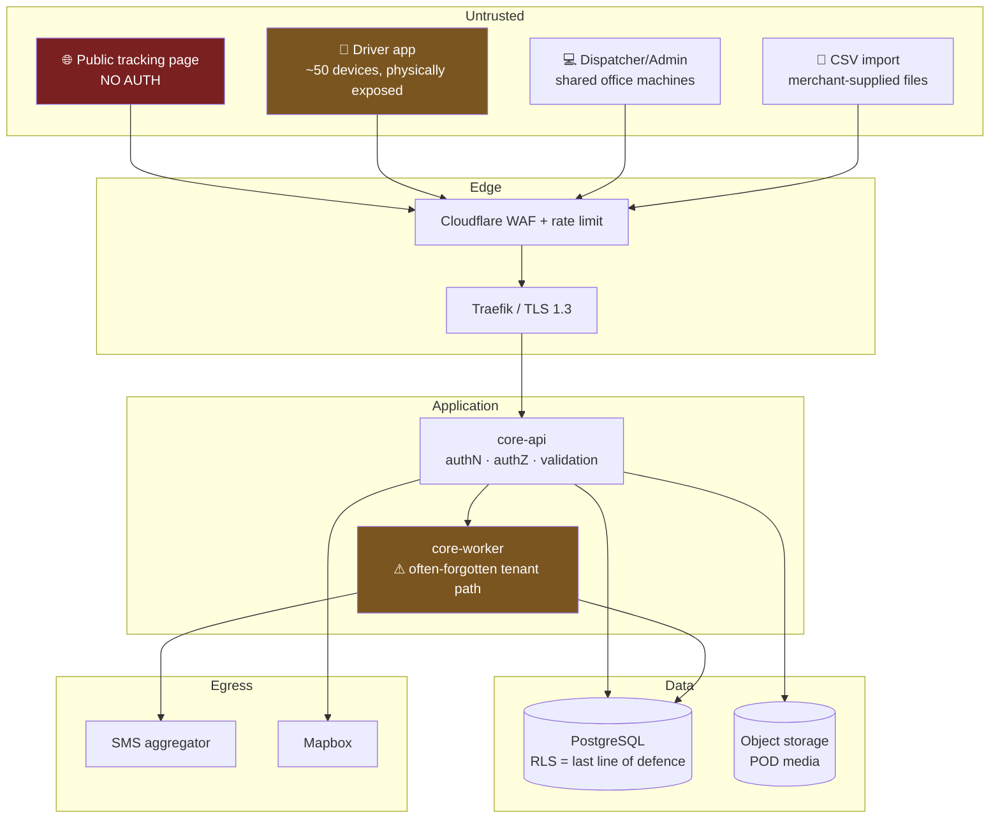

# Security Architecture

> Expands [architecture-blueprint.md §9](./architecture-blueprint.md#9-phase-9--security-architecture) into an implementable specification for the MVP.
> Posture per **Q7**: security-first engineering, **no certification programme yet**, architected so SOC 2 / ISO 27001 can be added without redesign.
> **Status:** DRAFT — awaiting approval.
> **Date:** 2026-07-22

---

## 1. Posture & Scope

| In scope for MVP | Deferred |
|---|---|
| OWASP ASVS **Level 2** engineering practices | Formal certification audit |
| OWASP API Security Top 10 controls | SOC 2 evidence collection |
| Tenant isolation enforced by the database | Penetration test by a third party (schedule post-pilot) |
| Encryption in transit and at rest, envelope encryption for PII | Bug bounty |
| Audit logging, secrets management, dependency scanning | SIEM |
| GDPR-inspired privacy + Tunisian Law 2004-63 (INPDP) | Full DPIA (do a lightweight one) |

**The governing principle:** the controls that are cheap now and ruinously expensive to retrofit are non-negotiable at MVP. Everything else waits. Tenant isolation, audit logging, and PII encryption are in the first category. A SIEM is not.

---

## 2. Threat Model

### 2.1 Assets, ranked by loss severity

| Rank | Asset | Threat | Impact if lost |
|---|---|---|---|
| 1 | **Cross-tenant data boundary** | Courier A reads Courier B's shipments, customers, or pricing | **Business-ending.** In a SaaS serving competitors, one leak ends the company |
| 2 | **COD cash** | Driver theft, insider ledger manipulation, remittance fraud | Direct financial loss; with cash-in-field routinely in the tens of thousands of TND |
| 3 | **Customer PII** (name, phone, address) | Bulk exfiltration via API enumeration | Regulatory exposure, reputational loss. Tunisian addresses + phones are highly identifying |
| 4 | **Driver location history** | Unauthorised access; off-shift tracking | Privacy violation against workers; regulatory exposure |
| 5 | **POD records** | Forgery to claim false delivery | Chargebacks, unwinnable disputes, legal liability |
| 6 | **Tracking links** | Enumeration exposing recipient details | PII leak at scale — a common real-world breach vector in this industry |
| 7 | **Driver credentials** | Account takeover → fraudulent deliveries | Parcel theft, safety risk |

### 2.2 Attack surface



**Highest-risk entry points, in order:**

1. **Public tracking page** — unauthenticated, internet-facing, returns PII. The most-attacked surface in every delivery platform.
2. **Driver app** — runs on physically accessible, possibly rooted Android devices in the field. Assume the client is hostile: **every rule it enforces must be re-enforced server-side.**
3. **Background workers** — the tenant-isolation path developers most often forget to test, because the HTTP path is the one with obvious tests.
4. **CSV import** — merchant-supplied files: formula injection, zip bombs, malformed encodings, and 500k-row denial of service.

---

## 3. Authentication

| Actor | Mechanism | Token TTL |
|---|---|---|
| Dispatcher / Admin / Finance | Email + password (**Argon2id**, `m=64MiB, t=3, p=4`) | Access 10 min · Refresh 30 days, rotating |
| **Owner / Finance** | Above **plus mandatory TOTP MFA** | Same |
| Driver | Phone + 6-digit OTP, device-bound | Access 60 min · Refresh 90 days, device-bound |
| Customer | **No account.** HMAC tracking token in URL | 30 days, single shipment |
| Platform Admin | Password + **mandatory MFA** + IP allowlist | Access 10 min |

### 3.1 Rules

- **Refresh-token rotation with reuse detection.** A refresh token is single-use; presenting a used token invalidates the entire family and forces re-authentication. This is what turns a stolen token into a detected incident rather than persistent access.
- **Refresh tokens live in `HttpOnly; Secure; SameSite=Strict` cookies** for web. Never in `localStorage` — that is XSS-readable.
- **Uniform failure response and timing** for "unknown email" vs "wrong password" vs "disabled account". Anything else is an enumeration oracle.
- **Account lockout:** exponential backoff after 5 failures, capped at 15 minutes. Locking out permanently is itself a denial-of-service vector.
- **OTP:** 6 digits, 5-minute expiry, single-use, max 3 verification attempts, 60-second resend cooldown, rate-limited per phone **and** per IP. `POST /auth/driver/otp/request` returns `202` regardless of whether the phone exists.
- **Driver device binding:** refresh token is bound to `deviceId`. Presenting it from a different device revokes and alerts. A driver changing phones re-authenticates by OTP — mildly inconvenient, and it stops a stolen token working from an attacker's device.
- **Password reset:** single-use token, 30-minute expiry, invalidates all sessions on use, notifies the previous email.

### 3.2 Tracking tokens — the highest-exposure credential

```
token = base64url(shipmentId_uuidv7) + "." + base64url(HMAC-SHA256(shipmentId + expiryTs, serverSecret))
```

- Unguessable, server-verified, **expiring**, scoped to exactly one shipment.
- **Not derived from `trackingNumber`** — the tracking number appears on printed labels and in merchant emails, so it must not itself grant access.
- Revocable per shipment; all tokens revocable per tenant via secret rotation.
- Rate-limited harder than any authenticated endpoint.

---

## 4. Authorization

### 4.1 Three layers, evaluated in order

1. **Tenant isolation** (§5) — structural, database-enforced. Cannot be bypassed by application bugs.
2. **Role → permission** — what this role may do at all.
3. **Resource scope** — which specific records within the tenant.

### 4.2 Permission catalogue and role matrix

Permissions are `resource:action` verbs. Roles are bundles. MVP has a **fixed** role set; custom roles are V2.

| Permission | Owner | Dispatcher | Hub Op | Finance | Driver |
|---|:--:|:--:|:--:|:--:|:--:|
| `shipment:read` | ✅ | ✅ | ✅ hub | ✅ | own |
| `shipment:create` `:update` | ✅ | ✅ | ❌ | ❌ | ❌ |
| `shipment:assign` | ✅ | ✅ | ❌ | ❌ | ❌ |
| `shipment:cancel` | ✅ | ✅ | ❌ | ❌ | ❌ |
| `shipment:override_status` | ✅ audited | ➖ audited | ❌ | ❌ | ❌ |
| `shipment:deliver` `:fail` | ❌ | ❌ | ❌ | ❌ | ✅ own |
| `route:read` | ✅ | ✅ | ✅ hub | ➖ | own |
| `route:create` `:publish` | ✅ | ✅ | ❌ | ❌ | ❌ |
| `driver:read` | ✅ | ✅ | ✅ hub | ➖ | self |
| `driver:location:read_live` | ✅ | ✅ | ✅ hub | ❌ | ❌ |
| **`driver:location:read_history`** | ✅ audited | ➖ audited | ❌ | ❌ | **self only** |
| `manifest:*` | ✅ | ➖ read | ✅ | ❌ | ➖ own |
| **`cod:read_amount`** | ✅ | **❌** | ➖ own hub | ✅ | own |
| `cod:collect` | ❌ | ❌ | ❌ | ❌ | ✅ |
| `cod:remit_receive` | ✅ | ❌ | ✅ | ✅ | ❌ |
| `ledger:read` | ✅ | ❌ | ➖ own hub | ✅ | own |
| `ledger:adjust` | ✅ audited | ❌ | ❌ | ✅ audited | ❌ |
| `settlement:approve` | ✅ | ❌ | ❌ | ✅ | ❌ |
| `user:manage` `:role_assign` | ✅ | ❌ | ❌ | ❌ | ❌ |
| `feature:manage` | ✅ | ❌ | ❌ | ❌ | ❌ |
| `pii:export` | ✅ audited | ❌ | ❌ | ➖ audited | ❌ |

✅ granted · ➖ limited/audited · ❌ denied

**Two deliberate decisions worth defending:**

- **Dispatchers cannot see COD amounts.** They do not need them to dispatch, and it shrinks the blast radius of a compromised dispatcher account — the most numerous and least-hardened account type.
- **Finance is read-only on operations.** Separation of duties: the person reconciling cash must not be able to alter delivery status to conceal a discrepancy.

### 4.3 Object-level authorization (OWASP API1 / BOLA)

**The single most common real breach in logistics APIs.** Sequential shipment IDs are routinely enumerable in this industry.

- **UUIDv7 external identifiers everywhere.** No sequential integers exposed, ever.
- **Ownership verified after retrieval, on every single resource fetch** — never inferred from the fact that a valid token was presented.
- A driver may act only on shipments on their **own currently active route**. Checked per request against route state, not cached in the token.
- **`404`, not `403`, for another tenant's resource.** `403` confirms existence and is an enumeration oracle.

### 4.4 Field-level authorization

Response shaping by role is part of the API contract ([05-api-contracts §3](./05-api-contracts.md#3-shipments)), not a UI concern:
- `codAmountMinor` **omitted from the payload** for roles lacking `cod:read_amount`.
- `recipientPhone` omitted from list responses (present in detail views only) — a list endpoint is a bulk-extraction tool.
- Driver PII (national ID, licence) never returned to Dispatcher.

### 4.5 Mass assignment (OWASP API6)

Explicit DTO allow-lists with `strict` schema mode — unknown properties are **rejected**, not stripped and not merged. `Object.assign(entity, body)` is banned by lint rule. Without this, a driver could `PATCH` their own `cashAccountId`.

---

## 5. Tenant Isolation — The Critical Control

The one failure that cannot be recovered from. Therefore it is enforced **structurally**, at the database, not by application discipline.

### 5.1 Implementation

```
Request → JWT validated → tenantId extracted FROM TOKEN CLAIM ONLY
        → AsyncLocalStorage TenantContext set
        → Transaction opened
        → SET LOCAL app.current_tenant_id = '<uuid>'   ← inside the transaction
        → Query executes under FORCED RLS
        → Transaction commits; SET LOCAL discarded automatically
```

| Requirement | Detail |
|---|---|
| Every tenant-scoped table | `tenant_id UUID NOT NULL` |
| RLS | `ENABLE` **and `FORCE ROW LEVEL SECURITY`** — so even the table owner is subject to policy |
| Policy | `USING (tenant_id = current_setting('app.current_tenant_id')::uuid)` **plus a matching `WITH CHECK`** — the `WITH CHECK` is what prevents *writing* rows into another tenant |
| Application role | **No `BYPASSRLS`.** Migrations use a separate elevated role |
| Context | **`SET LOCAL`, never `SET`** |

### 5.2 Why `SET LOCAL` is non-negotiable

We use PgBouncer in transaction-pooling mode ([06-database-design §7](./06-database-design.md#7-partitioning--scaling-strategy)). A connection is returned to the pool after **every transaction**. A session-scoped `SET` would persist on that connection and be inherited by **the next tenant's query**.

**`SET` here is a cross-tenant data leak with no error message.** It is scoped to a single transaction interceptor that no developer bypasses, and the pooling mode and the context mechanism are a coupled pair that cannot be changed independently.

### 5.3 Isolation across every layer

| Layer | Mechanism | Failure mode if omitted |
|---|---|---|
| HTTP | Tenant from token claim; a client `X-Tenant-Id` header is **rejected outright** | Trivial impersonation |
| Application | `AsyncLocalStorage` — no manual `tenantId` threading through signatures | Developers forget; leaks appear in least-tested paths |
| Database | Forced RLS + `SET LOCAL` | The catastrophic case |
| Cache (Valkey) | Every key namespaced `tenant:{uuid}:...`; un-namespaced keys banned by lint | Wrong tenant's cached data served — often invisible in testing |
| **Job queue** | `tenantId` in every payload; worker re-establishes context before executing | **The most common real gap** — HTTP is tested, workers frequently are not |
| Events | `tenantId` mandatory in the envelope | Consumer cannot scope its writes; corruption spreads |
| Object storage | Key prefix `tenant/{uuid}/`; presigned URLs scoped to that prefix | POD photos exposed across tenants |
| Logs / traces | `tenantId` as a structured field — **never a Prometheus label** | Cardinality explosion takes down metrics before the app |

### 5.4 Verification — a blocking CI gate

Isolation is verified mechanically, because review cannot catch what it cannot see:

1. **Cross-tenant test suite:** authenticate as Tenant A; attempt read, update, delete on **every** Tenant B resource type across **every** endpoint. Any `2xx` fails the build.
2. **Worker and event-consumer paths included** — not just HTTP.
3. **RLS regression test:** a query issued with no `app.current_tenant_id` set must return **zero rows**, not all rows.
4. **Migration lint:** any new tenant-scoped table without `tenant_id NOT NULL` and an RLS policy fails CI.
5. **Adversarial seed data:** staging always holds two tenants with deliberately colliding tracking numbers and identical customer names, so ID-confusion bugs surface in testing rather than production.

---

## 6. Data Protection

### 6.1 PII classification

| Class | Data | At rest | Retention |
|---|---|---|---|
| **Critical** | Driver national ID, licence number, bank details, MFA secrets | **Envelope-encrypted**, per-tenant DEK | Employment + legal minimum |
| **High** | Recipient name, phone, exact address; POD photos and signatures | Envelope-encrypted (phone, national ID); volume encryption for media | 2 years hot, 7 years archived |
| **Medium** | Driver location history | Volume encryption | **90 days at full resolution** |
| **Low** | Shipment status, timestamps, aggregate metrics | Volume encryption | 7 years |

### 6.2 Encryption

- **In transit:** TLS 1.3 only, HSTS with preload, **certificate pinning in the Android app** for the API domain.
- **At rest:** managed volume encryption on database and object storage.
- **Application-level envelope encryption** for Critical and selected High fields: per-tenant Data Encryption Keys wrapped by a KMS master key.

**Why envelope encryption specifically:** it makes **cryptographic erasure** possible. A GDPR/INPDP deletion request cannot simply `DELETE` — financial and custody records carry legal retention obligations. Destroying the per-subject key renders PII unrecoverable while leaving the transactional skeleton (amounts, timestamps, status history) intact and auditable. This satisfies both obligations at once and is why it is designed in from the start rather than added later.

### 6.3 Secrets

| Rule | Detail |
|---|---|
| Storage | Cloud secrets manager, injected at runtime |
| Never | In repos, images, build args, or committed `.env` files |
| Local dev | `.env` (gitignored), **non-production values only** |
| Scanning | **gitleaks in pre-commit and CI, blocking** |
| Rotation | Signing keys 90 days · database credentials 180 days · API keys on demand · **immediately on any suspected exposure** |
| Key hierarchy | KMS master → per-tenant DEK → field encryption |

---

## 7. API & Transport Security

| Control | Implementation |
|---|---|
| Rate limiting | Multi-tier: per-IP (Cloudflare) + per-token + per-tenant + per-endpoint. Token bucket in Valkey |
| Stricter tiers | `/auth/*`, `/track/*`, and list/search endpoints — the credential-attack and bulk-extraction surfaces |
| Input validation | Zod at the boundary, `strict` mode, unknown properties rejected |
| SQL injection | Parameterised queries exclusively; string-concatenated SQL banned by lint |
| Payload limits | 1 MB body default · bulk arrays capped at 1,000 · JSON depth limited · CSV row cap with streaming parse |
| Output encoding | Context-aware escaping; strict CSP; `X-Content-Type-Options: nosniff` |
| CSRF | `SameSite=Strict` cookies + double-submit token for cookie-authenticated browser flows. Bearer-token API paths are not cookie-authenticated and are not CSRF-exposed |
| CORS | Explicit origin allowlist. **No wildcard with credentials** |
| Security headers | HSTS, CSP, `X-Frame-Options: DENY`, `Referrer-Policy: strict-origin-when-cross-origin`, `Permissions-Policy` |
| Error hygiene | No stack traces, SQL, or internal structure in responses. `requestId` is the only correlation handle given to clients |

### 7.1 File upload (POD media)

Presigned direct-to-storage upload; the API never proxies binaries.

Content-type allowlist (`image/jpeg`, `image/png`) · **magic-byte verification server-side after upload** (never trust the declared type) · size cap 10 MB · **EXIF stripped** (capture location is stored in the POD row, not left embedded in a file that may be shared) · served from a **separate origin domain with no ambient credentials** · malware scan before the artifact is marked available.

### 7.2 CSV import

Merchant-supplied files are untrusted input: streaming parse with a row cap · **formula-injection neutralisation** (cells beginning `=`, `+`, `-`, `@` are prefixed on export and never evaluated on import) · encoding validation (Arabic/French content means UTF-8 and Windows-1256 both appear in practice) · per-tenant concurrency limit so one import cannot starve interactive traffic.

### 7.3 Egress / SSRF

Relevant even at MVP, because the geocoding client and future webhooks make outbound requests: deny RFC1918, loopback, link-local, and **cloud metadata addresses** · DNS-rebinding-safe resolution (resolve → validate the resolved IP → connect to that IP) · timeouts and circuit breakers on every third-party call · outbound allowlist.

---

## 8. Android App Security

**Assume the device is hostile.** Drivers' phones are physically exposed, sometimes rooted, and sometimes shared.

| Control | Detail |
|---|---|
| Token storage | Android Keystore–backed encrypted storage. **Never** `SharedPreferences` in plaintext |
| Offline queue | Encrypted local database — it holds recipient PII and COD amounts |
| Certificate pinning | Pin the API domain; fail closed on mismatch |
| Root / tamper detection | Detect and **report** (a signal), do not hard-block — false positives strand legitimate drivers mid-route |
| Mock location | Detected and recorded in `deviceMetadata`; feeds the `MOCK_LOCATION` fraud rule |
| Screenshot prevention | On COD and PII screens |
| Debug protections | No debuggable release builds; obfuscation enabled; logging stripped from release |
| Session | Server-revocable; remote wipe of the local queue on device revocation |
| **Server-side re-enforcement** | **Every client-side rule is re-checked server-side.** The app enforcing "cannot deliver without POD" is a UX affordance; the server rejecting it is the control |

---

## 9. Domain-Specific Fraud Controls

Generic security checklists miss these entirely, and in a COD market they carry the highest direct financial impact. Rules only — no ML.

| Rule | Detection | Response |
|---|---|---|
| `POD_LOCATION_MISMATCH` | POD captured >150 m from the destination geocode | Flag for review |
| **`NO_ATTEMPT_TRACE`** | `CUSTOMER_UNAVAILABLE` failure with **no GPS trace within 200 m** of the address | Flag — **highest-value single rule in the suite** |
| `IMPOSSIBLE_SPEED` | Position jump implying >200 km/h | Flag |
| `MOCK_LOCATION` | Android mock-location provider active | Flag |
| `COD_VARIANCE` | Remittance counted ≠ expected | Flag + require reason |
| `RAPID_COMPLETIONS` | >N stops completed within M minutes | Flag |
| `OFF_SHIFT_ACTIVITY` | Any shipment event outside an open shift | **Reject** the event |
| `EXCESSIVE_CASH_HOLD` | Driver holding COD beyond the tenant's remittance SLA | Alert finance |

**Operating discipline:** these **score for human review and never auto-suspend a driver**. A false positive costs someone their livelihood. Every flag carries its evidence — the GPS trace, the POD photo, the timeline — so an investigator can judge rather than guess.

---

## 10. Audit Logging

Append-only `audit_log`; `UPDATE`/`DELETE` grants revoked from the application role and enforced by trigger.

**Mandatory events:** authentication (success and failure), permission and role changes, feature-flag changes, **shipment status overrides**, **all ledger adjustments**, remittance confirmations with variance, settlement approvals, PII exports, tracking-token issuance in bulk, tenant lifecycle changes, and every Platform Admin action.

**Each record captures:** actor (user/driver/system/API client), tenant, action, resource type and ID, **before/after diff for sensitive fields**, IP, user agent, `requestId`, timestamp.

Partitioned monthly. **Retained 7 years** for financial-adjacent actions. Platform Admin access to a tenant is additionally **notified to the tenant owner** — support access without the customer's knowledge is a trust failure, whatever the contract permits.

---

## 11. Privacy

### 11.1 Legal basis (Tunisia + GDPR-aligned)

| Processing | Basis |
|---|---|
| Shipment and delivery data | Contract performance |
| **Driver location during shift** | **Legitimate interest, with explicit written notice to the driver** |
| Customer notifications | Contract performance |
| Fraud detection | Legitimate interest |

**Tunisia:** Law 2004-63 and the INPDP apply to personal data processed locally. Obligations are lighter than GDPR, but our GDPR-inspired design satisfies them. 🟥 **MVP-O3: confirm INPDP registration obligations before the pilot.**

### 11.2 The controls that matter most

1. **Data minimisation on location.** Collected **only during an open shift** — enforced in the app *and* rejected server-side. This is the single most important privacy control in a delivery platform, and the one most often violated by competitors.
2. **90-day raw GPS retention**, then downsampled to route polylines and per-stop aggregates. Both a privacy control and the dominant storage cost.
3. **Driver access to their own data** — a driver can see their own location history and metrics, and has a documented dispute path.
4. **No off-shift monitoring of any kind.** Not a setting; not implementable.
5. **Right of access / erasure** — self-serve export; erasure via cryptographic key destruction, with financial and custody records retained as a documented legal exemption.
6. **Sub-processor register** with DPAs: cloud provider, Mapbox, SMS aggregator.

---

## 12. OWASP Mapping

| API Top 10 | Control | Section |
|---|---|---|
| API1 Broken Object Level Authorization | UUIDv7, post-fetch ownership check, `404` not `403` | §4.3 |
| API2 Broken Authentication | Argon2id, MFA, rotation with reuse detection, device binding | §3 |
| API3 Broken Object Property Level Authorization | Field-level response shaping; strict DTO allowlists | §4.4, §4.5 |
| API4 Unrestricted Resource Consumption | Multi-tier rate limits, payload/row caps, per-tenant concurrency | §7 |
| API5 Broken Function Level Authorization | Permission catalogue; guards on every route | §4.2 |
| API6 Unrestricted Access to Sensitive Business Flows | COD/POD/remittance-specific controls, separation of duties | §9, §4.2 |
| API7 SSRF | Egress allowlist, rebinding-safe resolution | §7.3 |
| API8 Security Misconfiguration | IaC, hardened images, security headers, CI gates | §13, [09-infrastructure](./09-infrastructure.md) |
| API9 Improper Inventory Management | OpenAPI as source of truth, per-tenant version usage tracking | [05-api-contracts §12](./05-api-contracts.md#12-contract-governance) |
| API10 Unsafe Consumption of Third-Party APIs | Timeouts, circuit breakers, response validation on Mapbox/SMS | §7.3 |

---

## 13. Security in CI/CD

| Gate | Tool | Blocking |
|---|---|---|
| Secret scanning | gitleaks (pre-commit + CI) | ✅ |
| Dependency vulnerabilities | `npm audit` / OSV | ✅ on HIGH+ |
| Container scan | Trivy | ✅ on HIGH/CRITICAL |
| SAST | Semgrep with custom rules | ✅ |
| **Cross-tenant isolation suite** | Custom | ✅ **the most important gate in the pipeline** |
| RLS regression | Custom | ✅ |
| Migration lint (`tenant_id` + RLS present) | Custom | ✅ |
| Lint: no literal `tenantId` branching (I17) | ESLint | ✅ |
| Lint: no `Object.assign` onto entities | ESLint | ✅ |
| Lint: no un-namespaced cache keys | ESLint | ✅ |
| SBOM generation | Syft | — |

**Custom Semgrep rules worth writing early:** raw SQL string concatenation · `SET` instead of `SET LOCAL` for tenant context · direct `shipments.status` writes bypassing the event log · money arithmetic on floats · PII fields in log statements.

---

## 14. Incident Response

| Severity | Definition | Response |
|---|---|---|
| **P0** | Cross-tenant data exposure · credential compromise · ledger corruption | Immediate: contain, revoke, preserve evidence, assess notification duty |
| **P1** | Single-tenant data exposure · suspected COD fraud in progress | Same day |
| **P2** | Vulnerability found, not exploited | Patch within 7 days |

**Prerequisites, written before launch — not during the first incident:**
- Runbooks: revoke all sessions · rotate all secrets · restore from PITR · disable a tenant · revoke a driver device.
- **Breach notification process:** 72-hour clock, decision tree for INPDP and GDPR duty, pre-drafted customer communication.
- **Evidence preservation:** audit logs and object storage are in a **separate account** from production, so a compromised production account cannot destroy the forensic trail.
- Quarterly game day exercising one of these paths in staging.

---

## 15. Open Items

| # | Item | Blocked on |
|---|---|---|
| SEC1 | Confirm INPDP registration and notification obligations | MVP-O3 / legal |
| SEC2 | Schedule third-party penetration test after pilot, before scale-up | Budget |
| SEC3 | Confirm driver location-tracking notice wording in Arabic and French, and how consent is recorded | Legal + MVP-O4 |
| SEC4 | Decide whether Platform Admin impersonation is permitted at all, or read-only with tenant approval | Product |
| SEC5 | Confirm whether POD photos containing bystanders require additional handling | Legal |
| SEC6 | Lightweight DPIA for driver location processing | Before pilot |
