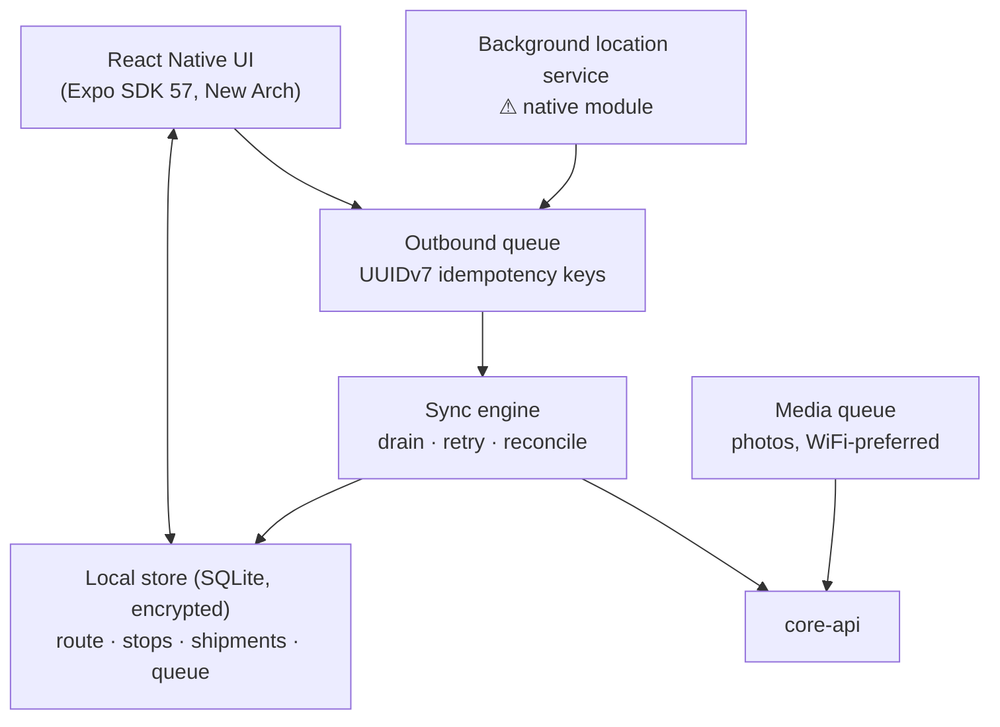

# Frontend Architecture & Wireframes

> Four applications, their architecture, and low-fidelity wireframes for workflow validation. **These are deliberately ugly** — they exist to validate flow, not to look good.
> Depends on: [05-api-contracts.md](./05-api-contracts.md), [01-mvp-scope.md](./01-mvp-scope.md)
> **Status:** DRAFT — awaiting approval.
> **Date:** 2026-07-22

---

## 1. Application Inventory

| App | Users | Tech | Rendering | Priority |
|---|---|---|---|---|
| **Dispatcher Dashboard** | Dispatchers, Owner | Next.js 16, React 19 | Client-heavy SPA | **P0 — largest build** |
| **Admin Console** | Owner, Finance, Hub Op | Next.js 16 (same app, role-routed) | SSR + client | P0 |
| **Customer Tracking** | Public, unauthenticated | Next.js 16 (route handler, **no React**) | **Server-rendered HTML, 0 KB JS** | P0 |
| **Driver App** | Drivers | React Native / Expo SDK 57, Android | Native, offline-first | **P0 — highest risk** |

**Dispatcher and Admin are one Next.js application** with role-based routing, not two deployments. They share auth, layout, design system, and API client; splitting them would double the build for no benefit at this scale.

---

## 2. Shared Foundations

```
apps/
├── web/                 # Dispatcher + Admin (Next.js)
├── track/               # Public tracking (Next.js, separate deploy — separate risk surface)
└── driver/              # React Native / Expo
packages/
├── api-client/          # Generated from OpenAPI — single source of types
├── ui/                  # Design system primitives (web)
├── i18n/                # Translation catalogues, shared across all apps
└── domain-types/        # Shared enums: ShipmentStatus, FailureReason, PodType
```

**`packages/api-client` is generated from the OpenAPI spec in CI.** A backend contract change that breaks the frontend fails the build rather than production. This is the concrete payoff of freezing [05-api-contracts.md](./05-api-contracts.md) before controllers.

**`track/` is deployed separately** from `web/` deliberately — it is unauthenticated and internet-facing ([07-security §2.2](./07-security-architecture.md#22-attack-surface)). Separate deploy means separate CSP, separate rate limits, and a bug in the dispatcher bundle cannot affect it.

### 2.1 State management

| Kind of state | Tool | Rule |
|---|---|---|
| Server data | **TanStack Query** | Never copied into a global store. Caching, invalidation, refetch are its job |
| Real-time positions | Zustand store fed by WebSocket | Ephemeral, high-frequency, never persisted |
| UI state (filters, panels, selection) | Zustand + URL search params | Filters live in the URL so a dispatcher can share a view |
| Forms | React Hook Form + Zod | Same Zod schemas as the API — one definition of valid |

---

## 3. Internationalisation & RTL

**This is P0 and structural, not polish.** Retrofitting RTL to a dispatcher board full of maps, tables, and timelines is effectively a rewrite ([01-mvp-scope §7.3](./01-mvp-scope.md#73-language--layout)).

| Concern | Approach |
|---|---|
| Languages | **Arabic (RTL)**, French, English. French dominates Tunisian business use; Arabic is essential for drivers and customers |
| Direction | `dir` attribute on `<html>`, driven by locale. **All layout uses CSS logical properties** — `margin-inline-start`, never `margin-left` |
| Tailwind | Logical-property utilities (`ms-4`, `pe-2`), never directional (`ml-4`, `pr-2`). **Enforced by an ESLint rule** — this is the single discipline that makes RTL work |
| Icons | Directional icons (arrows, chevrons, progress) mirror under RTL; non-directional (search, trash) do not |
| Maps | Map canvas **does not mirror** — geography is not directional. Only the surrounding chrome flips |
| Numbers | Stored and computed in Western Arabic numerals. Arabic-Indic display is a **user preference**, not a locale default |
| Dates/times | Rendered in the **hub's** timezone, not the browser's. A dispatcher in Tunis viewing a Sfax hub sees Sfax local time, labelled |
| **Money** | **Always formatted from `currencyExponent`** returned by the API. `12500` + exponent `3` → `12,500 د.ت`. Never hardcode 2 decimals |
| Translation keys | Namespaced by module; missing key in production renders the key, never blank |
| Pluralisation | ICU MessageFormat — **Arabic has six plural forms**, and naive `n === 1 ? x : y` is wrong in Arabic for most values |

**Testing rule:** every screen is reviewed in Arabic RTL before it is considered done. A screen only ever tested in French will break in Arabic, and it will be found by a customer.

---

## 4. Dispatcher Dashboard

### 4.1 Architecture

The product's centre of gravity — dispatchers live here 8 hours a day. **If it is slower than the spreadsheet it replaces, the product fails regardless of backend quality.**

| Concern | Decision |
|---|---|
| Map | **MapLibre GL** (BSD) with Mapbox tiles. **WebGL markers, not DOM** — DOM markers die past ~500 pins; we need 2,000+ |
| Live positions | WebSocket, **one coalesced frame per second**, client interpolates between points for smooth 60 fps motion |
| Viewport subscription | Only drivers in the current bounding box plus explicitly watched entities |
| Shipment list | **Virtualised** (TanStack Virtual). A 10,000-row list must not mount 10,000 nodes |
| Assignment | **Optimistic UI with rollback.** Drag-to-assign updates instantly; a server rejection reverts with a toast |
| Refresh | Push, not poll. Poll only as a reconnect fallback |
| Selection sync | Selecting in the list highlights on the map and vice versa — one selection model, two views |

### 4.2 Wireframe — main dispatch board

```
┌───────────────────────────────────────────────────────────────────────────────────────────┐
│ ⬢ COURIER TN   [Dispatch] Hubs  Finance  Admin              🔔3   FR ▾   Amina B. ▾       │
├──────────────────────────────┬────────────────────────────────────────────────────────────┤
│ FILTERS                      │  ┌──────────────────────────────────────────────────────┐  │
│ Date  [23/07/2026    ▾]      │  │                                        [Map] [List]  │  │
│ Hub   [Tunis-01      ▾]      │  │                                                      │  │
│ Status[Unassigned ✓  ▾]      │  │        ▲Karim(7)                                     │  │
│ ☐ Needs review only (4)      │  │              ●●●                                     │  │
│ ──────────────────────────── │  │           ●     ▲Sonia(12)                           │  │
│ UNASSIGNED            41 ⚠   │  │        ●    ●●                                       │  │
│ ┌──────────────────────────┐ │  │      ▲Mehdi(3)      ●  ●                             │  │
│ │⚠ CTN-8K3M-92XQ           │ │  │         ●        ●                                   │  │
│ │  Sonia Gharbi            │ │  │                ●  ● ●                                │  │
│ │  Ariana · 12.500 TND COD │ │  │           ●                                          │  │
│ │  ⚠ Geocode 0.72 — review │ │  │      ▲ driver   ● stop   ⚠ needs review              │  │
│ ├──────────────────────────┤ │  └──────────────────────────────────────────────────────┘  │
│ │  CTN-4P1L-77AB           │ │  ROUTES TODAY                                              │
│ │  Ahmed Belhaj            │ │  ┌──────────────────────────────────────────────────────┐  │
│ │  Ariana · No COD         │ │  │ R-014 Karim T.  ████████░░░░░░  7/38  ⏱ +12m  ⚠     │  │
│ ├──────────────────────────┤ │  │ R-015 Sonia M.  ████████████░░ 12/31  ⏱ on time     │  │
│ │  CTN-2Z9K-31CD           │ │  │ R-016 Mehdi K.  ███░░░░░░░░░░░  3/29  ⏱ +34m  ⚠⚠   │  │
│ │  Fatma Nasri             │ │  │ R-017 (draft)   — unassigned — 41 stops   [Optimize] │  │
│ │  Ben Arous · 45.000 TND  │ │  └──────────────────────────────────────────────────────┘  │
│ └──────────────────────────┘ │  EXCEPTIONS                                          3 ⚠   │
│ [Select all] [→ Assign to…]  │  • Mehdi K. offline 22 min — 14 stops remaining           │
│                              │  • Manifest MF-TUN01-0231 — 2 parcels missing             │
│                              │  • CTN-9X2M — POD 340 m from address                      │
└──────────────────────────────┴────────────────────────────────────────────────────────────┘
```

**What this layout is asserting:**
- **Exceptions are always visible**, never behind a tab. A dispatcher's job is handling what went wrong; burying it means it is not handled.
- **Route progress bars with schedule delta** (`+34m ⚠⚠`) let one glance find the problem route among twelve.
- **`⚠ Geocode 0.72 — review`** surfaces address quality *in the work queue*, not in a settings screen. This is the MENA address problem made operational.
- COD amount is shown to Owner but **hidden for Dispatcher** ([07-security §4.2](./07-security-architecture.md#42-permission-catalogue-and-role-matrix)); the wireframe shows the Owner view.

### 4.3 Wireframe — assignment drawer

```
┌─────────────────────────────────────────────────────────┐
│ ASSIGN 3 SHIPMENTS                                  [✕] │
├─────────────────────────────────────────────────────────┤
│ Selected: CTN-8K3M-92XQ, CTN-4P1L-77AB, CTN-2Z9K-31CD   │
│ Total: 3 parcels · 4.2 kg · 57.500 TND COD              │
│ ─────────────────────────────────────────────────────── │
│ SUGGESTED DRIVERS                                       │
│ ┌─────────────────────────────────────────────────────┐ │
│ │ ◉ Karim Trabelsi   R-014                            │ │
│ │   +8 min detour · 38→41 stops · cap 41/60 ✓         │ │
│ │   Zone: Ariana ✓ familiar                           │ │
│ ├─────────────────────────────────────────────────────┤ │
│ │ ○ Sonia Mansour    R-015                            │ │
│ │   +23 min detour · 31→34 stops · cap 34/45 ✓        │ │
│ ├─────────────────────────────────────────────────────┤ │
│ │ ○ Mehdi Karray     R-016   ⚠ offline 22 min         │ │
│ │   +11 min detour · cap 29/40 ✓                      │ │
│ └─────────────────────────────────────────────────────┘ │
│ ○ New route…                                            │
│                                                         │
│                       [Cancel]  [Assign to Karim ▸]     │
└─────────────────────────────────────────────────────────┘
```

**Notes.** Suggestions are **explained, not scored** — "+8 min detour, zone familiar" is actionable; "score 0.87" is not. A dispatcher who does not understand a suggestion overrides it, and then the feature is dead weight.

---

## 5. Shipment Detail Screen

```
┌────────────────────────────────────────────────────────────────────────────┐
│ ← Shipments    CTN-8K3M-92XQ                    [Reassign] [Cancel] [⋮]    │
├────────────────────────────────────────────────────────────────────────────┤
│  ● OUT FOR DELIVERY          ETA 14:10–14:40    Promised by 17:00 ✓        │
├──────────────────────────────────┬─────────────────────────────────────────┤
│ RECIPIENT                        │ CUSTODY TIMELINE                        │
│ Sonia Gharbi                     │                                         │
│ +216 20 987 654      [📞 Call]   │ ● CREATED          22/07 09:14          │
│ +216 98 111 222 (alt)            │ │  API · Boutique Farah                 │
│                                  │ │                                       │
│ Rue de la Liberté                │ ● ASSIGNED         23/07 07:02          │
│ Immeuble Yasmine, Apt 4B         │ │  Amina B. → Karim T. · R-014 #7       │
│ Ariana 2080                      │ │                                       │
│ ⚠ Geocode confidence 0.72        │ ● PICKED UP        23/07 08:31          │
│   [Review on map]                │ │  Karim T. · Tunis                     │
│                                  │ │  ⓘ synced 09:04 (offline 33 min)      │
│ 📝 Derrière la pharmacie,        │ │                                       │
│    2ème étage, sonner 2 fois     │ ● OUT FOR DELIVERY 23/07 13:05          │
│ ──────────────────────────────── │ │  Ariana                               │
│ SHIPMENT                         │ │                                       │
│ Merchant   Boutique Farah        │ ○ ARRIVING SOON…                        │
│ Service    Standard              │                                         │
│ Parcels    1 · 1.2 kg            │                                         │
│ COD        12.500 TND  PENDING   │                                         │
│ Attempts   0 of 3                │                                         │
│ ──────────────────────────────── │                                         │
│ ASSIGNED TO                      │                                         │
│ Karim Trabelsi · R-014 · stop 7  │                                         │
│ 123 TU 4567                      │                                         │
│ [Track on map]                   │                                         │
└──────────────────────────────────┴─────────────────────────────────────────┘
```

**Notes.**
- **`ⓘ synced 09:04 (offline 33 min)`** makes the `occurredAt` / `recordedAt` distinction visible to support staff. Without it, "why does the log say 08:31 when I saw it at 09:04?" becomes a recurring support ticket.
- **Access notes are prominent**, not buried — in Tunisia they are frequently what makes the delivery succeed.
- **Call button is first-class.** Phone is the real addressing mechanism in this market.

---

## 6. COD Reconciliation Screen

The screen that either catches cash shrinkage or does not.

```
┌───────────────────────────────────────────────────────────────────────────────┐
│ ← Finance   CASH RECONCILIATION            Hub: Tunis-01   Date: 23/07/2026   │
├───────────────────────────────────────────────────────────────────────────────┤
│  CASH IN FIELD                        TODAY                                   │
│  ┌─────────────────────┐  ┌─────────────────────┐  ┌────────────────────────┐ │
│  │  4,820.000 TND      │  │  Collected          │  │  Remitted              │ │
│  │  across 12 drivers  │  │  1,240.500 TND      │  │    754.000 TND         │ │
│  │  ⚠ 2 overdue        │  │  87 shipments       │  │    5 remittances       │ │
│  └─────────────────────┘  └─────────────────────┘  └────────────────────────┘ │
├───────────────────────────────────────────────────────────────────────────────┤
│ PENDING REMITTANCES                                                           │
│ ┌───────────────────────────────────────────────────────────────────────────┐ │
│ │ Driver          Expected      Declared      Counted     Variance   Status │ │
│ ├───────────────────────────────────────────────────────────────────────────┤ │
│ │ Karim Trabelsi   486.500       486.500       [______]      —     SUBMITTED│ │
│ │   27 shipments · shift ended 18:05                          [Count cash ▸]│ │
│ ├───────────────────────────────────────────────────────────────────────────┤ │
│ │ Sonia Mansour    312.000       312.000       312.000       0.000  ✓ CONF. │ │
│ │   19 shipments · confirmed 18:22 by Hub Op                                │ │
│ ├───────────────────────────────────────────────────────────────────────────┤ │
│ │ Mehdi Karray     540.000       539.500       539.500     ⚠ -0.500 DISPUTED│ │
│ │   31 shipments · reason: SHORT_DRIVER_ACKNOWLEDGED                        │ │
│ │   ⚠ 3rd variance in 30 days · total -2.750 TND        [Review flag ▸]     │ │
│ ├───────────────────────────────────────────────────────────────────────────┤ │
│ │ Nabil Ayari      298.000          —            —           —      OVERDUE │ │
│ │   14 shipments · shift ended 16:40 · 2h 15m ago      [Contact driver ▸]   │ │
│ └───────────────────────────────────────────────────────────────────────────┘ │
│                                                          [Export ▾] [Close day]│
└───────────────────────────────────────────────────────────────────────────────┘
```

**This layout is the financial control, and every column earns its place:**
- **Expected · Declared · Counted are three separate columns.** Collapsing them destroys the ability to distinguish a driver's arithmetic error from a hub miscount from theft ([02-domain-model §3.13](./02-domain-model.md#313-codremittance)).
- **`-0.500`** on a 3-decimal currency is **half a dinar**, not fifty. Formatting reads `currencyExponent` from the API.
- **Historical variance context inline** (`3rd variance in 30 days · total -2.750`) — one variance is a rounding error, three is a pattern. The screen shows the pattern without requiring a report.
- **`Close day` is blocked** while any remittance is `SUBMITTED` or `OVERDUE`.

---

## 7. Customer Tracking Page

Server-rendered, unauthenticated, must load fast on a poor mobile connection.

```
┌──────────────────────────────┐
│  Courier TN                  │
│  ────────────────────────────│
│  CTN-8K3M-92XQ               │
│                              │
│   🚚  En cours de livraison  │
│                              │
│   Arrivée estimée            │
│   ┌────────────────────────┐ │
│   │   14:10 – 14:40        │ │
│   └────────────────────────┘ │
│                              │
│  ────────────────────────────│
│  ● Commande créée            │
│  │  22 juil. 09:14 · Tunis   │
│  │                           │
│  ● Colis collecté            │
│  │  23 juil. 08:31 · Tunis   │
│  │                           │
│  ● En cours de livraison     │
│  │  23 juil. 13:05 · Ariana  │
│  │                           │
│  ○ Livré                     │
│  ────────────────────────────│
│  Destinataire  Sonia         │
│  Ville         Ariana        │
│  Adresse       Rue de la     │
│                Liberté,      │
│                Imm. Y••••••  │
│  À payer       12,500 TND    │
│                💵 Espèces     │
│  ────────────────────────────│
│  ⚠ Préparez le montant       │
│    exact si possible         │
│  ────────────────────────────│
│  Besoin d'aide ?             │
│  📞 +216 71 000 000          │
│                              │
│      [ AR ]  [ FR ]  [ EN ]  │
└──────────────────────────────┘
```

**Notes — this is the most exposed surface in the system:**
- **First name only. Masked address. No phone number. No driver identity. No live map.** Anyone with the link sees this ([07-security §2.2](./07-security-architecture.md#22-attack-surface)).
- **"Préparez le montant exact"** is a small COD-market touch that measurably reduces failed deliveries from `INSUFFICIENT_CASH`.
- Language switcher is visible, not buried — the recipient's language is unknown.
- 🟥 Open: whether to show live driver position at all (AC1 / H4). Currently **no**.

---

## 8. Driver App (Android)

### 8.1 Architecture — offline-first, not offline-tolerant



| Concern | Decision |
|---|---|
| Source of truth | **Local database.** The UI never blocks on the network |
| Queue | Every action gets a client-generated UUIDv7 idempotency key. Retries are always safe |
| Media | Photos queue **separately** and upload opportunistically on WiFi. **A delivery completes without waiting for the photo** |
| Conflicts | Server state machine wins. Per-item sync results with an explicit `action` (`DISCARD_AND_REFRESH` / `RETRY_LATER` / `ESCALATE`) — never all-or-nothing |
| Location | Native background module behind an interface, so it can be replaced with Kotlin without touching the app ([technology-decisions §5.3](./technology-decisions.md#53-the-background-location-risk--stated-plainly)) |
| Feature flags | Received at login and on sync. **A non-COD tenant's driver never sees a cash screen at all** — not a disabled one |
| Language | Arabic and French, RTL-aware |
| Security | Keystore-backed tokens, encrypted local DB, screenshot prevention on COD screens |

### 8.2 Wireframe — route list (the driver's home)

```
┌──────────────────────────┐
│ ☰  R-014      🔋74% ●سنك │   ● = synced   ⟳ = pending
├──────────────────────────┤
│ ████████░░░░░░  7 / 38   │
│ Cash: 87.500 TND         │
├──────────────────────────┤
│ ▸ NEXT STOP              │
│ ┌──────────────────────┐ │
│ │ 7  Sonia Gharbi      │ │
│ │    Rue de la Liberté │ │
│ │    Imm. Yasmine 4B   │ │
│ │    Ariana            │ │
│ │                      │ │
│ │ 💰 12.500 TND COD    │ │
│ │ 📝 Derrière la       │ │
│ │    pharmacie, 2ème   │ │
│ │                      │ │
│ │ [📞 Appeler]         │ │
│ │ [🧭 Naviguer]        │ │
│ │ [▸ Ouvrir le stop]   │ │
│ └──────────────────────┘ │
├──────────────────────────┤
│  8  Ahmed Belhaj      ›  │
│     Ariana · pas de COD  │
│  9  Fatma Nasri       ›  │
│     Ben Arous · 45.000   │
│ 10  Youssef Amri      ›  │
│     Ben Arous · 8.000    │
├──────────────────────────┤
│ ✓ 6  Livré  13:58        │
│ ✕ 5  Échec  13:31 ⟳      │
└──────────────────────────┘
```

**Notes.** Running cash total is always on screen — a driver must know what they are carrying. `⟳` marks unsynced items so a driver can see the queue drain rather than wondering. Call and Navigate are reachable **without opening the stop**, because that is what drivers actually do first.

### 8.3 Wireframe — delivery capture

```
┌──────────────────────────┐   ┌──────────────────────────┐
│ ← Stop 7      Sonia G.   │   │ ← Preuve de livraison    │
├──────────────────────────┤   ├──────────────────────────┤
│ 📦 CTN-8K3M-92XQ         │   │ Reçu par                 │
│    1 colis · 1.2 kg      │   │ ┌──────────────────────┐ │
│ 💰 12.500 TND            │   │ │ Sonia Gharbi         │ │
│                          │   │ └──────────────────────┘ │
│ [📷 Scanner le code]     │   │ Lien                     │
│                          │   │ (•) Elle-même            │
│ ──────────────────────── │   │ ( ) Famille              │
│ Que s'est-il passé ?     │   │ ( ) Voisin               │
│                          │   │ ( ) Gardien              │
│ ┌──────────────────────┐ │   │ ──────────────────────── │
│ │  ✓  LIVRÉ            │ │   │ Signature                │
│ └──────────────────────┘ │   │ ┌──────────────────────┐ │
│ ┌──────────────────────┐ │   │ │                      │ │
│ │  ✕  ÉCHEC            │ │   │ │    ~Sonia G.~        │ │
│ └──────────────────────┘ │   │ │                      │ │
│                          │   │ └──────────────────────┘ │
│                          │   │ [Effacer]                │
│                          │   │ ──────────────────────── │
│                          │   │ 💰 ESPÈCES À COLLECTER   │
│                          │   │      12.500 TND          │
│                          │   │ ┌──────────────────────┐ │
│                          │   │ │ ☑ Montant reçu       │ │
│                          │   │ └──────────────────────┘ │
│                          │   │                          │
│                          │   │ [ ✓ CONFIRMER ]          │
└──────────────────────────┘   └──────────────────────────┘
```

**Notes.**
- **Target is ≤6 taps** for delivery + POD + COD ([01-mvp-scope §9.1](./01-mvp-scope.md#91-product--is-it-actually-usable)). A driver does this 60 times a day; two extra taps is two extra minutes per route.
- **The COD block is only rendered when `COD_ENABLED` and the shipment has an amount.** Feature flags reaching all the way into the driver UI.
- Confirming works fully offline; the queue drains later.

### 8.4 Wireframe — failure capture

```
┌──────────────────────────┐
│ ← Échec de livraison     │
├──────────────────────────┤
│ Raison                   │
│ ( ) Client absent        │
│ ( ) Client a refusé      │
│ (•) Fonds insuffisants   │
│ ( ) Adresse incorrecte   │
│ ( ) Téléphone injoignable│
│ ( ) Accès refusé         │
│ ──────────────────────── │
│ Note (optionnel)         │
│ ┌──────────────────────┐ │
│ │ Client n'avait que   │ │
│ │ 8 TND                │ │
│ └──────────────────────┘ │
│ ──────────────────────── │
│ [📷 Photo (optionnel)]   │
│ ──────────────────────── │
│ ⓘ 2 tentatives restantes │
│   Prochaine: demain 08:00│
│                          │
│ [ ENREGISTRER L'ÉCHEC ]  │
└──────────────────────────┘
```

**Notes.** Reasons come from `GET /v1/config/failure-reasons` — **tenant-configured data, not a hardcoded enum**. A new reason is a config change, not an app release. The app shows the consequence (`2 tentatives restantes`) before the driver commits, so the choice is informed.

---

## 9. Performance Budgets

| App | Metric | Budget |
|---|---|---|
| Dispatcher | First meaningful paint | <2 s |
| Dispatcher | Map with 2,000 markers | 60 fps pan/zoom |
| Dispatcher | Assignment perceived latency | <300 ms (optimistic) |
| Dispatcher | Shipment list, 10,000 rows | Virtualised, <100 ms filter |
| Dispatcher | WebSocket → marker move | <2 s p99 |
| Tracking page | LCP on 3G | **<2.5 s** — measured: one 2.1 KB request, no subresources |
| Tracking page | JS bundle | **<100 KB gzipped** — measured: **0 KB** |
| Driver app | Cold start | <3 s |
| Driver app | Stop list scroll | 60 fps |
| Driver app | Delivery confirm (offline) | **<200 ms to local commit** |
| Driver app | **Battery during shift** | **<6 %/hour** |
| Driver app | APK size | <40 MB |

The tracking page budget is strict because it loads on whatever phone and connection a recipient happens to have, once, and a slow load means a support call.

**How the JS budget is met: the tracking page is a Next ROUTE HANDLER, not a React page.** Built as a server component it still shipped 136 KB of gzipped client runtime — React and the App Router hydration, sent to hydrate a document with no interactivity at all. Returning a `Response` of rendered HTML skips React entirely: the whole page, CSS inlined, is 2.1 KB gzipped in a single request with no scripts, no stylesheet link and no font.

Next still earns its place — routing, the security headers, and a separate deployable with its own CSP and rate limits. It simply is not asked to hydrate a page that has nothing to hydrate. The other three apps are genuinely interactive and keep React.

The same reasoning as the printed delivery documents (docs/01 §4.2 #2.14): server-rendered HTML is the right medium for a document, and the CSS is inlined because a linked stylesheet is a second round-trip before the page can paint.

---

## 10. Accessibility

WCAG 2.2 AA target. Contrast ≥4.5:1 · full keyboard navigation on the dispatcher board (power users prefer it) · visible focus indicators · screen-reader labels in all three languages · **status never conveyed by colour alone** (icon + text, since colour-blind dispatchers exist and red/green route states are the primary signal) · touch targets ≥48 dp in the driver app, used one-handed, outdoors, in sunlight, sometimes in gloves.

---

## 11. Testing

| Layer | Approach |
|---|---|
| Unit | Vitest + Testing Library |
| Contract | Generated API types — a backend change breaks the build |
| Visual | Storybook + snapshots, **rendered in both LTR and RTL** |
| E2E web | Playwright: create → assign → publish → deliver → reconcile |
| E2E mobile | Detox: **airplane-mode delivery → reconnect → sync**, the flow that matters most |
| Manual | Every screen reviewed in Arabic RTL before done |
| Device matrix | 1 low-end Android (2 GB RAM), 1 mid-range, **1 aggressive-OEM handset (Xiaomi/Huawei)** |

---

## 12. Open Items

| # | Item | Blocked on |
|---|---|---|
| FE1 | Validate the dispatch board layout with a real dispatcher | MVP-O4 |
| FE2 | Confirm default UI language per pilot tenant (Arabic or French) | MVP-O5 |
| FE3 | Decide whether to show live driver position on the tracking page | AC1 / H4 |
| FE4 | Confirm Google Maps vs Waze for navigation hand-off | MVP-O6 |
| FE5 | Decide whether dispatchers need an offline mode (currently no) | Product |
| FE6 | Confirm Arabic-Indic numeral preference is wanted, or Western only | MVP-O4 |
