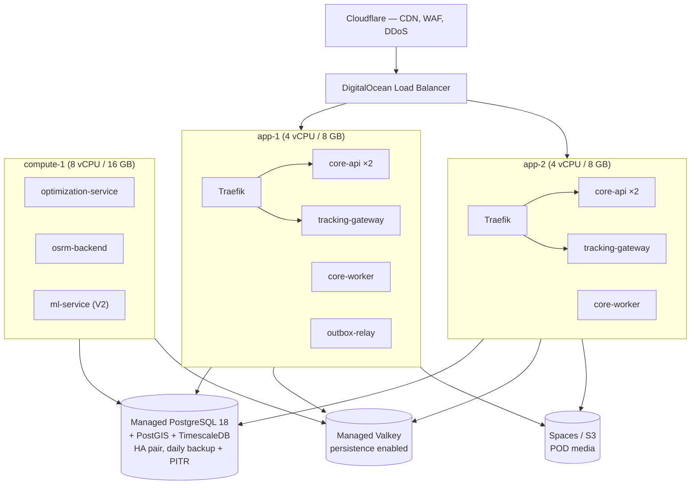

# Infrastructure & DevOps Plan

> Covers **Phase 10** — containers, orchestration, CI/CD, observability, backup, disaster recovery, cloud selection.
> Parent: [architecture-blueprint.md](./architecture-blueprint.md)
> **Status:** DRAFT — awaiting approval.

---

## 1. Guiding Principle

**Infrastructure complexity is deferred until a measured threshold demands it.** Every deferral below has an explicit numeric trigger, so the decision to advance is evidence-driven rather than aspirational.

| Capability | MVP | Adopt when |
|---|---|---|
| Kubernetes | ❌ Docker Compose on VMs | >8 services/replicas to coordinate, OR autoscaling becomes a daily operational need, OR the team exceeds ~8 engineers |
| Kafka / Redpanda | ❌ Valkey Streams | >2,000 events/sec sustained, OR >24 h replay needed, OR a third independent consumer group appears |
| MQTT broker | ❌ Batched HTTPS | >2,000 concurrent drivers, OR measured battery/bandwidth complaints |
| Service mesh | ❌ | Never at current trajectory; revisit past ~15 engineers |
| Multi-region | ❌ Single region | First EU/regulated enterprise contract requiring residency |
| Read replicas | ❌ Single primary | Read load >60 % of primary capacity, OR analytics queries affect transactional p99 |
| OpenSearch | ❌ Postgres FTS | >10 M shipments, OR dispatcher search p99 >500 ms |
| Feature store | ❌ SQL + `ml_features` table | Measured train/serve skew, OR ≥5 models sharing features |

---

## 2. Cloud Provider Analysis

| Provider | Strengths | Weaknesses | Relative cost | Verdict |
|---|---|---|---|---|
| **AWS** | Deepest managed-service catalogue (RDS, ElastiCache/Valkey, MSK, EKS, S3, KMS); best compliance posture (SOC 2, ISO, HIPAA BAAs); most regions for residency; largest hiring pool; enterprise buyers trust it | Most expensive; egress pricing is punitive; complexity tax on a small team | 3.0× | **✅ Target from V2** |
| **Google Cloud** | Best Kubernetes (GKE Autopilot is genuinely excellent); strong data/ML tooling; good networking | Smaller enterprise-logistics footprint; some managed services less mature; product deprecation reputation | 2.7× | ⚠️ Strong alternative, especially if the team is Kubernetes-forward |
| **Azure** | Best if the customer base is Microsoft-centric enterprise; strong EU compliance story | Weakest developer experience of the big three for this stack | 2.9× | ❌ Unless enterprise sales demand it |
| **DigitalOcean** | Excellent price/performance; managed PostgreSQL and Valkey; App Platform and DOKS are simple; predictable flat pricing | Fewer regions; thinner managed-service catalogue; no equivalent of KMS/MSK depth | 1.4× | **✅ Recommended for MVP** |
| **Hetzner** | Cheapest by a wide margin — dedicated hardware at cloud-VM prices; excellent EU presence and GDPR posture | Managed services are minimal (you operate PostgreSQL yourself); EU/US only; less enterprise credibility | **1.0× (baseline)** | ⚠️ Compelling if cost dominates and you have ops capability |
| **Render** | Very simple deploys, managed Postgres/Valkey, good DX | Limited control; scaling costs rise steeply; not suited to OSRM's memory profile | 2.2× | ❌ Outgrown too quickly |
| **Railway** | Best DX of any option; excellent for prototypes | Not positioned for production logistics workloads at scale; limited compliance story | 2.0× | ❌ |

### Recommendation

**MVP on DigitalOcean; migrate to AWS at V2 when enterprise requirements arrive.**

Reasoning:
- At Tier 1, managed-service depth is not the constraint — engineering velocity is. DigitalOcean's managed PostgreSQL and Valkey cover our needs at roughly half the AWS cost with a fraction of the configuration surface.
- **The migration is genuinely low-risk because we containerise everything from day one and depend on no proprietary services.** PostgreSQL, Valkey, and S3-compatible object storage exist identically on both. There is no Lambda, no DynamoDB, no proprietary queue to rewrite.
- AWS becomes correct when we need KMS-backed per-tenant encryption at scale, MSK, multi-region residency, and the compliance artifacts enterprise buyers request. Those arrive with the first enterprise contract — not before.

**If the answer to Blueprint Q5 is "minimise time-to-market above all,"** start on AWS directly and accept ~2× infrastructure cost. **If it is "minimise burn,"** Hetzner with self-managed PostgreSQL is defensible but requires genuine ops capability — it is a real trade, not a free lunch.

**Deliberately avoided in all cases:** provider-proprietary compute (Lambda, Cloud Run as the primary runtime), proprietary databases (DynamoDB, Firestore), and proprietary queues (SQS as the event backbone). Each would convert a provider migration from a weekend into a quarter.

---

## 3. Container Strategy

Every service ships as a Docker image built identically for every environment.

| Service | Base image | Build approach | Approx. size |
|---|---|---|---|
| `core-api` / `core-worker` | `node:24-alpine` | Multi-stage: build with dev deps → runtime with production deps only | ~180 MB |
| `tracking-gateway` | `gcr.io/distroless/static` | Multi-stage from `golang:1.26`; static binary | ~15 MB |
| `optimization-service` | `debian-slim` | Go binary + OSRM/VROOM native libs | ~250 MB |
| `ml-service` | `python:3.14-slim` | Multi-stage; wheels pre-built | ~600 MB |
| `osrm-backend` | Official OSRM image | Preprocessed regional graphs mounted as a volume | Varies by region |

**Standards applied to every image:**
- Multi-stage builds; no build toolchain in the runtime layer.
- **Non-root user**, read-only root filesystem, no shell in production images where the base allows.
- Pinned base image **by digest**, not by tag — a tag is mutable and silently changes what you deploy.
- No secrets in images or build args; injected at runtime only.
- `HEALTHCHECK` defined; `/health` (liveness) and `/ready` (readiness, checks dependencies) on every service.
- Trivy scan in CI; **build fails on HIGH/CRITICAL** with a documented, time-boxed exception process.
- SBOM generated and stored per build.
- Images tagged with the git SHA; `latest` is never deployed.

**`core-api` and `core-worker` are the same image with different entrypoints** — one build, one test suite, no drift between the API and the background workers.

---

## 4. Orchestration

### 4.1 MVP — Docker Compose on VMs

Rationale: two application VMs give redundancy and rolling deploys; the compute VM isolates OSRM's large memory footprint and the solver's CPU burn from the API path. Databases are managed — **we do not operate PostgreSQL by hand at MVP.** Total: 3 VMs plus two managed data services.

### 4.2 V2 — Kubernetes

Adopted when a trigger in §1 fires. Target **Kubernetes 1.35 or 1.36** (1.36.2 is current as of 2026-06-09; 1.34 reaches EOL 2026-10-27 — we deliberately target N-1 for ecosystem stability).

- Managed control plane (EKS/DOKS) — never self-managed.
- Separate node pools: `general` (core-api, workers), `compute` (optimization, OSRM — memory-optimised), `ml` (inference).
- HPA on `core-api` (CPU + request rate), `tracking-gateway` (connection count via custom metric), `optimization-service` (queue depth via KEDA).
- PodDisruptionBudgets, resource requests/limits on everything, anti-affinity across zones.
- **The container images do not change between §4.1 and §4.2.** Only the orchestrator does — this is the entire point of containerising from day one.

**Why not Kubernetes at MVP:** it would consume an estimated 3–4 engineer-weeks of setup plus ongoing operational attention, to solve autoscaling and self-healing problems that do not exist at 5,000 shipments/day. That is roughly 20 % of the MVP budget spent on infrastructure the product cannot yet use.

---

## 5. Environments

| Environment | Purpose | Data | Infrastructure |
|---|---|---|---|
| **Local** | Development | Seeded synthetic; Testcontainers for tests | Docker Compose, full stack on a laptop |
| **CI** | Automated testing | Ephemeral, per-run | Testcontainers (real PostgreSQL — RLS policies cannot be tested against a mock) |
| **Staging** | Pre-production verification | Anonymised production-shaped data; **always ≥2 tenants with deliberately colliding references** | Same topology as production, smaller |
| **Production** | Live | Real | Per §4 |
| **Sandbox** | Customer/partner integration testing | Seeded demo tenant with simulated driver movement | Shares staging infrastructure, isolated tenant |

**A full-stack local environment is a hard requirement.** If an engineer cannot run the entire platform on a laptop, iteration speed collapses and the multi-language choice becomes genuinely painful rather than merely a trade-off.

---

## 6. CI/CD

```mermaid
flowchart LR
    PR["Pull Request"] --> L["Lint + typecheck<br/>+ module boundary rules"]
    L --> U["Unit tests"]
    U --> I["Integration tests<br/>(Testcontainers + real PG)"]
    I --> X["Cross-tenant isolation suite"]
    X --> SEC["gitleaks + Trivy + SAST<br/>+ dependency audit"]
    SEC --> SPEC["OpenAPI + proto<br/>breaking-change diff"]
    SPEC --> B["Build images<br/>tag = git SHA"]
    B --> STG["Auto-deploy staging"]
    STG --> E2E["E2E smoke + migration<br/>rehearsal on prod-shaped data"]
    E2E --> APP{"Manual approval"}
    APP --> PROD["Rolling deploy production"]
    PROD --> V["Health verify<br/>auto-rollback on failure"]
```

| Gate | Rule |
|---|---|
| Module boundaries | Cross-module internal imports fail the build (protects ADR-001) |
| Test coverage | Ratchet — coverage may not decrease. No arbitrary global target |
| **Cross-tenant isolation suite** | **Mandatory, blocking.** Authenticate as Tenant A, attempt every operation on Tenant B's resources across HTTP *and* worker/consumer paths. Any success fails the build |
| Secret scanning | gitleaks, blocking, pre-commit and CI |
| Container scan | Trivy; HIGH/CRITICAL blocks |
| API contract | OpenAPI and `.proto` breaking-change detection without a version bump blocks |
| Migration rehearsal | Every migration runs against a production-shaped dataset in CI |
| Production deploy | Manual approval at MVP; automated once change-failure rate justifies it |

**Deployment strategy:** rolling updates with health gates; automatic rollback on failed health checks. Database migrations are **expand → migrate → contract**, deployed separately from and ahead of the code that requires them, so any deploy can roll back without a schema rollback.

**Infrastructure as Code:** Terraform for all cloud resources from day one — including MVP. Click-ops infrastructure cannot be reproduced, reviewed, or disaster-recovered. State in remote backend with locking.

---

## 7. Observability

Non-negotiable, because [ADR-004](./architecture-blueprint.md#54-event-driven-architecture--adr-004)'s asynchronous fan-out is **undebuggable without distributed tracing**. This is a functional requirement of the architecture, not an operational nicety.

| Pillar | Tooling | Standard |
|---|---|---|
| **Tracing** | OpenTelemetry → Grafana Tempo (or Datadog/Honeycomb) | Every request carries a `request_id`; every event carries `correlation_id` and `causation_id`. **A trace must follow one user action from the HTTP request through the outbox, the relay, and every downstream consumer** |
| **Metrics** | Prometheus + Grafana | RED (rate/errors/duration) per endpoint; USE (utilisation/saturation/errors) per resource; plus the domain metrics below |
| **Logs** | Structured JSON → Loki (or provider) | Mandatory fields: `timestamp`, `level`, `service`, `request_id`, `correlation_id`, `tenant_id`, `message`. **Automatic PII redaction layer** |
| **Errors** | Sentry | Source-mapped, release-tagged, per-tenant grouping. Mobile crash reporting included |
| **Uptime** | External synthetic checks | From multiple regions, including the public tracking page |

### Domain metrics that matter more than CPU

| Metric | Why | Alert |
|---|---|---|
| Oldest unpublished outbox row age | A stalled relay is silent and severe | >60 s = P1 |
| Event consumer lag per group | Primary health signal of the event system | >5 min = P2 |
| DLQ depth per consumer | Poison messages | >0 = P2 |
| GPS ingest rate vs expected (per tenant) | A drop means drivers lost tracking — invisible in system metrics | −40 % vs 7-day baseline = P2 |
| Drivers online vs drivers on shift | Detects app crashes and battery-kill in the field | >10 % gap = P2 |
| Optimization fallback-invocation rate | The solver is silently degrading route quality | >5 % = P2 |
| ML prediction fallback rate | Models are down or degraded | >10 % = P3 |
| Shipments past promised window, unresolved | Direct business health | Threshold per tenant |
| COD cash-in-field total | Financial exposure | Threshold per tenant |
| Failed webhook deliveries per tenant | Tenant integration broken | >20 % failure = P2 |

**Metric cardinality discipline:** `tenant_id` appears in logs and trace attributes, **never as a Prometheus label**. At 1,000 tenants it would multiply every series by 1,000 and take down the metrics backend first. Per-tenant aggregates are computed in the analytics store.

### SLOs

| Service | SLO | Error budget |
|---|---|---|
| `core-api` availability | 99.9 % | 43 min/month |
| `core-api` p99 latency | <300 ms | — |
| `tracking-gateway` ingest availability | 99.95 % | 22 min/month |
| Dispatcher WebSocket delivery | <2 s p99 | — |
| Public tracking page | 99.9 % | 43 min/month |

Alerts fire on **error-budget burn rate**, not on individual metric spikes. Alerting on every blip produces alert fatigue, which produces missed incidents.

---

## 8. Security in Infrastructure

| Layer | Control |
|---|---|
| Network | Private VPC; databases have **no public interface**; application VMs reachable only via load balancer; egress restricted (critical for webhook SSRF defence) |
| Access | SSH via bastion or SSM only, key-based, MFA on all cloud consoles; no shared accounts |
| Secrets | AWS Secrets Manager / Vault, injected at runtime. Never in images, env files, or repos. Rotation schedule per secret class |
| Encryption | TLS 1.3 in transit; volume encryption at rest; envelope encryption with per-tenant DEKs for PII |
| Images | Digest-pinned bases, Trivy gate, SBOM per build, non-root, read-only rootfs |
| Runtime | Least-privilege IAM per service; no wildcard policies |
| Audit | Cloud audit logs (CloudTrail equivalent) shipped to immutable storage |
| Backups | Encrypted, **stored in a separate account/project** so a compromised production account cannot destroy them |
| Patching | Automated OS patching windows; dependency updates via Renovate PRs with CI gates |

---

## 9. Backup & Disaster Recovery

| Asset | Backup | Retention | Restore target |
|---|---|---|---|
| PostgreSQL | Continuous WAL archiving + nightly base backup | 30 days PITR, monthly snapshots 12 months | Tier 1: 8 h · Tier 2: 1 h · Tier 3: 15 min |
| TimescaleDB | Same cluster, same policy | Same | Same |
| Object storage (POD) | Versioning + cross-region replication | 7 years per retention policy | Immediate (replicated) |
| Valkey | Snapshot; **treated as rebuildable** | 24 h | Rebuild from Postgres — no data loss by design |
| Event log (V2) | Kafka/Redpanda replication factor 3 + tiered storage | 30 days hot, 12 months cold | Immediate |
| Secrets | Provider-managed backup | — | Documented recovery procedure |
| IaC / code | Git, mirrored to a second remote | Permanent | Immediate |

### DR scenarios and responses

| Scenario | Response | Target |
|---|---|---|
| Single application VM fails | Load balancer removes it; remaining capacity absorbs traffic | <1 min, no data loss |
| Database primary fails | Managed HA failover to standby | <2 min |
| Accidental data deletion | PITR to just before the incident | <1 h |
| Region outage (V2+) | Failover to secondary region | <4 h (Tier 2), <15 min (Tier 3 active-active) |
| Ransomware / account compromise | Restore from cross-account backups | <8 h |
| Bad deploy | Automatic rollback on failed health checks | <5 min |
| Bad migration | Roll back application only (migrations are additive/expand-contract by policy) | <10 min |

**Discipline that makes this real:**
- **Monthly automated restore drill** into an isolated environment, verifying row counts and checksums. An untested backup is not a backup — it is a hope.
- **Quarterly game day**: deliberately fail a component in staging and exercise the runbook.
- Runbooks are written **before** launch, not during the first incident.

### Degraded-mode operation

The system must remain partially useful during dependency failures — a delivery platform that stops entirely when one service is down strands physical goods and real people:

| Failure | Degraded behaviour |
|---|---|
| `ml-service` down | Heuristic ETAs and rule-based fraud. Fully functional |
| `optimization-service` down | Manual dispatch + nearest-neighbour fallback sequencing. Functional, less efficient |
| TimescaleDB down | `tracking-gateway` buffers to local disk; live positions still served from Valkey. History delayed, not lost |
| Valkey down | Live tracking degraded; core API functional (sessions fall back to token validation, cache misses hit Postgres) |
| SMS/push provider down | Notifications queue and retry; deliveries proceed normally |
| **PostgreSQL down** | **Hard outage.** This is the one true single point of failure, which is why it is managed, HA, and monitored most closely |

---

## 10. Indicative Cost Model

Monthly, USD, order-of-magnitude for planning. Excludes salaries.

| Component | Tier 1 (MVP, DigitalOcean) | Tier 2 (AWS) | Tier 3 (AWS) |
|---|---|---|---|
| Compute | $150 (3 VMs) | $1,800 (EKS + nodes) | $9,000 |
| PostgreSQL (managed, HA) | $120 | $1,200 | $6,000 |
| Valkey (managed) | $30 | $250 | $1,200 |
| Object storage + CDN | $20 | $300 | $1,500 |
| Event backbone | $0 (Valkey) | $400 (Redpanda) | $2,500 |
| OSRM compute | included | $400 | $1,500 |
| Maps/geocoding APIs | $100 | $2,000 | $8,000 |
| SMS/notifications | $150 | $4,000 | $18,000 |
| Observability | $50 | $600 | $3,000 |
| Backups & DR | $30 | $400 | $2,000 |
| **Total** | **≈ $650** | **≈ $11,400** | **≈ $53,000** |

**The important observation:** at Tier 3, **SMS and maps APIs together exceed all compute and database cost combined.** Cost optimisation effort should target notification strategy (prefer push over SMS; batch and suppress redundant messages) and geocode caching — not shaving VM sizes. This is the opposite of where teams usually look.

---

## 11. Self-Hosting Distribution (if pursued)

If the answer to Blueprint Q3 includes self-hosting, these constraints apply **from day one** and materially shape the design:

- **No dependency on any proprietary managed service** in the core path. This is already satisfied by §2's provider-neutral choices — but it must remain a standing rule, not an accident.
- A published, versioned Docker Compose reference deployment and a Helm chart.
- All configuration via environment variables with documented defaults and a validated startup check.
- A documented minimum footprint (single VM, ~8 GB RAM) for small operators.
- Licence decision required **before** the first public release — it constrains what dependencies may be used (note: Redis 8's AGPLv3 was a factor in choosing Valkey, precisely for this reason).
- An offline/air-gapped installation path if targeting government or regulated logistics.

---

## 12. Open Items

| # | Item | Blocked on |
|---|---|---|
| INF1 | Confirm cloud provider — the DigitalOcean→AWS recommendation assumes cost-consciousness at MVP | Blueprint Q5 |
| INF2 | Confirm compliance scope (SOC 2 / ISO 27001) — audit requirements change logging, access control, and vendor selection, and are far cheaper designed in than retrofitted | Blueprint Q7 |
| INF3 | Confirm whether self-hosting is a product requirement | Blueprint Q3 |
| INF4 | Select observability vendor vs self-hosted Grafana stack — a cost/effort trade at Tier 2 | Budget input |
| INF5 | Determine OSRM regional coverage needed at launch (drives memory sizing and preprocessing pipeline effort) | Blueprint Q1 |
