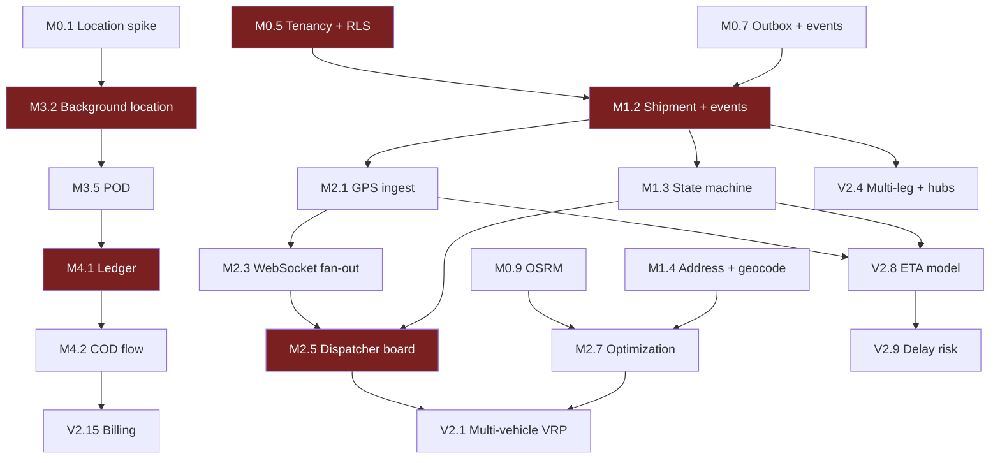

# Development Roadmap

> Covers **Phase 12** — MVP → V2 → Enterprise sequencing with dependencies, difficulty, and priority.
> Parent: [architecture-blueprint.md](./architecture-blueprint.md)
> **Status:** DRAFT — awaiting approval. No implementation has begun.

---

## 1. How to Read This

**Difficulty:** S (≤3 days) · M (1–2 weeks) · L (2–4 weeks) · XL (>4 weeks), for one engineer.
**Priority:** P0 = MVP cannot ship without it · P1 = MVP is weak without it · P2 = valuable, deferrable · P3 = later.

> ⚠️ **SUPERSEDED FOR THE MVP PHASE.** This document was written before the Blueprint §12 answers. Q4 confirmed the team is **founder + AI-assisted**, not 3–4 engineers, and Q8 confirmed Android-only. **[01-mvp-scope.md](./01-mvp-scope.md) is authoritative for everything through MVP**, including the reduced deployment topology in ADR-005 (TypeScript-only; Go and Python services deferred). Sections 4 (V2) and 5 (Enterprise) below remain valid as directional planning.

**Original assumed team (now superseded):** 1 backend lead, 1 backend, 1 full-stack/frontend, 1 mobile.

**The organising principle:** the MVP proves one thing — *a real courier can run a real delivery day end-to-end on this system and get their cash reconciled at the end of it.* Everything not on that path is deferred, including features that are individually excellent.

---

## 2. Phase M0 — Foundations & De-risking (Weeks 1–3)

Nothing here is a feature. All of it prevents expensive mistakes.

| # | Item | Difficulty | Priority | Notes |
|---|---|---|---|---|
| M0.1 | **Background-location spike on real devices** | M | **P0** | The highest-risk unknown in the stack ([technology-decisions §5.3](./technology-decisions.md#53-the-background-location-risk--stated-plainly)). Test on low-end Android and an aggressive-OEM handset (Xiaomi/Huawei) for one week. **Acceptance: <6 %/h battery drain, >95 % batch delivery over an 8-hour shift, correct recovery after reboot and force-stop.** Everything mobile depends on the outcome |
| M0.2 | Monorepo, tooling, module-boundary lint rules | M | P0 | The boundary enforcement that protects ADR-001. Retrofitting it later never happens |
| M0.3 | CI pipeline skeleton with Testcontainers | M | P0 | Real PostgreSQL in CI from commit one — RLS cannot be tested against a mock |
| M0.4 | Terraform for staging + production | M | P0 | Click-ops infrastructure cannot be reproduced or disaster-recovered |
| M0.5 | **Tenancy + RLS foundation and the cross-tenant test suite** | L | **P0** | Built **first**, before any domain feature. Every subsequent table inherits the pattern. Retrofitting tenant isolation is not realistically possible |
| M0.6 | Auth: JWT, refresh rotation, RBAC skeleton | L | P0 | |
| M0.7 | Transactional outbox + event envelope + relay | M | P0 | [ADR-004](./architecture-blueprint.md#54-event-driven-architecture--adr-004). Cheap now; a cross-cutting migration later |
| M0.8 | Observability baseline (OTel, structured logs, Sentry) | M | P0 | Async fan-out is undebuggable without tracing — this is a functional requirement |
| M0.9 | OSRM deployment + regional graph preprocessing | M | P0 | Long preprocessing cycles; start early to surface surprises |
| M0.10 | **Design-partner engagement: shadow a real courier for 2 days** | S | **P0** | Watch a dispatcher and ride with a driver. Will change the roadmap — this is the cheapest, highest-value item on the entire list |

**Gate to exit M0:** location spike passes or an alternative is chosen; a request can be authenticated, tenant-scoped, traced, and RLS-verified end-to-end.

---

## 3. MVP (Weeks 4–17) — "Run a real delivery day"

### 3.1 Milestone M1 — Core domain (Weeks 4–7)

| # | Feature | Difficulty | Priority | Depends on |
|---|---|---|---|---|
| M1.1 | Tenant, user, role, permission management | M | P0 | M0.5, M0.6 |
| M1.2 | **Shipment CRUD + immutable `shipment_events` + status projection** | L | P0 | M0.5 |
| M1.3 | Shipment state machine with validated transitions | M | P0 | M1.2 |
| M1.4 | Address model + geocoding (Mapbox) + confidence scoring | M | P0 | — |
| M1.5 | Driver, vehicle, shift management | M | P0 | M1.1 |
| M1.6 | Hub model + shipment legs (single-leg in use, multi-leg modelled) | M | P0 | M1.2 · Avoids risk D8 |
| M1.7 | Merchant model + bulk CSV import with actionable rejections | M | P1 | M1.2, M1.4 |
| M1.8 | Admin console: tenant setup, users, roles | M | P0 | M1.1 |

### 3.2 Milestone M2 — Dispatch & tracking (Weeks 6–11, overlaps M1)

| # | Feature | Difficulty | Priority | Depends on |
|---|---|---|---|---|
| M2.1 | `tracking-gateway`: batched GPS ingest → TimescaleDB | L | P0 | M0.9 |
| M2.2 | Driver presence + last-known position in Valkey | M | P0 | M2.1 |
| M2.3 | WebSocket fan-out with coalescing and viewport scoping | L | P0 | M2.2 |
| M2.4 | Geofence evaluation → `arrived_at_stop` business events | M | P0 | M2.1, M0.7 |
| M2.5 | **Dispatcher dashboard: live map + shipment list + manual assignment** | XL | **P0** | M2.3, M1.2 · *The product's centre of gravity. Budget generously* |
| M2.6 | Route + route-stop model, manual sequencing | M | P0 | M1.5, M1.2 |
| M2.7 | `optimization-service`: OSRM matrix + VROOM single-vehicle sequencing | L | P1 | M0.9 |
| M2.8 | Nearest-neighbour + 2-opt fallback | S | P0 | M2.7 · Must exist before the solver is trusted |

### 3.3 Milestone M3 — Driver app (Weeks 6–14, parallel track)

| # | Feature | Difficulty | Priority | Depends on |
|---|---|---|---|---|
| M3.1 | App shell, auth, offline-first local queue | L | P0 | M0.1, M0.6 |
| M3.2 | Background location service + adaptive sampling | XL | P0 | M0.1 |
| M3.3 | Route/manifest view, stop sequence, navigation hand-off | M | P0 | M2.6 |
| M3.4 | Barcode/QR scanning for pickup and delivery | M | P0 | M1.2 |
| M3.5 | **POD capture: signature, photo, recipient name, GPS stamp** | L | P0 | M3.1 |
| M3.6 | Failure reasons + re-attempt flow | M | P0 | M1.3 |
| M3.7 | COD collection recording | M | P0 | M4.1 |
| M3.8 | Offline sync with idempotent submission + conflict handling | L | P0 | M3.1 · *Where offline-first is actually earned* |
| M3.9 | Battery diagnostics screen | S | P1 | M3.2 · Materially reduces drivers disabling tracking |

### 3.4 Milestone M4 — Money & customer (Weeks 11–15)

| # | Feature | Difficulty | Priority | Depends on |
|---|---|---|---|---|
| M4.1 | **Double-entry ledger: accounts, entries, balance invariants** | L | P0 | M0.5 · Avoids risk D3 |
| M4.2 | COD collection → driver liability → hub remittance → settlement | L | P0 | M4.1, M3.7 |
| M4.3 | COD reconciliation screen + variance alerts | M | P0 | M4.2 |
| M4.4 | **Public customer tracking page** (token-scoped, minimal PII) | M | P0 | M1.2, M2.2 |
| M4.5 | Notifications: SMS + push on key transitions | M | P0 | M0.7 |
| M4.6 | Rule-based fraud flags (POD distance, no-attempt, mock location) | M | P1 | M3.5 · Cheap, high ROI, no ML needed |

### 3.5 Milestone M5 — Hardening & launch (Weeks 15–17)

| # | Item | Difficulty | Priority |
|---|---|---|---|
| M5.1 | Security review against OWASP ASVS L2 + API Top 10 | M | P0 |
| M5.2 | Load test to 2× Tier 1 targets | M | P0 |
| M5.3 | Backup + **restore drill executed and verified** | S | P0 |
| M5.4 | Runbooks, alerting, on-call rotation | M | P0 |
| M5.5 | Retention jobs implemented and scheduled | M | P0 |
| M5.6 | GDPR: export, erasure, DPA, privacy policy | M | P0 |
| M5.7 | App store submission (background-location justification) | M | P0 |
| M5.8 | Pilot onboarding + operator training materials | M | P0 |

### 3.6 Explicitly NOT in MVP

Deferred deliberately — each is valuable, and each would extend MVP past the point where feedback arrives too late to matter.

Multi-vehicle VRP optimization · multi-leg linehaul execution · ML/AI of any kind · fleet maintenance · marketplace/3PL brokering · advanced analytics dashboards · webhooks · public partner API · SSO/SAML · multi-currency · customer self-scheduling · returns/RTO beyond basic status · OpenSearch · Kafka · Kubernetes · iOS (pending Blueprint Q8)

---

## 4. V2 — "Efficient and intelligent" (Months 5–11)

**Theme:** the MVP proves the operation runs. V2 makes it *efficient* and begins compounding the data advantage.

| # | Feature | Difficulty | Priority | Depends on |
|---|---|---|---|---|
| V2.1 | **Multi-vehicle VRP** — time windows, capacity, skills, breaks | XL | P0 | M2.7 |
| V2.2 | Auto-assignment with scoring + cheapest-insertion for on-demand | L | P0 | V2.1 |
| V2.3 | Re-optimization on disruption, with stop-locking for route stability | L | P1 | V2.1 |
| V2.4 | **Multi-leg / hub sortation: manifests, linehaul, bag/container scanning** | XL | P0 | M1.6 |
| V2.5 | **Migrate event backbone to Redpanda** (dual-run cutover) | L | P1 | M0.7 · Triggers in [infrastructure-plan §1](./09-infrastructure.md#1-guiding-principle) |
| V2.6 | **MQTT uplink** (EMQX) with adapter swap in the driver app | L | P1 | M3.2 |
| V2.7 | Service-time prediction (historical median → ML) | M | P0 | 2 months of data |
| V2.8 | **ETA prediction (residual model)** | L | **P0** | 3 months of data · *Highest-value ML feature* |
| V2.9 | Delay/failure risk scoring with SHAP explanations | L | P1 | V2.8 |
| V2.10 | ML fraud detection (anomaly + COD variance) | L | P1 | M4.6, 6 months of data |
| V2.11 | Webhooks + public partner API + generated SDKs | L | P0 | M0.7 |
| V2.12 | Customer self-scheduling / reschedule | M | P0 | M4.4 · Largest single reducer of failed deliveries |
| V2.13 | Returns / RTO lifecycle | M | P0 | M1.3 |
| V2.14 | Analytics dashboards: SLA, driver, hub, cost-per-delivery | L | P1 | — |
| V2.15 | Billing: plans, entitlements, usage metering, invoicing | L | P0 | M4.1 · Required to charge anyone |
| V2.16 | Read replicas + PgBouncer + OpenSearch | M | P1 | Triggers in infra plan |
| V2.17 | Kubernetes migration | L | P2 | Trigger-based |
| V2.18 | SSO (OIDC/SAML) for enterprise tenants | M | P1 | M0.6 |
| V2.19 | Driver performance analytics (descriptive, difficulty-normalised) | M | P2 | [ai-strategy §8](./ai-strategy.md#8-driver-performance-analytics--ethical-constraints) constraints apply |
| V2.20 | Address-quality pipeline + driver geocode corrections | M | P1 | M1.4 · Compounding asset |

---

## 5. Enterprise / V3 (Months 12–24)

**Theme:** scale, compliance, and the capabilities that win large contracts.

| # | Feature | Difficulty | Priority |
|---|---|---|---|
| V3.1 | Multi-region deployment + data residency routing | XL | P0 |
| V3.2 | Dedicated-database graduation path for enterprise tenants | L | P0 |
| V3.3 | SOC 2 Type II / ISO 27001 readiness | XL | P0 |
| V3.4 | 3PL/carrier brokering — allocate across in-house fleet, contractors, gig carriers | XL | P0 |
| V3.5 | Fleet management: maintenance schedules, inspections, fuel, telematics ingest | L | P1 |
| V3.6 | Demand forecasting + capacity planning | L | P1 |
| V3.7 | Smart dispatch with learned weights (shadow → canary → rollout) | XL | P1 |
| V3.8 | Low-code workflow builder for tenant-specific exception handling | XL | P2 |
| V3.9 | Advanced COD: multi-currency, partial payment, digital payment at door | L | P1 |
| V3.10 | White-label tenant branding (domains, apps, notification templates) | L | P1 |
| V3.11 | Warehouse/inventory module | XL | P2 |
| V3.12 | Real-time capacity-aware order acceptance | L | P1 |
| V3.13 | Sortation automation integration (scanners, conveyor, label printers) | L | P2 |
| V3.14 | Marketplace/storefront order intake connectors | L | P2 |
| V3.15 | ML platform maturity: feature store, automated retraining, A/B infrastructure | L | P2 |

---

## 6. Dependency Map

*Red = critical path. Delays here delay everything downstream.*

---

## 7. Critical Path & Risk

| Item | Why it is critical | Mitigation |
|---|---|---|
| **M0.1 Background location** | Determines whether the mobile framework choice holds. A failure here reshapes the mobile plan | Spike in week 1, before any dependent work. Native fallback pre-planned |
| **M0.5 Tenancy + RLS** | Every table and every query inherits this. Cannot be retrofitted | Built first; blocking automated test suite |
| **M2.5 Dispatcher board** | The product's most-used screen. Largest single frontend effort and most underestimated | Start early; usability-test with the design partner from week 8 |
| **M1.2 Shipment + event log** | Everything depends on this model. A wrong design here propagates everywhere | Design reviewed against the design partner's real workflow before implementation |
| **M4.1 Ledger** | Financial correctness. Cannot be "fixed later" without reconciling real money | Invariants enforced in-database; property-based tests |
| **M3.8 Offline sync** | Where offline-first is either real or theatre | Field-test with the design partner on real routes with real dead zones |

**Buffer policy:** the 14-week MVP estimate assumes no major surprises. **Plan for 18 weeks.** The most likely overruns, in order: the dispatcher board (M2.5), offline sync (M3.8), and app store review (M5.7).

---

## 8. Definition of Done

Applies to every item above. Nothing is "done" without all of it.

- [ ] Meets acceptance criteria agreed with the design partner
- [ ] Unit + integration tests; coverage does not decrease
- [ ] **Cross-tenant isolation test added** if it touches tenant-scoped data
- [ ] Hot-path queries have a reviewed `EXPLAIN (ANALYZE, BUFFERS)` plan
- [ ] Structured logs, metrics, and traces emitted with `tenant_id` / `correlation_id`
- [ ] Errors handled with the standard Problem Details shape
- [ ] Idempotency implemented on mutating endpoints
- [ ] OpenAPI/proto/event schema updated; no unversioned breaking change
- [ ] Security review for auth, authorization, input validation, PII in logs
- [ ] Migration is expand-contract and rehearsed on production-shaped data
- [ ] Documentation updated (API reference, runbook if operationally relevant)
- [ ] Feature flag / entitlement gate if the capability is plan-dependent
- [ ] Reviewed by someone other than the author

---

## 9. Review Cadence

| Cadence | Activity |
|---|---|
| Weekly | Progress vs milestone; blocker triage; design-partner feedback |
| Bi-weekly | Demo to the design partner on their real data |
| Monthly | Architecture review — are ADR trigger conditions approaching? Any ADR now falsified? |
| Quarterly | Roadmap re-planning based on evidence; **module dependency-graph review** (protects ADR-001 against risk A2); restore drill and game day |

**ADRs are living documents.** Each records trigger conditions; when one fires, the ADR is revisited and superseded with a new record — the old one is never edited into a lie. The architecture is a starting hypothesis, not a commitment.

---

## 10. Open Items

| # | Item | Blocked on |
|---|---|---|
| RM1 | Confirm team size and composition — all estimates scale directly from this | Blueprint Q4 |
| RM2 | Confirm iOS at MVP or Android-first (materially changes M3 and M5.7) | Blueprint Q8 |
| RM3 | Secure a design partner before M1 — the roadmap assumes one exists | Business |
| RM4 | Confirm whether COD is P0 (MENA/South Asia) or P2 (Western Europe) — this reorders M4 substantially | Blueprint Q1 |
| RM5 | Confirm target launch date to validate the 14–18 week estimate against commercial commitments | Business |
