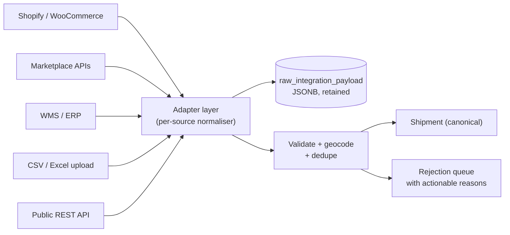

# API & Communication Strategy

> Contracts for every boundary in the system: client↔server, service↔service, and the **event catalog** implementing [ADR-004](./architecture-blueprint.md#54-event-driven-architecture--adr-004).
> Parent: [architecture-blueprint.md](./architecture-blueprint.md)
> **Status:** DRAFT — awaiting approval.

---

## 1. Communication Topology

| Boundary | Protocol | Format | Why |
|---|---|---|---|
| Web/mobile clients → `core-api` | REST/HTTPS | JSON | Universal, cacheable, debuggable, what partner integrators expect |
| Partner systems → `core-api` | REST/HTTPS | JSON | Same |
| Driver app → `tracking-gateway` (telemetry) | HTTPS batch → **MQTT (V2)** | JSON → CBOR | See Blueprint §7.1 |
| `tracking-gateway` → dispatcher dashboards | WebSocket | JSON | Sub-second push, native browser support |
| `core-api` → `optimization-service` / `ml-service` | **gRPC** | Protobuf | Typed contract, low latency, streaming, code-generated clients across three languages |
| Any module/service → interested parties | **Events** | JSON envelope | Fan-out without coupling |
| `core-api` → tenant systems | **Webhooks** (HTTPS + HMAC) | JSON | Tenants integrate on their own terms |
| Deferred work with a known owner | **Job queue** (BullMQ) | JSON | Not an event — a command with an owner |

**GraphQL is not used.** Rationale in [technology-decisions.md §8](./technology-decisions.md#8-explicitly-rejected-technologies).

---

## 2. REST API Design

### 2.1 Principles

- **Resource-oriented**, plural nouns, no verbs in paths. Exception: explicit state-transition sub-resources (`POST /shipments/{id}/deliver`) — these are legitimate because they represent domain operations with their own authorization, validation, and side effects, not generic updates.
- **OpenAPI 3.1 is the source of truth**, generated from Zod schemas so the spec cannot drift from the implementation. Client SDKs and the documentation site are generated from it.
- **Consistency over cleverness.** Same pagination, same error shape, same filter syntax on every endpoint.

### 2.2 Versioning

URI-path versioning: `/v1/shipments`.

| Change type | Requires new version? |
|---|---|
| Adding an optional request field | No |
| Adding a response field | No — **clients must tolerate unknown fields**, stated in the contract |
| Adding a new endpoint | No |
| Adding a new enum value | **Yes if clients switch on it exhaustively** — documented per field. New `status` values are a breaking change in practice |
| Removing/renaming a field | Yes |
| Changing a type or semantics | Yes |
| Tightening validation | Yes (it breaks previously-valid callers) |

**Deprecation policy:** minimum **12 months** support for a deprecated version. `Deprecation` and `Sunset` response headers per RFC 8594, a documented migration guide, and proactive notification to tenants whose traffic still uses it. We track per-tenant version usage so this is measured, not guessed (OWASP API9 — inventory management).

### 2.3 Core resources

```
/v1/shipments                        GET, POST
/v1/shipments/{id}                   GET, PATCH
/v1/shipments/{id}/events            GET            # immutable custody log
/v1/shipments/{id}/assign            POST
/v1/shipments/{id}/deliver           POST           # POD payload
/v1/shipments/{id}/fail              POST           # reason code required
/v1/shipments/{id}/cancel            POST
/v1/shipments/bulk                   POST           # async import, returns job
/v1/drivers                          GET, POST
/v1/drivers/{id}                     GET, PATCH
/v1/drivers/{id}/shifts              GET, POST
/v1/drivers/{id}/location            GET            # last known; permission-gated
/v1/drivers/{id}/location/history    GET            # heavily permission-gated + audited
/v1/vehicles                         GET, POST
/v1/hubs                             GET, POST
/v1/hubs/{id}/manifests              GET, POST
/v1/routes                           GET, POST
/v1/routes/{id}                      GET, PATCH
/v1/routes/{id}/optimize             POST           # async, returns job_id
/v1/routes/{id}/publish              POST
/v1/cod/reconciliations              GET, POST
/v1/ledger/accounts/{id}/entries     GET
/v1/webhooks                         GET, POST, DELETE
/v1/analytics/reports/{name}         GET
/track/{token}                       GET            # public, unauthenticated
```

### 2.4 Idempotency

**Mandatory on every non-GET endpoint.** The driver app is offline-first and *will* retry; without idempotency it will create duplicate shipments and double-count COD.

- Client sends `Idempotency-Key: <UUIDv7>`.
- Server stores `(tenant_id, idempotency_key) → response` for **24 hours**.
- A replay returns the **original response** with `Idempotency-Replayed: true` — it does not re-execute.
- A key reused with a *different* request body returns `422` — this catches client bugs rather than silently corrupting data.
- Missing the header on a mutating endpoint returns `400`. It is not optional, because "optional idempotency" means "no idempotency" in practice.

### 2.5 Pagination

**Cursor-based, always.** Offset pagination degrades badly past a few thousand rows and produces duplicate/missing items when the underlying data changes mid-scroll — which it constantly does on a live dispatcher board.

```
GET /v1/shipments?limit=50&cursor=eyJpZCI6...
→ { "data": [...], "page": { "next_cursor": "...", "has_more": true } }
```

`limit` defaults to 50, caps at 200. No unbounded list endpoint exists.

### 2.6 Filtering, sorting, sparse fields

```
?status=in_transit,out_for_delivery      # CSV = OR within a field
?promised_to[gte]=2026-07-22T00:00:00Z   # bracket operators: gte,lte,gt,lt,ne
?sort=-promised_to,reference             # '-' prefix = descending
?fields=id,reference,status,eta_at       # sparse fieldsets for the dispatcher list
?include=driver,destination_address      # explicit relation expansion, allow-listed
```

Filterable, sortable, and includable fields are **allow-listed per resource** — an open filter surface is both a performance risk (unindexed sorts) and an information-disclosure risk.

### 2.7 Error format — RFC 9457 Problem Details

```json
{
  "type": "https://api.example.com/problems/shipment-invalid-transition",
  "title": "Invalid status transition",
  "status": 409,
  "detail": "Cannot transition shipment from 'returned' to 'delivered'.",
  "instance": "/v1/shipments/018f.../deliver",
  "code": "SHIPMENT_INVALID_TRANSITION",
  "request_id": "01J9X...",
  "errors": [
    { "field": "pod.recipient_name", "code": "REQUIRED", "detail": "Required when pod_type is 'signature'." }
  ]
}
```

- `code` is a **stable, machine-readable** identifier — clients branch on it, never on `detail` text.
- `request_id` correlates to logs and traces; support asks for it first.
- Error messages never leak internal structure, SQL, stack traces, or the existence of other tenants' resources.
- **Uniform 404 for both "not found" and "not yours"** — distinguishing them is an enumeration oracle.

### 2.8 Status codes

| Code | Use |
|---|---|
| 200 / 201 / 202 | OK / Created / Accepted (async job started, returns `job_id`) |
| 400 / 401 / 403 | Malformed / unauthenticated / unauthorized (incl. `FEATURE_NOT_ENTITLED`) |
| 404 | Not found **or not visible to this tenant** |
| 409 | State conflict (invalid transition, concurrent modification) |
| 422 | Semantically invalid (business rule violated, idempotency-key body mismatch) |
| 429 | Rate limited — always with `Retry-After` |
| 503 | Dependency unavailable — with `Retry-After` |

### 2.9 Long-running operations

Bulk imports and route optimization are asynchronous:

```
POST /v1/routes/{id}/optimize  → 202 { "job_id": "...", "status_url": "/v1/jobs/..." }
GET  /v1/jobs/{job_id}         → { "status": "running|succeeded|failed", "progress": 0.6, "result": {...} }
```

Completion also emits an event and pushes over WebSocket, so clients need not poll — polling is the fallback, not the design.

---

## 3. API Security Controls

Full model in [Blueprint §9](./architecture-blueprint.md#9-phase-9--security-architecture). API-boundary specifics:

| Control | Detail |
|---|---|
| Transport | TLS 1.3 only; HSTS preload; certificate pinning in mobile apps |
| Auth | `Authorization: Bearer <JWT>` for users/drivers; API keys (`Authorization: Bearer sk_live_...`) for partners; tracking tokens are path-scoped and grant nothing else |
| Tenant resolution | **From the token claim only.** A `X-Tenant-Id` header from a client is never trusted and is rejected if present |
| Object-level authz | Every resource fetch verifies ownership after retrieval — OWASP API1/BOLA is the top real-world breach vector in logistics APIs |
| Mass assignment | Explicit DTO allow-lists; unknown properties rejected (`strict` schema mode), never merged |
| Rate limits | Per-IP (edge) + per-key + per-tenant + per-endpoint, token bucket in Valkey. Headers: `RateLimit-Limit`, `RateLimit-Remaining`, `RateLimit-Reset` |
| Payload limits | 1 MB default body; bulk endpoints capped at 1,000 items; JSON depth limited |
| Response filtering | Field-level authorization — `finance` sees COD amounts, `dispatcher` does not receive customer phone numbers in list responses |

**Stricter limits** apply to `/auth/*`, `/track/*`, and search endpoints, which are the enumeration and credential-attack surfaces.

---

## 4. Internal Service Contracts (gRPC)

Protobuf definitions live in a shared, versioned `contracts/` package; Go, TypeScript, and Python clients are code-generated in CI. Compatibility is checked automatically — a breaking `.proto` change fails the build.

| Service | Method | Shape | SLA |
|---|---|---|---|
| `OptimizationService` | `ComputeMatrix` | coordinates[] → duration/distance matrix | p99 <500 ms (cached: <10 ms) |
| | `SequenceRoute` | stops + constraints → ordered sequence | p99 <800 ms (≤25 stops) |
| | `SolveVRP` | jobs + vehicles + constraints → assignment plan | Async; 10–60 s |
| | `SnapToRoad` | raw GPS trace → map-matched polyline | p99 <200 ms |
| `MlService` | `PredictEta` | shipment + route + context → ETA + confidence | p99 <100 ms |
| | `ScoreDelayRisk` | shipment features → risk 0–1 + top factors | p99 <100 ms |
| | `ScoreFraud` | event features → score + reason codes | p99 <150 ms |
| | `ForecastDemand` | tenant + hub + horizon → volume forecast | Async batch |

**Every gRPC call from `core-api` is wrapped in a timeout, a circuit breaker, and a documented fallback.** No specialist service may be a hard dependency of a core business flow (Blueprint §6.3, §6.4).

---

## 5. Event Contracts

Implements [ADR-004](./architecture-blueprint.md#54-event-driven-architecture--adr-004). Events are the platform's most durable contract — harder to change than REST, because consumers are numerous and often not ours.

### 5.1 Envelope

```json
{
  "event_id":       "018f7c3e-...",
  "event_type":     "shipment.delivered",
  "event_version":  1,
  "tenant_id":      "018f7a11-...",
  "aggregate_type": "shipment",
  "aggregate_id":   "018f7b22-...",
  "occurred_at":    "2026-07-22T14:02:11.412Z",
  "published_at":   "2026-07-22T14:47:03.980Z",
  "correlation_id": "018f7c00-...",
  "causation_id":   "018f7bff-...",
  "actor":          { "type": "driver", "id": "018f7a99-...", "app_version": "1.4.2" },
  "payload":        { }
}
```

Envelope rules (all enforced by a shared publisher library and validated in CI):
- `tenant_id` is **mandatory on every event, without exception.**
- `aggregate_id` is the **partition key** — guarantees ordering per shipment.
- `event_type` is `domain.fact`, **past tense**, always.
- `event_id` is the consumer's idempotency key.
- `occurred_at` is business time; `published_at` is system time. They differ substantially for offline-captured events.

### 5.2 Event catalog (v1)

Payloads are deliberately **thin but actionable** — enough to act without a callback, not a full entity dump.

| Event | Payload essentials | Consumers |
|---|---|---|
| `shipment.created` | reference, service_level, merchant_id, destination summary, promised window, cod_amount_minor, currency | analytics, webhooks |
| `shipment.assigned` | driver_id, route_id, sequence, assigned_by, eta_at | notification, analytics, webhooks |
| `shipment.picked_up` | driver_id, location, occurred_at | notification, analytics, webhooks |
| `shipment.arrived_at_hub` | hub_id, manifest_id | analytics, webhooks |
| `shipment.out_for_delivery` | driver_id, route_id, eta_at | notification, webhooks |
| `shipment.arrived_at_stop` | driver_id, stop_id, distance_from_destination_m | notification ("arriving now"), analytics |
| **`shipment.delivered`** | driver_id, pod_id, pod_type, recipient_name, location, cod_amount_minor, cod_collected, occurred_at, promised_to, **was_on_time** | **ledger, billing, notification, analytics, webhooks, ml-training** |
| `shipment.failed` | attempt_number, reason_code, driver_id, location, next_attempt_at | notification, analytics, webhooks, reattempt-scheduler |
| `shipment.returned` | reason_code, return_hub_id | ledger, billing, analytics, webhooks |
| `shipment.cancelled` | cancelled_by, reason_code | billing, notification, webhooks |
| `cod.collected` | shipment_id, driver_id, amount_minor, currency, method | ledger, fraud-scoring |
| `cod.remitted` | driver_id, hub_id, amount_minor, expected_minor, **variance_minor** | ledger, fraud-scoring, notification |
| `driver.shift_started` / `shift_ended` | driver_id, vehicle_id, hub_id, timestamps | tracking-gateway (enable/disable ingest), analytics |
| `driver.went_offline` | driver_id, last_seen_at, last_location, active_route_id | dispatch (reassignment review), notification |
| `route.optimized` | route_id, driver_id, stop_count, planned_distance_m, planned_duration_s, solver, solve_ms | notification, dispatcher push, ml-plan-vs-actual |
| `route.published` | route_id, driver_id, stop_count | notification (driver) |
| `hub.manifest_closed` | manifest_id, hub_id, shipment_count, destination_hub_id | analytics, webhooks |
| `address.geocode_corrected` | address_id, old_location, new_location, corrected_by | address-quality pipeline |
| `tenant.provisioned` / `suspended` / `plan_changed` | tenant_id, plan, entitlements | billing, entitlement cache invalidation, all services |

### 5.3 Schema evolution

| Change | Allowed in-version? |
|---|---|
| Add an optional field | ✅ Yes |
| Add a new event type | ✅ Yes |
| Make a required field optional | ✅ Yes |
| Remove a field | ❌ New `event_version` |
| Rename or retype a field | ❌ New `event_version` |
| Change the meaning of a field | ❌ New `event_version` — **the most dangerous change**, because it passes every automated check |

Breaking changes publish **both versions in parallel** until every consumer has migrated, tracked in a consumer registry. A JSON Schema per event type is stored in `contracts/events/` and validated in CI; at V2 this moves into a schema registry enforced at publish time.

### 5.4 Consumer requirements

Every consumer must:
1. **Be idempotent** — record processed `event_id`s with a unique index and no-op on duplicates.
2. **Tolerate unknown fields** — never fail on an additive change.
3. **Tolerate out-of-order delivery across aggregates** (ordering is guaranteed only per `aggregate_id`).
4. **Handle its own retries** with capped exponential backoff and jitter.
5. **Declare a DLQ** and alert on non-empty.
6. **Re-establish tenant context** from `tenant_id` before any write.
7. **Never write to another module's tables** — call the owning service or own a read model.

### 5.5 Reliability

| Concern | Mechanism |
|---|---|
| Publication atomicity | Transactional outbox in the same transaction as the business write |
| Delivery | At-least-once |
| Ordering | Per `aggregate_id` |
| Poison messages | Per-consumer, per-tenant DLQ after N attempts, with full envelope and failure trace — triaged and replayable, never silently drained |
| Monitoring | Consumer lag per group; oldest-unpublished-outbox-row age; DLQ depth. **These three are the primary health signals of the event system** |
| Replay | V2+: reset consumer-group offset to rebuild read models and ML feature tables |

---

## 6. WebSocket Protocol (dispatcher real-time)

**Endpoint:** `wss://api.../v1/realtime` · **Auth:** JWT in the connection handshake, re-validated on token refresh; connection closed on expiry.

**Client → server:**
```json
{ "op": "subscribe", "channels": ["drivers:viewport"], "viewport": { "bbox": [lon1,lat1,lon2,lat2] } }
{ "op": "subscribe", "channels": ["route:018f...", "shipment:018f..."] }
{ "op": "unsubscribe", "channels": [...] }
{ "op": "ping" }
```

**Server → client:**
```json
{ "op": "positions", "ts": "...", "drivers": [ { "id": "...", "lat": 33.58, "lon": -7.62, "hdg": 145, "spd": 8.3 } ] }
{ "op": "shipment_updated", "shipment": { "id": "...", "status": "delivered", "eta_at": null } }
{ "op": "route_optimized", "route_id": "..." }
{ "op": "alert", "severity": "warning", "code": "DRIVER_OFFLINE", "driver_id": "..." }
```

**Rules that make this survive Tier 3:**
- **Coalescing:** one `positions` frame per second per client carrying all changed drivers — never one frame per driver.
- **Viewport scoping:** only drivers in the current bounding box plus explicitly subscribed entities.
- **Server-authoritative subscriptions:** the server verifies the tenant may see every requested entity; a client cannot subscribe its way into another tenant's channel.
- **Backpressure:** if a client cannot keep up, drop intermediate position frames (they are superseded anyway) but **never** drop `shipment_updated` or `alert` frames.
- **Reconnect:** exponential backoff with jitter; on reconnect the client re-subscribes and fetches a REST snapshot to resynchronise. WebSocket carries deltas; REST is the source of truth.

---

## 7. Webhooks (tenant-facing)

Tenants subscribe to a subset of the [event catalog](#52-event-catalog-v1) — the public API of our event system.

| Aspect | Design |
|---|---|
| Registration | `POST /v1/webhooks` with `url`, `event_types[]`, and a generated signing secret |
| Signing | `X-Signature: t=<unix>,v1=<hmac-sha256(t + "." + body, secret)>` — timestamp inside the signed payload prevents replay |
| Timestamp tolerance | 5 minutes |
| Delivery | At-least-once. **Tenant endpoints must be idempotent on `event_id`** — stated prominently in the docs |
| Timeout | 10 s, then retry |
| Retries | Exponential backoff over ~24 h (roughly 1 m, 5 m, 30 m, 2 h, 6 h, 12 h) |
| Auto-disable | After 24 h of continuous failure, disable and notify the tenant |
| Replay | Tenants can replay deliveries from the last 7 days via the dashboard — the most-requested webhook feature in every platform, and cheap to build on an event log |
| **SSRF protection** | Destination must be HTTPS and publicly routable. **Deny RFC1918, loopback, link-local, and cloud metadata addresses**, with DNS-rebinding-safe resolution (resolve, validate the resolved IP, then connect to that IP). Egress from a restricted network path |
| Payload | The exact event envelope — identical to internal events, so there is one contract to document and version |

---

## 8. Inbound Integration Adapters

Following the Deliverect pattern (Blueprint §3.2): all external order sources normalise at the edge into one internal `Shipment` shape.



- **The raw payload is always retained** before transformation. When a merchant disputes what they sent, the answer must be data, not memory.
- **Rejections are actionable and visible to the merchant** — "address could not be geocoded with sufficient confidence," not "validation error."
- Deduplication on `(tenant_id, merchant_id, external_reference)`.
- Each adapter is independently versioned; a marketplace changing its schema must not break the core.

---

## 9. API Governance

| Practice | Detail |
|---|---|
| Source of truth | OpenAPI 3.1 generated from Zod schemas — spec and implementation cannot diverge |
| Breaking-change detection | Automated spec diff in CI; a breaking change without a version bump fails the build |
| SDKs | TypeScript and Python clients generated from the spec, published per release |
| Documentation | Generated reference + hand-written guides (quickstart, auth, webhooks, idempotency, pagination, errors) |
| Sandbox | Full-featured sandbox tenant with seeded data and simulated driver movement — the single highest-leverage integration accelerator |
| Inventory | Every deployed endpoint and version is inventoried with per-tenant usage metrics (OWASP API9) |
| Postman/Bruno collection | Published and versioned alongside the spec |

---

## 10. Open Items

| # | Item | Blocked on |
|---|---|---|
| API1 | Confirm whether partner-facing API access is an MVP requirement or V2 | Product input |
| API2 | Decide whether webhook payloads should support tenant-selected field subsets (reduces PII egress but complicates versioning) | Privacy review |
| API3 | Confirm the 12-month deprecation window against expected enterprise contract terms | Commercial input |
