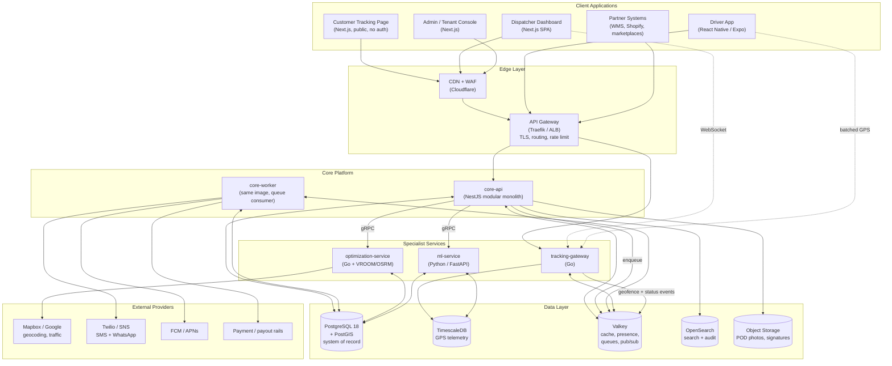
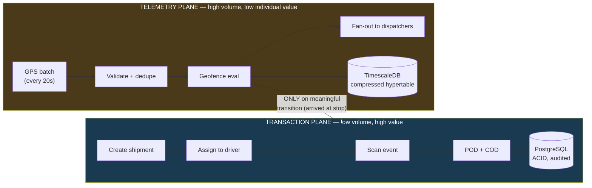
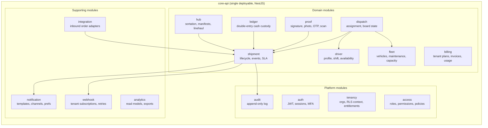
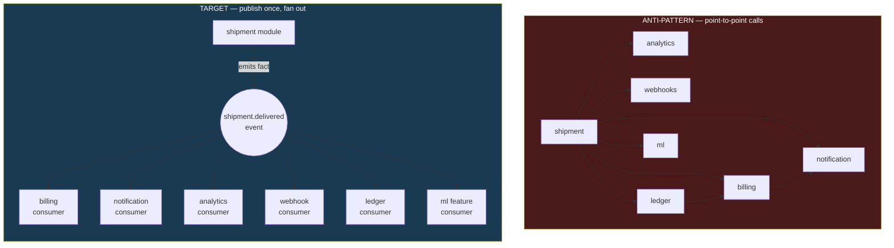
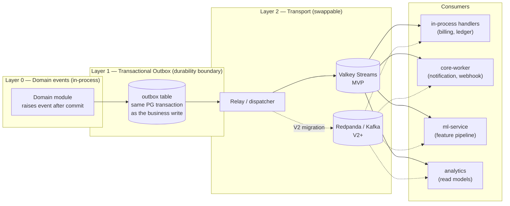
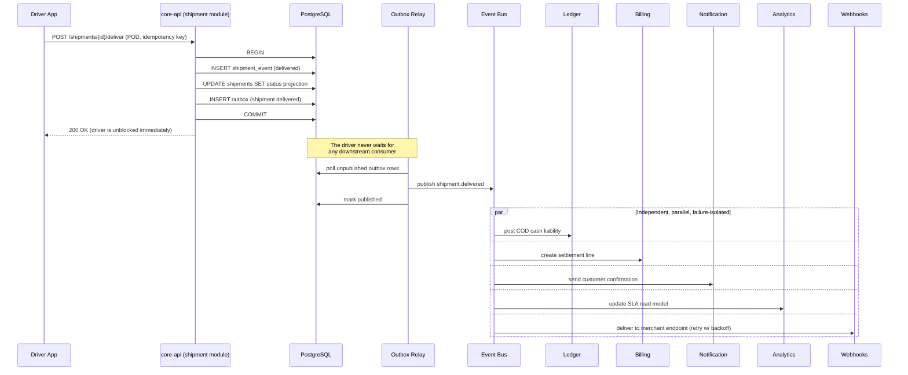
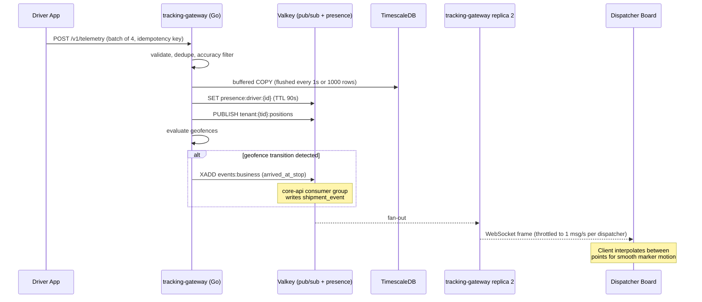
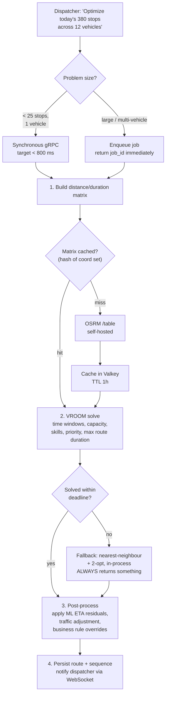
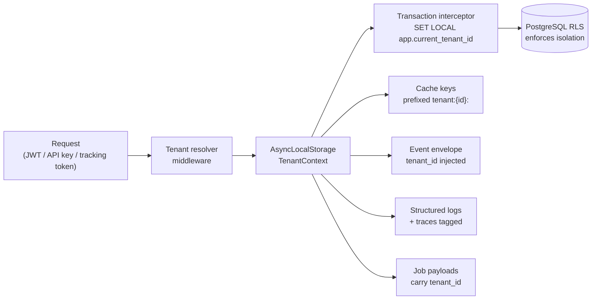

# Delivery Management Platform — Architecture Blueprint

> **Status:** DRAFT — awaiting approval. No implementation has begun.
> **Version:** 0.1
> **Date:** 2026-07-22
> **Author:** Principal Architect (planning phase)

---

## Table of Contents

1. [Executive Summary](#1-executive-summary)
2. [Scale Targets — Making "Millions" Concrete](#2-scale-targets--making-millions-concrete)
3. [Phase 1 — Market & Existing System Analysis](#3-phase-1--market--existing-system-analysis)
4. [Phase 2 — Architecture Decision (ADR-001)](#4-phase-2--architecture-decision-adr-001)
5. [Phase 4 — System Architecture Design](#5-phase-4--system-architecture-design)
   - 5.1 [High-level system context](#51-high-level-system-context)
   - 5.2 [Request-path separation](#52-request-path-separation-the-critical-diagram)
   - 5.3 [Core-api internal module structure](#53-core-api-internal-module-structure)
   - **5.4 [Event-Driven Architecture — ADR-004](#54-event-driven-architecture--adr-004)**
6. [Service Catalog](#6-service-catalog)
7. [Phase 6 — Real-Time System Design](#7-phase-6--real-time-system-design)
8. [Phase 7 — Route Optimization Design](#8-phase-7--route-optimization-design)
9. [Phase 9 — Security Architecture](#9-phase-9--security-architecture)
10. [Multi-Tenancy Model](#10-multi-tenancy-model)
11. [Risks & Mistakes to Avoid](#11-risks--mistakes-to-avoid)
12. [Open Questions Requiring Business Input](#12-open-questions-requiring-business-input)

**Companion documents:**
| Document | Covers |
|---|---|
| [technology-decisions.md](./technology-decisions.md) | Phase 3 language/framework analysis, version pinning, Phase 11 documentation list |
| [06-database-design.md](./06-database-design.md) | Phase 5 — entities, indexes, partitioning, retention |
| [api-strategy.md](./api-strategy.md) | REST/gRPC/WebSocket/webhook contracts, versioning, idempotency |
| [ai-strategy.md](./ai-strategy.md) | Phase 8 — ETA, delay risk, fraud, forecasting, dispatch |
| [09-infrastructure.md](./09-infrastructure.md) | Phase 10 — cloud, containers, CI/CD, observability, DR |
| [10-development-roadmap.md](./10-development-roadmap.md) | Phase 12 — MVP / V2 / Enterprise sequencing |

---

## 1. Executive Summary

We are designing a multi-tenant (SaaS) Delivery Management Platform intended to serve courier networks, last-mile operators, and enterprise logistics teams — competing on the same ground as Onfleet, Bringg, FarEye, and DispatchTrack, while remaining self-hostable like Fleetbase.

**The four decisions that define this system:**

**1. Hybrid architecture, split by runtime profile — not by business domain.**
The single most common failure mode in logistics platforms is premature decomposition into `ShipmentService`, `DriverService`, `OrderService`. Those domains share transactional boundaries — a shipment assignment touches shipment, driver, route, and vehicle in one atomic decision. Splitting them forces distributed transactions and sagas to solve a problem that did not exist. We therefore keep **all business domains inside one deployable modular monolith** (`core-api`), and extract only the three workloads whose *runtime characteristics* are irreconcilable with a request/response API: **high-frequency GPS ingest**, **CPU-bound route optimization**, and **ML inference**. See [ADR-001](#4-phase-2--architecture-decision-adr-001).

**2. PostgreSQL is the system of record; specialised stores are additive, never authoritative.**
One ACID database holding shipments, money, and custody chain. PostGIS for geography, TimescaleDB for the GPS firehose, Valkey for ephemeral state, OpenSearch for search. We explicitly reject a document database as the primary store — logistics is a transactional, relational, audit-heavy domain where a mis-assigned shipment is a lost package and a mis-recorded COD is stolen money. Full rationale in [06-database-design.md](./06-database-design.md).

**3. Buy the hard math; build the domain.**
Routing and VRP solving are 30-year-old research fields. We self-host **OSRM** (road network routing + distance matrices) and **VROOM** (vehicle routing solver), and we do not write a solver. Our differentiation is in dispatch policy, exception handling, proof of delivery, COD reconciliation, and tenant workflow — not in re-deriving Dijkstra.

**4. Defer operational complexity until scale demands it.**
No Kubernetes at MVP. No MQTT broker at MVP. No Kafka at MVP. No feature store at MVP. Every one of these is on the roadmap with an explicit, numeric trigger condition. A three-engineer team that starts on Kubernetes with a service mesh will ship a dispatch board in nine months instead of three, and the product will die of slowness, not of architecture.

**What we are betting against:** the assumption that "enterprise-grade" means "many services." Amazon, DHL, and Uber run enormous service fleets because they have hundreds of teams, not because the domain requires it. Conway's Law runs in both directions — we will size the architecture to the team, and re-shape it when the team grows.

**Estimated MVP timeline:** 14–18 weeks with 3–4 engineers. See [10-development-roadmap.md](./10-development-roadmap.md).

---

## 2. Scale Targets — Making "Millions" Concrete

Architecture cannot be evaluated against the word "millions." These are the tiers every design decision in this blueprint is measured against.

| Dimension | Tier 1 (MVP) | Tier 2 (V2 / Growth) | Tier 3 (Enterprise) |
|---|---|---|---|
| Tenants (companies) | 5–20 | 100–300 | 1,000+ |
| Shipments / day | 5,000 | 250,000 | 1,000,000 |
| Shipments / year | ~1.8 M | ~90 M | ~365 M |
| Active drivers (peak concurrent) | 200 | 5,000 | 50,000 |
| GPS events / second (peak) | ~40 | ~1,000 | ~10,000 |
| GPS events / day | ~3.5 M | ~86 M | ~864 M |
| Dispatcher dashboard sessions | 20 | 500 | 5,000 |
| Route optimizations / day | 50 | 3,000 | 30,000 |
| API p99 latency target | 400 ms | 300 ms | 250 ms |
| Availability target | 99.5 % | 99.9 % | 99.95 % |
| RPO / RTO | 24 h / 8 h | 15 min / 1 h | 5 min / 15 min |

**Derived storage budget (GPS telemetry, the dominant write load):**

- Raw event ≈ 64 bytes on disk (tenant_id, driver_id, ts, lat, lon, speed, heading, accuracy, battery).
- Tier 3: 864 M events/day × 64 B ≈ **55 GB/day raw**, ≈ 20 TB/year.
- With TimescaleDB native columnar compression at an observed 90–95 % on telemetry: **≈ 3–5 GB/day**, ≈ 1.5 TB/year retained.
- Retention policy (see [06-database-design.md](./06-database-design.md)) drops raw resolution after 90 days, keeping only route-snapped polylines and per-stop aggregates — steady-state footprint stays under 5 TB indefinitely.

**The load-shape insight that drives the whole architecture:** GPS writes outnumber business writes by roughly **170:1** at Tier 3 (864 M telemetry events vs ~5 M shipment state transitions). These two workloads must never share a connection pool, a table, or a deployment. That asymmetry — not domain boundaries — is the real seam in this system.

---

## 3. Phase 1 — Market & Existing System Analysis

### 3.1 Platform-by-platform assessment

| Platform | Model | Genuine strengths worth adopting | Weaknesses we can beat |
|---|---|---|---|
| **Fleetbase** | Open source, AGPL-3.0 | Modular install (Fleet-Ops, Pallet, Storefront, Ledger) — customers enable only what they need. Self-hostable with no vendor lock-in. Extension/registry model. | Polyglot sprawl (PHP/Laravel + Go backend, Vue **and** Ember frontends) makes contribution and hiring hard. Ember is effectively legacy. Weak native route optimization and no meaningful ML. AGPL blocks many commercial embeds. |
| **Onfleet** | SaaS, last-mile | Best-in-class dispatcher UX — the drag-and-drop assignment board is the benchmark. Excellent driver app ergonomics. Clean, well-documented REST API + webhooks. Predictive ETA and customer SMS tracking done well. | Per-task pricing punishes high-volume, low-margin couriers. Shallow multi-hub / sorting-center support. Limited COD and cash reconciliation — a blocker in emerging markets. Weak warehouse/linehaul modelling. |
| **Bringg** | Enterprise orchestration | Strong "delivery orchestration" abstraction — brokering across in-house fleet, 3PLs, and gig carriers through one interface. Carrier marketplace. Robust SLA/promise management. | Heavy, long implementation cycles. Expensive. Configuration complexity requires professional services — a self-serve competitor has room here. |
| **FarEye** | Enterprise, low-code | Low-code workflow builder lets each customer model its own exception handling without a code deploy. Strong first/mid/last-mile coverage. | Low-code engine becomes a performance and debuggability liability at scale. UI dated. Heavy consulting dependency. |
| **DispatchTrack** | SaaS, big-and-bulky | Outstanding at appointment/time-window promising and customer self-scheduling. Strong ETA accuracy reputation. Reverse logistics done properly. | Narrow segment focus (furniture/appliance). Limited API surface for platform-style integration. |
| **Samsara** | Fleet telematics + IoT | Hardware-grade telematics: dashcams, ELD/HOS compliance, engine diagnostics, driver safety scoring. Strong data pipeline for vehicle events. | It is a *fleet* platform, not a *delivery* platform — order lifecycle, POD, and COD are thin. Hardware lock-in. |
| **Deliverect** | Order aggregation | Excellent normalisation of many chaotic upstream order sources (delivery marketplaces, POS) into one clean schema. Menu/catalog sync at scale. | Not a delivery execution system — no driver management, no routing. Relevant to us only as an **integration pattern**, not a competitor. |
| **OpenTMS / open-source TMS** | Open source | Demonstrates the freight/TMS data model: loads, legs, carriers, tariffs, settlements. Useful vocabulary. | Generally unmaintained, freight-centric (FTL/LTL) rather than last-mile, no real-time layer, dated stacks. |
| **DHL / large-carrier patterns** | In-house, hub-and-spoke | The **scan-event model** is the single most valuable idea in the industry: every physical touch emits an immutable, timestamped, located scan event; shipment status is a *projection* of the scan stream, never a directly-mutated field. Also: hub sortation, linehaul legs, network-wide capacity planning, address normalisation to a canonical geocode. | Built over decades on mainframe/COBOL cores with expensive integration layers; batch-oriented rather than real-time. Not replicable, but the *event model* is. |

### 3.2 What we deliberately adopt

1. **Immutable scan-event ledger (DHL).** `shipment_events` is append-only and authoritative. `shipments.status` is a derived, cached projection. This gives free audit trails, trivially correct history, replayable state, and dispute resolution. **This is the most important structural decision in the data model.**
2. **Modular capability licensing (Fleetbase).** Tenants enable modules — COD, hubs, fleet maintenance, marketplace brokering — gated by a feature-flag/entitlement service. Enables tiered pricing without forked codebases.
3. **Dispatcher-board UX as the product's centre of gravity (Onfleet).** Dispatchers live in this screen 8 hours a day. It must be faster than a spreadsheet or the product fails regardless of backend quality.
4. **Carrier/3PL brokering abstraction (Bringg).** Model `carrier` as a first-class actor from day one — even if MVP only supports the in-house fleet. Retrofitting third-party carriers later is a schema-wide migration.
5. **Time-window promising and self-scheduling (DispatchTrack).** Customer-facing reschedule is the highest-ROI failed-delivery reduction available.
6. **Source-agnostic order ingestion (Deliverect).** A normalising adapter layer at the edge so marketplaces, WMS, Shopify, and CSV all become one internal `Shipment` shape.

### 3.3 The gaps in the market — our differentiation

| Gap | Why it exists | Our approach |
|---|---|---|
| **COD / cash reconciliation is an afterthought** | Western-built platforms assume card-on-file. In MENA, South Asia, Africa, and LATAM, 40–70 % of e-commerce is cash-on-delivery. | Full **double-entry ledger** for cash custody: driver collects → driver liability increases → hub remittance → settlement to merchant. Cash is money, and money requires accounting primitives, not a `cod_collected` boolean. |
| **Open source has no serious ML** | Fleetbase and OpenTMS ship zero predictive capability. | ETA residual modelling, delay-risk scoring, and COD fraud detection from V2. See [ai-strategy.md](./ai-strategy.md). |
| **Hub/sorting-center modelling is weak in last-mile SaaS** | Onfleet and DispatchTrack assume point-to-point. | First-class `hub`, `linehaul_leg`, `sort_manifest`, and `bag/container` entities from MVP. Multi-leg journeys are the norm outside pure same-city courier work. |
| **Offline capability is shallow** | Most driver apps degrade badly with no signal. | Offline-first driver app: local queue, deterministic conflict resolution, idempotent event submission. Non-negotiable for rural and basement deliveries. |
| **Failed-delivery workflow is primitive** | Usually just a status. | Failure-reason taxonomy, automatic re-attempt scheduling, customer-initiated reschedule, and return-to-origin lifecycle as designed flows. |
| **Pricing punishes volume** | Per-task SaaS pricing. | Self-hostable + volume-tiered. Positions us against Onfleet's economics. |

### 3.4 Architectural lessons extracted

- **Event-sourced physical custody, CRUD for everything else.** Do not event-source the whole system; that is a well-documented path to unmaintainable complexity. Event-source the one thing that genuinely needs it: the chain of custody.
- **Separate the telemetry plane from the transaction plane.** Every platform that scaled successfully did this. Every one that did not, suffered write amplification on its primary database.
- **The dispatcher board is a real-time read model**, not a set of REST polls. It needs push, and it needs to survive 500 concurrent dispatchers watching 5,000 drivers.
- **Address quality determines routing quality.** Garbage geocodes produce garbage routes, which destroy ETA credibility, which destroys the product. Address normalisation is infrastructure, not a feature.

---

## 4. Phase 2 — Architecture Decision (ADR-001)

### ADR-001: Hybrid — Modular Monolith Core with Runtime-Profile-Extracted Services

**Status:** Proposed
**Date:** 2026-07-22

#### Context

We must choose between (A) a modular monolith, (B) microservices, or (C) a hybrid. The initial team is 3–5 engineers. The domain is transactionally dense: assigning a shipment simultaneously affects shipment state, driver workload, route sequence, vehicle capacity, and SLA promise.

#### Options considered

**Option A — Pure modular monolith**

| Pros | Cons |
|---|---|
| Single deploy, single test suite, single migration path | Cannot scale the GPS ingest path independently of the API |
| ACID transactions across domains — no sagas | One CPU-heavy route optimization can starve API request threads |
| Refactoring across module boundaries is a compiler-checked rename | Node.js is a poor host for CPU-bound solver work |
| Fastest possible feature velocity for a small team | ML runtime (Python) cannot live in a Node process |
| Trivial local development | A memory leak in any module takes down everything |

**Option B — Full microservices (Auth, Shipment, Driver, Tracking, Route, Notification, Billing, Analytics, AI as 9+ services)**

| Pros | Cons |
|---|---|
| Independent scaling and deployment per domain | Shipment assignment becomes a distributed saga with compensating transactions — enormous accidental complexity |
| Team autonomy at large headcount | 3–5 engineers cannot operate 9 services, 9 pipelines, 9 on-call surfaces |
| Fault isolation | Cross-service joins for the dispatcher board require an aggregation layer that does not exist yet |
| Technology heterogeneity per service | Every schema change becomes a multi-repo coordination problem |
| Matches "enterprise" expectations in sales conversations | Local development requires orchestration tooling before writing a line of business logic |
| | Distributed tracing/observability must be built *before* features, not after |

**Option C — Hybrid: modular monolith + extracted specialist services**

| Pros | Cons |
|---|---|
| Business domains stay transactionally coherent inside one process | Two-plus languages in the codebase (mitigated: strict, small, well-defined surfaces) |
| The three genuinely different workloads run on appropriate runtimes and scale independently | Requires disciplined contract management between core and specialists |
| Extraction path to more services is preserved (module boundaries are already enforced) | Slightly more deployment units than Option A |
| Small team operates 4 deployables, not 9 | |

#### Decision

**Option C.** Split by **runtime profile**, not by business domain.

The four deployable units:

| Unit | Language | Why it is separate |
|---|---|---|
| **`core-api`** — modular monolith containing Auth, Tenancy, Shipment, Driver, Vehicle, Hub, Dispatch, POD, COD/Ledger, Notification, Billing, Analytics-read, Webhooks | TypeScript / NestJS | These domains share transactions. Keeping them together is the whole point. |
| **`tracking-gateway`** — GPS ingest, driver presence, WebSocket fan-out to dispatchers | Go | 170:1 write ratio vs business writes; needs tens of thousands of persistent connections and predictable memory. A fundamentally different runtime problem. |
| **`optimization-service`** — VRP solving, distance matrices, route sequencing (wraps VROOM + OSRM) | Go (orchestrator) + VROOM/OSRM (C++) | CPU-bound, multi-second jobs. Must never share an event loop with 200 ms API requests. Scales on CPU, not connections. |
| **`ml-service`** — ETA prediction, delay risk, fraud scoring, demand forecast | Python / FastAPI | The ML ecosystem is Python. Reimplementing gradient boosting inference in TypeScript is not a defensible use of engineering time. |

#### Why the domain-split boundaries were rejected specifically

- **Auth as a separate service:** authentication is a library concern plus a token issuer. At our scale it is a NestJS module with its own schema, not a network hop on every request. Extract only if we adopt an external IdP (Keycloak/Auth0) — which is a *replacement*, not a decomposition.
- **Shipment vs Driver vs Route as separate services:** these three are written together in a single dispatch decision. Separating them converts one `BEGIN...COMMIT` into a three-party saga with compensations. This is the canonical microservices mistake and we will not make it.
- **Notification as a separate service:** it is genuinely asynchronous and a plausible early extraction candidate — but at MVP it is a queue consumer inside `core-api`. Extraction is a background-worker deployment change, not a rewrite. Trigger: >500 notifications/sec sustained, or a third-party provider outage causing core-api thread starvation.
- **Billing as a separate service:** correct eventually (different compliance/audit surface, different release cadence), but not before we have paying tenants. Trigger: first enterprise contract requiring SOC 2 scope separation.

#### Impact analysis

**Team size impact.** Rule of thumb: one service per team, minimum two engineers per service for sustainable on-call. At 4 engineers, 9 services means every engineer owns 2+ services and nobody is expert in any. At 4 deployables with one dominant codebase, the whole team can work anywhere in the system. **Revisit this ADR at ~15 engineers**, when the monolith's module boundaries should be re-evaluated for extraction along the lines the code has actually grown.

**Scaling impact.** The three axes that will actually saturate are: (1) GPS ingest → `tracking-gateway` scales horizontally on connection count; (2) optimization CPU → `optimization-service` scales on a job queue; (3) API request volume → `core-api` scales horizontally behind a load balancer, stateless. Database is the shared constraint and is addressed with read replicas, connection pooling (PgBouncer), and partitioning — see [06-database-design.md](./06-database-design.md).

**Deployment complexity.** MVP: 4 containers + Postgres + Valkey via Docker Compose on 2–3 VMs. V2: the same 4 images on Kubernetes with HPA. The container images do not change between those phases — only the orchestrator does. This is deliberate.

#### Consequences

- Module boundaries inside `core-api` must be enforced mechanically (lint rules on cross-module imports, per-module public API barrel files). An unenforced modular monolith degrades into a big ball of mud within a year, and then Option A's advantages evaporate.
- Contracts between `core-api` and the three specialists must be versioned from day one (Protobuf for gRPC, OpenAPI for HTTP) — see [api-strategy.md](./api-strategy.md).
- We accept the cost of three languages. The mitigation is that two of them have deliberately small surface areas: `tracking-gateway` is ~5k lines of Go, `ml-service` is inference endpoints plus training jobs. The vast majority of business logic lives in one TypeScript codebase.

---

## 5. Phase 4 — System Architecture Design

### 5.1 High-level system context



### 5.2 Request-path separation (the critical diagram)



**The single arrow between planes is the whole design.** 864 M GPS events per day produce roughly 5 M business events — a geofence entry that means "driver arrived at stop 7." Everything else stays in the telemetry plane and never touches PostgreSQL.

### 5.3 Core-api internal module structure



**Enforcement rule:** modules communicate only through each module's published service interface (a single barrel export). Direct imports of another module's entities, repositories, or internals are blocked by ESLint boundary rules and fail CI. Cross-module database access goes through the owning module's service — never a foreign repository. This is what makes future extraction a mechanical exercise instead of a rewrite.

---

### 5.4 Event-Driven Architecture — ADR-004

#### ADR-004: Event Backbone — Transactional Outbox with a Transport That Evolves

**Status:** Proposed · **Date:** 2026-07-22 · **Supersedes:** the informal "Valkey Streams → Kafka" note in [§7.1](#71-transport-decision-adr-002)

#### Context

Delivery is an event-heavy domain. A single `shipment.delivered` fact must trigger settlement, customer notification, analytics update, webhook delivery to the merchant's own system, COD cash-liability posting, and an ML training-data append. If the shipment module calls six collaborators directly, we have built a distributed monolith: six reasons for the delivery transaction to fail, six deployment couplings, and an N×N call graph that nobody can reason about.



The shipment module must not know that billing exists. It publishes a fact; interested parties subscribe. Adding a seventh consumer must be a zero-change operation for the publisher.

#### The governing rule

> **Commands are synchronous and return an answer. Events are asynchronous facts about the past, and the publisher never learns who consumed them.**

| Interaction | Mechanism | Example |
|---|---|---|
| Client needs an answer now | Synchronous REST | `POST /shipments` → `201` with the created shipment |
| One module needs data owned by another, in-request | Synchronous in-process service call | Dispatch reads driver availability before assigning |
| Cross-service request needing a result | Synchronous gRPC | `core-api` → `optimization-service` for a 20-stop sequence |
| **Something happened; others may care** | **Asynchronous event** | `shipment.delivered` → billing, notification, analytics, webhooks, ledger, ML |
| Deferred work with a known owner | Job queue (not an event) | "Render this label PDF", "retry this webhook" |

The distinction between the last two matters: `notification.send_sms` is a **command in disguise** and belongs on a job queue. `shipment.delivered` is a **fact**. Events named as imperatives are the most common way event-driven systems decay back into point-to-point coupling.

#### Options considered

| Option | Strengths | Weaknesses | Verdict |
|---|---|---|---|
| **Synchronous REST between services** | Simplest to reason about; trivially debuggable; no new infrastructure | Publisher coupled to every consumer's availability and latency; a slow notification provider stalls the delivery transaction; no replay; failure cascades | ❌ **Rejected as the fan-out mechanism.** Retained for commands and queries only |
| **RabbitMQ** | Mature; rich routing (topic/header exchanges); excellent work-queue semantics; per-message TTL and DLQ built in | It is a **queue, not a log** — once consumed, a message is gone. No replay for a new consumer, no historical backfill for ML training or analytics rebuild. Adds a third piece of stateful infrastructure alongside Valkey | ❌ **Rejected.** Its strongest feature (work queues) is already covered by BullMQ on Valkey; its weakest (no retention/replay) is exactly what we need most |
| **Apache Kafka** | Durable, replayable, ordered-per-partition log; independent consumer groups; the ecosystem we want downstream (Debezium CDC, connectors, stream processing); proven at far beyond Tier 3 | Substantial operational burden (JVM tuning, partition/rebalance management, ZooKeeper-free KRaft still needs expertise); overkill at 40 events/sec | ✅ **Target state (V2+)**, via Redpanda — see below |
| **Redpanda** | **Kafka-wire-compatible**, single Go/C++ binary, no JVM, no ZooKeeper, dramatically lower ops burden, lower latency | Smaller community; some Kafka ecosystem edges differ | ✅ **Chosen concrete implementation for V2.** Gives Kafka semantics and Kafka client libraries at a fraction of the operational cost — the right trade for a small team. Migration to managed Kafka (MSK/Confluent) later is a broker swap, not a code change |
| **Valkey Streams** | Already deployed for cache/presence/queues — **zero additional infrastructure**; consumer groups with at-least-once delivery and explicit ack; bounded retention via `MAXLEN`; sub-millisecond | Memory-bound retention (hours, not months); weaker durability guarantees than a disk-log; no compaction; limited partition semantics | ✅ **Chosen for MVP.** Correct semantics, zero marginal ops cost |
| **NATS JetStream** | Very light, fast, good persistence, simple ops | Third messaging system for us; weaker downstream analytics ecosystem than the Kafka API | ⚠️ Documented alternative if Redpanda disappoints |
| **PostgreSQL `LISTEN/NOTIFY`** | No new infrastructure at all | No persistence, no consumer groups, payload size limit, notifications lost if no listener connected | ❌ Unsuitable as a backbone (usable only as an outbox-relay wake-up signal) |

#### Decision

**A three-layer event architecture in which the event *contract* is permanent and the *transport* is replaceable.**



**Why the outbox is non-negotiable.** `core-api` must both (a) commit the delivery to PostgreSQL and (b) publish `shipment.delivered`. Doing these as two independent operations is a **dual write**: if the process dies between them, either the delivery is recorded but never billed, or an event fires for a delivery that was rolled back. Neither is acceptable when money is involved. The outbox makes the event insert part of the *same database transaction* as the business change — atomic by construction. A relay process then reads the outbox and publishes, retrying safely because consumers are idempotent.

This single pattern is what allows the transport to be swapped without touching business logic: the domain writes to `outbox`, and only the relay knows what a broker is.

#### Transport migration path

| Phase | Transport | Trigger to advance | Migration effort |
|---|---|---|---|
| **MVP** | In-process handlers + **Valkey Streams** for cross-service consumers | — | — |
| **V2** | **Redpanda** (Kafka API) as the durable backbone; Valkey retained for cache/presence/job queues only | Any of: sustained >2,000 events/sec · need to replay >24 h of history · a third independent consumer group appears · analytics requires a full rebuild from the log · event retention must outlive memory | **Relay adapter swap + consumer client library change.** Event schemas, publisher code, and handler logic are untouched. Estimated 1–2 engineer-weeks |
| **Enterprise** | Kafka/Redpanda multi-region, tiered storage to object store, schema registry enforced in CI, per-tenant topic partitioning | Multi-region residency · >20k events/sec · regulated audit-replay requirements | Infrastructure work; application code stable |

**Dual-run strategy for the V2 cutover:** run the Valkey and Redpanda relays simultaneously, publishing every event to both. Migrate consumers one at a time, verifying output equivalence. Decommission the Valkey path only when every consumer has been running on Redpanda for a full business cycle. **No big-bang switch** — this is the whole reason for building the relay abstraction in MVP rather than retrofitting it.

#### Event contract standard

Every event, on every transport, carries the same envelope:

```
event_id        UUIDv7   — globally unique; the consumer idempotency key
event_type      string   — "shipment.delivered"  (domain.fact, past tense, always)
event_version   int      — schema version, incremented only on breaking change
tenant_id       UUID     — MANDATORY on every event; see §10
aggregate_type  string   — "shipment"
aggregate_id    UUID     — partition key; guarantees per-shipment ordering
occurred_at     tstz     — when the fact happened (business time)
published_at    tstz     — when it entered the bus (system time)
correlation_id  UUID     — traces one user action across all downstream effects
causation_id    UUID     — the event/command that directly caused this one
actor           object   — who or what caused it (user, driver, system, api_client)
payload         jsonb    — the fact itself
```

**Rules:**
- **Past tense, always.** `shipment.delivered`, never `shipment.deliver` or `send_delivery_email`.
- **Events carry facts, not instructions.** A consumer decides what to do; the publisher never implies it.
- **Payloads are self-contained enough to act on** (include denormalised essentials like `tenant_id`, `shipment_reference`, `amount_minor`, `currency`) but **not** a full entity dump — a consumer needing more calls the owning module's API. This avoids the "event as database replica" trap where every schema change breaks every consumer.
- **Additive schema evolution only.** New optional fields are free. Removing or retyping a field requires a new `event_version` published alongside the old one until all consumers migrate. Enforced by a schema-compatibility check in CI.
- **Consumers are idempotent by contract.** Every consumer records processed `event_id`s (unique index) and no-ops on repeat. At-least-once delivery means duplicates are normal operation, not an error condition.

#### Where events are used — the initial catalog

| Event | Emitted when | Consumers (MVP) | Added at V2+ |
|---|---|---|---|
| `shipment.created` | Order accepted from any intake channel | analytics, webhooks | ml-demand-forecast |
| `shipment.assigned` | Dispatch commits driver ↔ shipment | notification (driver push), analytics, webhooks | ml-assignment-feedback |
| `shipment.picked_up` | Scan at origin/hub | notification (customer), analytics, webhooks | — |
| `shipment.arrived_at_stop` | Geofence transition from `tracking-gateway` | notification ("arriving now"), analytics | ml-eta-actuals |
| **`shipment.delivered`** | POD captured and validated | **ledger (COD posting), billing (settlement line), notification (customer confirmation), analytics (SLA metric), webhooks (merchant system)** | **ml-training-append, fraud-scoring** |
| `shipment.failed` | Delivery attempt unsuccessful | notification, analytics, webhooks, re-attempt scheduler | ml-failure-prediction |
| `shipment.returned` | RTO lifecycle completed | ledger, billing, analytics, webhooks | — |
| `cod.collected` | Driver records cash receipt | ledger (driver liability +), analytics | fraud-scoring |
| `cod.remitted` | Cash handed over at hub | ledger (driver liability −), billing | fraud-scoring |
| `driver.shift_started` / `shift_ended` | Shift state change | tracking-gateway (enable/disable ingest), analytics | ml-performance |
| `driver.went_offline` | Presence TTL expiry | dispatch (reassignment evaluation), notification | — |
| `route.optimized` | Optimization job completes | notification (driver), dispatch board push | ml-plan-vs-actual |
| `hub.manifest_closed` | Sortation batch sealed | analytics, webhooks | — |
| `tenant.provisioned` / `suspended` | Tenant lifecycle | billing, entitlements, all services | — |

**The `shipment.delivered` fan-out — exactly the case in the brief:**



**The critical property:** the driver's request returns as soon as the transaction commits. Twilio being down, the merchant's webhook endpoint timing out, or the analytics consumer lagging cannot delay or fail a delivery confirmation. This is the difference between an event-driven system and a synchronous one dressed up with a queue.

#### Delivery guarantees & failure handling

| Concern | Approach |
|---|---|
| **Delivery semantics** | At-least-once. Exactly-once is not achievable end-to-end; idempotent consumers make it unnecessary. |
| **Ordering** | Guaranteed **per `aggregate_id`** (partition key). `shipment.picked_up` always precedes `shipment.delivered` for the same shipment. Global ordering is neither provided nor needed. |
| **Retries** | Exponential backoff with jitter, capped. Consumer-side, not publisher-side. |
| **Poison messages** | After N attempts, move to a **per-consumer, per-tenant dead-letter stream** with the full envelope and failure trace. DLQs are alerted on, triaged, and replayable — never silently drained. |
| **Consumer lag** | Monitored per consumer group with alert thresholds. Lag is the primary health signal of an event-driven system. |
| **Replay** | V2+: any consumer group can reset its offset and rebuild from the log. This is how analytics read models and ML feature tables are rebuilt after a bug — and it is the main reason we chose a log over RabbitMQ. |
| **Outbox relay failure** | Relay is stateless and idempotent; multiple instances coordinate via `SELECT ... FOR UPDATE SKIP LOCKED`. Unpublished-row age is alerted on (a stalled relay is a silent, severe failure). |

#### Choreography vs orchestration — where we draw the line

Pure choreography (everyone reacts to everyone's events) makes business processes **invisible**: no single artifact describes what happens after a delivery, and debugging requires reconstructing the flow from logs across six consumers.

| Flow type | Style | Rationale |
|---|---|---|
| Side effects — notify, analytics, webhooks, ML features | **Choreography** | Independent, non-transactional, freely added and removed. Nobody needs to see them as one process |
| Money — COD custody, settlement, driver payout, refunds | **Orchestration** — an explicit, persisted process manager in the ledger module | Must be auditable as a single sequence with a visible state machine and defined compensations. "Where did this money go?" must be answerable from one place |
| Shipment lifecycle | **Explicit server-side state machine**, with events emitted on transition | Legal transitions are enforced in one authority; events are the *output*, never the mechanism of control |

**Events broadcast facts; they do not implement workflows.** Any flow that must be explained to an auditor gets an orchestrator.

#### Anti-patterns explicitly forbidden

1. **Events used for queries.** Never publish `driver.location_requested`. Queries are synchronous.
2. **Command events.** `notification.send_email` is a job, not an event. Jobs go on BullMQ.
3. **Distributed monolith via events.** If consumer B cannot function without an immediate response from consumer A, they are one module — merge them.
4. **Fat events carrying entire aggregates.** Couples every consumer to the publisher's schema.
5. **Events without `tenant_id`.** Structurally forbidden by the envelope; a consumer that cannot determine the tenant cannot enforce isolation.
6. **Publishing before commit.** The outbox exists precisely to make this impossible.
7. **Consumers writing to another module's tables.** Consumers call the owning module's service, or they own their own read model.

#### Consequences

- Every domain module gains an outbox write; a shared transactional-outbox utility makes this a one-line concern.
- We accept **eventual consistency** for all derived data (analytics, read models, notifications). The dispatcher board and any screen showing money read from the primary transactional store, not from an eventually-consistent projection.
- End-to-end tracing via `correlation_id` becomes mandatory, not optional — without it, asynchronous fan-out is undebuggable. This is an observability requirement in [09-infrastructure.md](./09-infrastructure.md), not a nice-to-have.
- The full event catalog, envelope JSON Schema, versioning policy, and consumer contracts are specified in [api-strategy.md](./api-strategy.md).

---

## 6. Service Catalog

### 6.1 `core-api` (+ `core-worker`)

| Attribute | Detail |
|---|---|
| **Responsibility** | All business domain logic: tenancy, auth, shipment lifecycle, dispatch decisions, driver/fleet/hub management, POD, COD ledger, billing, notifications, webhooks, analytics reads, inbound integrations. |
| **Technology** | TypeScript 5.x, NestJS 11.1.x, Node.js 24 LTS, Fastify adapter, Drizzle ORM (see [technology-decisions.md](./technology-decisions.md)) |
| **Database** | PostgreSQL 18 (primary + read replica), PostGIS; Valkey for cache/sessions/queues; OpenSearch for search; S3-compatible object storage for POD media |
| **Communication** | Inbound: REST/JSON (OpenAPI 3.1) from all clients and partners. Outbound: gRPC to `optimization-service` and `ml-service`; BullMQ jobs on Valkey to `core-worker`; HTTP webhooks to tenants. |
| **Scaling strategy** | Stateless horizontal — N replicas behind a load balancer. Sessions in Valkey, not in memory. DB connections via PgBouncer (transaction pooling) to prevent replica-count × pool-size connection explosion. Read-heavy analytics queries routed to a read replica. |
| **Deployment unit note** | `core-worker` runs the **same container image** with a different entrypoint (queue consumer instead of HTTP server). Same code, same migrations, independent scaling. This gives async isolation without a second codebase. |

### 6.2 `tracking-gateway`

| Attribute | Detail |
|---|---|
| **Responsibility** | Ingest driver GPS batches; validate, deduplicate, and snap positions; evaluate geofences; maintain driver presence/online state; fan out live positions to dispatcher dashboards over WebSocket; emit *only* meaningful transitions to the business plane. |
| **Technology** | Go 1.26.x — chosen for goroutine-per-connection economics (tens of thousands of concurrent WebSockets at predictable memory), fast GC, and single-static-binary deployment. |
| **Database** | TimescaleDB hypertable (writes, batched COPY); Valkey for presence keys, last-known-position cache, and pub/sub fan-out across gateway replicas. **No direct writes to core business tables** — it publishes events that `core-api` consumes. |
| **Communication** | Inbound from drivers: HTTPS POST batches (MVP) → MQTT over TLS (V2). Outbound to dispatchers: WebSocket. To `core-api`: events on a Valkey stream (MVP) → Kafka topic (V2/V3). |
| **Scaling strategy** | Horizontal, connection-count-driven. Valkey pub/sub decouples "which gateway holds this dispatcher's socket" from "which gateway received this driver's ping." Sticky sessions not required. At Tier 3, shard pub/sub channels by `tenant_id` to bound fan-out cost. |
| **Failure posture** | Must degrade gracefully: if TimescaleDB is unavailable, buffer to local disk and continue serving live positions from Valkey. Losing historical GPS is an inconvenience; losing live dispatcher visibility is an outage. |

### 6.3 `optimization-service`

| Attribute | Detail |
|---|---|
| **Responsibility** | Distance/duration matrices, route sequencing, vehicle routing problem solving with time windows and capacity, driver-assignment scoring, re-optimization on disruption. |
| **Technology** | Go 1.26.x orchestrator wrapping **OSRM** (C++, road network routing) and **VROOM** (C++20, VRP solver). Go handles job queueing, request shaping, caching, timeouts, and fallback. |
| **Database** | Reads shipment/driver/vehicle snapshots from a PostgreSQL read replica; caches matrices in Valkey keyed by a hash of the coordinate set (matrix computation is the expensive part and is highly repetitive within a depot's service area). OSRM holds its own preprocessed road-network data on local NVMe. |
| **Communication** | gRPC from `core-api` for synchronous small problems (<25 stops, sub-second); job queue for large batch optimization (a 500-stop multi-vehicle plan takes 10–60 s and must be asynchronous with a callback/webhook). |
| **Scaling strategy** | CPU-bound → scale on CPU utilisation, not request count. OSRM instances are memory-heavy (a full country graph can require 8–32 GB RAM) and are deployed as separate, regionally-partitioned replicas. Solver workers scale independently of OSRM. |
| **Critical constraint** | Every optimization call has a hard timeout and a **deterministic fallback** (nearest-neighbour + 2-opt heuristic computed in-process). A dispatcher must never see a spinner because the solver is slow. Degraded routes beat no routes. |

### 6.4 `ml-service`

| Attribute | Detail |
|---|---|
| **Responsibility** | ETA prediction (residual model over the routing engine's baseline), delivery-delay risk scoring, COD/driver fraud anomaly detection, demand forecasting per hub/time-bucket, driver performance analytics. |
| **Technology** | Python 3.13, FastAPI, LightGBM / XGBoost for tabular models, scikit-learn, Pandas/Polars. **Not** deep learning — the problems are tabular and gradient-boosted trees dominate on this data shape. |
| **Database** | Reads features from TimescaleDB continuous aggregates and PostgreSQL read replica; writes predictions back to PostgreSQL and caches hot predictions in Valkey. Model artifacts versioned in object storage. |
| **Communication** | gRPC from `core-api` for synchronous inference (ETA on shipment view). Batch scoring jobs run on a schedule via the worker queue. |
| **Scaling strategy** | Inference is cheap and stateless → horizontal replicas. Training runs as scheduled batch jobs on separate, larger instances — never on inference nodes. |
| **Non-negotiable** | Every model must have a **documented, always-available heuristic fallback** (e.g. ETA = OSRM duration × static per-tenant calibration factor). The platform must be fully functional with `ml-service` down. See [ai-strategy.md](./ai-strategy.md). |

### 6.5 Cross-cutting: API Gateway

| Attribute | Detail |
|---|---|
| **Responsibility** | TLS termination, request routing, global rate limiting, IP allow/deny, request-ID injection, WAF integration. |
| **Technology** | MVP: Traefik v3 (Docker-native, automatic Let's Encrypt). V2: cloud load balancer (AWS ALB) + Kubernetes Ingress. Cloudflare in front for CDN, DDoS, and WAF at all tiers. |
| **Explicitly not doing** | No authentication logic, no request transformation, no business rules in the gateway. Gateways that accumulate logic become an untestable, unversioned second application. Auth is validated in `core-api` where the tenant context and RLS session live. |

---

## 7. Phase 6 — Real-Time System Design

### 7.1 Transport decision (ADR-002)

**Two distinct problems that are frequently and wrongly conflated:**
- **Uplink:** driver device → server. Thousands of low-frequency writers on hostile networks and constrained batteries.
- **Downlink:** server → dispatcher dashboard. Hundreds of readers needing sub-second fan-out of many drivers' positions.

| Option | Uplink verdict | Downlink verdict |
|---|---|---|
| **HTTPS batched POST** | **✅ Chosen for MVP.** Works on every network, through every corporate proxy and captive portal. Trivially offline-queueable. Zero new infrastructure. Cost: connection setup overhead per batch — acceptable at 1 batch/20 s. | ❌ Polling cannot deliver sub-second fan-out without hammering the server. |
| **MQTT (EMQX / VerneMQ)** | **✅ Chosen for V2.** Purpose-built for this: ~2-byte protocol overhead vs ~800-byte HTTP headers, persistent session with QoS 1 for offline redelivery, last-will for disconnect detection, dramatically lower battery/radio usage. Cost: a broker to operate, secure, and cluster. | ⚠️ Possible via MQTT-over-WebSocket, but adds broker coupling to the web frontend. |
| **WebSocket** | ⚠️ Workable but requires reimplementing QoS, resumption, and backoff that MQTT provides natively. Persistent sockets on mobile radios drain battery more than periodic batches. | **✅ Chosen for downlink at all tiers.** Native browser support, bidirectional, low latency. |
| **Kafka** | ❌ Never a client-facing protocol. | ❌ Same. |
| **Kafka (internal)** | **✅ V2/V3 internal event backbone** — durable, replayable, multi-consumer (ML training, analytics, audit, webhooks all read the same stream). Overkill at MVP. | — |
| **Valkey Streams** | **✅ MVP internal bus.** Consumer groups, at-least-once delivery, already-deployed infrastructure. Limitation: memory-bound retention, weaker durability than Kafka. Migrate when retention needs exceed hours. | — |
| **RabbitMQ** | ❌ Excellent broker, but we would be adding a third messaging system. Valkey → Kafka is a cleaner progression for a stream-shaped workload. | — |

**Decision summary:**

| Phase | Uplink | Downlink | Internal bus |
|---|---|---|---|
| MVP | HTTPS batched POST | WebSocket | Valkey Streams |
| V2 | MQTT / TLS (EMQX) | WebSocket | Kafka (or Redpanda) |
| Enterprise | MQTT, regionally sharded | WebSocket, tenant-sharded channels | Kafka, multi-region |

**Migration safety:** the driver app writes GPS batches to a local queue and a transport adapter drains it. Swapping HTTPS for MQTT is a change to one adapter class, not to the app's data flow. Design this seam at MVP even though we only use one implementation.

### 7.2 GPS update frequency — adaptive, not fixed

Fixed-interval polling is the primary cause of driver-app battery complaints, which is the primary cause of drivers disabling tracking, which destroys the product's core value.

| Driver state | Sample interval | Transmit interval | Rationale |
|---|---|---|---|
| Off shift | — | — | No collection. Legally and ethically mandatory. |
| On shift, stationary >5 min (geofence-stable) | 60 s | 120 s | Significant-location-change API; radio mostly idle |
| On shift, idle/at stop | 30 s | 60 s | Enough to detect departure |
| In transit (moving) | 5 s | 20 s (batch of 4) | Smooth dispatcher playback and accurate ETA |
| Approaching stop (<500 m) | 3 s | 10 s | Powers accurate "arriving now" customer notification |
| Battery <15 % | 30 s | 120 s | Degrade gracefully; a dead phone is worse than a coarse track |

Additional device-side rules: **distance filter** (suppress samples within 20 m of the last sample), **accuracy filter** (discard fixes with accuracy >100 m), **stationary detection** via the platform activity-recognition API, and compressed batch payloads.

**Traffic reduction achieved:** naive 1 Hz per-event HTTP posting at Tier 3 would be 50,000 req/s. The adaptive batched scheme yields roughly 2,500 req/s carrying ~10,000 positions/s — a **20× reduction in request count**.

### 7.3 Offline handling

The driver app is **offline-first by default**, not offline-tolerant as a fallback.

1. **Local persistent queue** (SQLite/WatermelonDB) for every outbound action: GPS batches, scans, POD captures, status changes, COD collections.
2. **Client-generated UUIDv7 idempotency keys** on every event. Server deduplicates on `(tenant_id, idempotency_key)`. Retries are always safe.
3. **Device timestamp plus server receipt timestamp** stored separately. Never trust device clocks for ordering; never discard them either (they are the truth about when the physical event occurred).
4. **Conflict resolution:** shipment status transitions are validated against a state machine on the server. A late-arriving `delivered` event for an already-`returned` shipment is rejected into an exception queue for dispatcher review — never silently dropped, never blindly applied.
5. **Media handling:** POD photos are compressed on-device, queued separately from the event stream, and uploaded opportunistically on WiFi. The delivery event completes without waiting for the photo; the photo attaches asynchronously by reference.
6. **Bounded queue:** cap the offline queue (e.g. 24 h of GPS, unlimited business events). GPS is sampled data and old points are discardable; a POD is not.

### 7.4 Broadcasting strategy



**Three optimisations that make this survive Tier 3:**

1. **Server-side throttling and coalescing.** A dispatcher watching 200 drivers must receive **one** aggregated message per second, not 200 individual frames. The gateway coalesces per-tenant position updates into a single delta frame.
2. **Viewport subscriptions.** The dashboard subscribes only to drivers within the current map viewport plus its active shipment list. A tenant with 5,000 drivers does not push 5,000 positions to a dispatcher looking at one city district.
3. **Client-side interpolation.** Push at 1 Hz, render at 60 fps by interpolating along the road-snapped path. This is why the map looks smooth in Onfleet despite modest update rates — perceived smoothness is a rendering concern, not a network one.

### 7.5 Battery optimization checklist

- Use platform-native background location (`CoreLocation` significant-change / `FusedLocationProvider` balanced-power) rather than a foreground timer loop.
- Android foreground service with a persistent, honest notification — required by policy and by user trust.
- Never hold a wake lock for GPS.
- Batch network transmission to align radio wake-ups; avoid one request per fix.
- Respect Doze / App Standby; use `WorkManager` with appropriate constraints for queue draining.
- Ship a **battery diagnostics screen** in the driver app showing tracking state and battery impact. Drivers who understand the trade-off disable tracking far less often.

---

## 8. Phase 7 — Route Optimization Design

### 8.1 Tooling decision (ADR-003)

| Tool | Role | Verdict |
|---|---|---|
| **OSRM** | Road-network routing, distance/duration matrices, map matching (GPS→road snapping), trip/TSP | **✅ Self-host — core routing engine.** Millisecond shortest-path on preprocessed graphs; the map-matching service is independently valuable for cleaning noisy GPS traces. Cost: heavy RAM per region and a slow preprocessing pipeline for OSM extracts. |
| **VROOM** | VRP solver — multi-vehicle, time windows, capacities, skills, pickup-and-delivery | **✅ Self-host — MVP/V2 solver.** Purpose-built, integrates natively with OSRM/Valhalla/ORS, solves realistic problems in seconds. **Documented limitation:** academic evaluation notes VROOM implements constructive heuristics plus local search and *does not compete with state-of-the-art metaheuristics*, and that customising its solver is under-documented. Accepted for now — see escalation path below. |
| **Valhalla** | Alternative routing engine — tiled, multimodal, dynamic costing | ⚠️ Keep as a documented alternative to OSRM. Better at dynamic per-request costing and lower memory via tiling; slower matrices. Revisit if per-vehicle-profile costing (bike vs van vs truck-with-restrictions) becomes a hard requirement. |
| **GraphHopper** | Routing + its own VRP solver (jsprit) | ⚠️ Credible all-in-one alternative; the open-source routing core is solid but the optimization API is commercially licensed. Documented fallback if the VROOM path stalls. |
| **Google Maps Platform** | Geocoding, traffic-aware ETAs, Routes API | **✅ Selective use.** Best-in-class live traffic and address quality. **Never the primary matrix engine** — cost scales linearly with elements and a 200×200 matrix is 40,000 elements per optimization run. Use for: initial address geocoding, final-leg customer ETA where traffic matters most, and as a truth source for calibrating our own ETA model. |
| **Mapbox** | Geocoding, Matrix API, map rendering, traffic | **✅ Primary map rendering + geocoding.** Better pricing than Google for tiles and rendering; strong mobile SDKs. Matrix API as burst overflow when self-hosted OSRM is saturated. |

**Decision:** self-hosted **OSRM + VROOM** as the workhorse, **Mapbox** for rendering and geocoding, **Google** for traffic-sensitive final ETAs and model calibration. This keeps marginal cost near zero for the 99 % of routing volume that is internal, and pays per-call only where external data quality is genuinely superior.

**Escalation path if VROOM's solver quality becomes the binding constraint** (measured as: solutions >10 % worse than a reference solver on our own benchmark set, or inability to express a required constraint): evaluate **Google OR-Tools** routing library (mature, free, far more expressive, but requires us to own the model), or a commercial solver (Timefold, Nextmv). We will maintain a **benchmark harness of real anonymised tenant problems** from V2 onward so this is a measured decision, not an opinion.

### 8.2 Optimization architecture



### 8.3 Constraints the model must express

| Constraint | Source | VROOM support |
|---|---|---|
| Time windows per stop | Customer promise / merchant SLA | Native (`time_windows`) |
| Vehicle capacity — weight, volume, parcel count | Fleet config | Native, multi-dimensional (`capacity` vector) |
| Driver shift start/end, max route duration | Labour rules, HOS | Native |
| Break scheduling | Labour law | Native (`breaks`) |
| Skills — refrigerated, hazmat, heavy-lift, language | Shipment requirements | Native (`skills`) |
| Priority — express vs standard | Service level | Native (`priority`) |
| Pickup-and-delivery pairing with precedence | Same-day / on-demand courier | Native (`shipments`) |
| Vehicle start/end depot (possibly different) | Hub layout, driver home-start | Native |
| Zone / territory preference | Driver familiarity — measurably improves real-world time vs model time | **Not native** — encoded via a per-driver cost adjustment in the matrix |
| Live traffic | Congestion | **Not native** — injected by scaling matrix durations with a traffic factor before solving |

### 8.4 Driver assignment algorithm

Assignment is distinct from sequencing and runs far more often (every new on-demand order). Score each candidate driver:

```
score(driver, shipment) =
      w1 · normalised_detour_cost          // extra minutes inserted into existing route
    + w2 · normalised_current_load          // capacity utilisation, prefer balance
    + w3 · sla_risk_delta                   // does insertion breach any promise?
    + w4 · (1 − zone_familiarity)           // historical performance in this area
    + w5 · (1 − skill_match)                // hard filter if mandatory skill absent
    + w6 · cost_to_serve                    // owned fleet vs contractor vs 3PL rate
    − w7 · fairness_credit                  // prevents starving low-earning drivers
```

- **Hard filters first** (skills, capacity, licence class, active shift), then scoring — never score infeasible candidates.
- **Weights are per-tenant configurable.** A pharmacy network optimises for SLA; a grocery courier optimises for cost; a gig marketplace optimises for fairness. One hard-coded weight vector cannot serve all three.
- **V2:** weights are *learned* per tenant from historical accept/complete/on-time outcomes rather than hand-tuned. See [ai-strategy.md](./ai-strategy.md).
- **Insertion heuristic** (cheapest-insertion into an existing route) is used for real-time assignment; full re-optimization runs on a schedule or on significant disruption, not per order.

### 8.5 Handling disruption

Re-optimization is triggered — not continuous. Triggers: driver goes offline >10 min, a stop fails, a high-priority order arrives, traffic degrades a leg beyond a threshold, or a vehicle breaks down. **Route stability is itself a constraint:** a driver whose sequence is reshuffled every 5 minutes loses trust and stops following it. Re-optimization must minimise changes to already-communicated stops (lock the next 2 stops; optimise the tail).

---

## 9. Phase 9 — Security Architecture

### 9.1 Threat model summary

| Asset | Threat | Impact |
|---|---|---|
| Cross-tenant data | Tenant A reads Tenant B's shipments/customers | Catastrophic — business-ending for a SaaS |
| Customer PII (name, address, phone) | Bulk exfiltration via API enumeration | GDPR breach, regulatory fine, reputational loss |
| Driver location history | Unauthorised access / off-shift tracking | Privacy violation; regulatory exposure in EU |
| COD cash | Driver fraud, insider manipulation of ledger | Direct financial loss |
| POD records | Forgery to falsely claim delivery | Chargebacks, disputes, legal liability |
| Shipment tracking links | Enumeration exposing recipient details | PII leak at scale — a common real-world breach vector |
| Driver credentials | Account takeover → fraudulent deliveries | Theft, safety risk |

### 9.2 Authentication

| Actor | Mechanism |
|---|---|
| Dispatcher / Admin (web) | Email + password (Argon2id) or SSO (OIDC/SAML for enterprise tenants). **MFA mandatory** for admin and finance roles (TOTP; WebAuthn preferred). Short-lived JWT access token (10 min) + rotating refresh token in `HttpOnly`, `Secure`, `SameSite=Strict` cookie, with refresh-token reuse detection. |
| Driver (mobile) | Phone + OTP, or tenant-issued credentials. Device binding: refresh token tied to a device fingerprint. Longer access-token TTL (60 min) to survive poor connectivity, with server-side revocation list. |
| Customer (tracking page) | **No account.** Unguessable, expiring, single-shipment tracking token (UUIDv7 + HMAC, 30-day TTL). Page shows minimal PII: first name, masked address, ETA. Never full address, never phone, never other shipments. |
| Partner / API clients | OAuth 2.0 client-credentials, or scoped API keys (prefix-identified, hashed at rest, per-key rate limits, per-key audit trail, rotatable without downtime). |
| Service-to-service | mTLS inside the cluster + short-lived service tokens. Never a shared static secret. |

### 9.3 Authorization — RBAC with tenant-scoped policies

Three-layer model, evaluated in order:

1. **Tenant isolation (mandatory, structural).** Every authenticated request establishes a PostgreSQL session variable `app.current_tenant_id`. **Row-Level Security policies on every tenant-scoped table** enforce isolation at the database, so an ORM bug or a missing `WHERE` clause cannot leak data across tenants. This is defence in depth: application-level filtering *and* database-level enforcement.
2. **Role → permission mapping.** Roles: `owner`, `admin`, `dispatcher`, `hub_operator`, `finance`, `driver`, `viewer`, `api_client`. Permissions are fine-grained verbs on resources (`shipment:assign`, `cod:reconcile`, `driver:location:read_history`). Roles are permission bundles; tenants may define custom roles from the permission catalog.
3. **Resource-scoped constraints.** A dispatcher may be restricted to specific hubs or zones. A driver can read only shipments currently assigned to them, and only their own location history.

**Additional hardening:**
- Object-level authorization checked on **every** resource fetch — the OWASP API #1 risk (BOLA/IDOR) is the most common real breach in logistics APIs, where sequential shipment IDs are routinely enumerable. Use UUIDv7 external identifiers; never expose sequential integer primary keys.
- Mass-assignment protection: explicit DTO allow-lists, never `Object.assign(entity, body)`.
- Field-level authorization: `finance` sees COD amounts; `dispatcher` does not need customer phone numbers in list views.

### 9.4 Encryption & secrets

- **In transit:** TLS 1.3 everywhere, HSTS with preload, certificate pinning in the mobile apps for the primary API domain.
- **At rest:** full-disk/volume encryption; PostgreSQL TDE or provider-managed encryption.
- **Application-level (envelope encryption)** for the highest-sensitivity fields — customer phone, recipient national ID where collected, driver documents, bank details. Per-tenant data encryption keys wrapped by a KMS master key (AWS KMS / Vault Transit). Rotatable per tenant; enables cryptographic erasure for GDPR deletion.
- **Secrets management:** no secrets in the repository, in images, or in environment files committed anywhere. AWS Secrets Manager or HashiCorp Vault, injected at runtime. Local development uses `.env` (gitignored) with non-production values only. Automated secret scanning (gitleaks) in pre-commit and CI, blocking.
- **PII in logs:** structured logging with an automatic redaction layer for a defined field list. Log review is part of the PR checklist.

### 9.5 API protection

| Control | Detail |
|---|---|
| Rate limiting | Multi-tier: per-IP (edge/Cloudflare), per-API-key, per-tenant, per-endpoint. Stricter limits on auth, tracking-token, and search endpoints. Token-bucket in Valkey. |
| Enumeration defence | UUIDv7 identifiers; tracking tokens HMAC'd; uniform response times on auth failure; generic error messages. |
| Input validation | Schema validation at the boundary (Zod / class-validator) with strict mode — reject unknown properties. Parameterised queries exclusively. |
| Output encoding | Context-aware escaping; strict CSP; `X-Content-Type-Options: nosniff`. |
| CSRF | SameSite cookies + double-submit token for cookie-authenticated browser flows. Bearer-token API paths are not cookie-authenticated and are therefore not CSRF-exposed. |
| File uploads (POD) | Pre-signed direct-to-S3 URLs, content-type allow-list, magic-byte verification, size caps, EXIF stripping, malware scan, served from a separate origin domain with no ambient credentials. |
| Payload limits | Global body size cap; explicit array-length caps on bulk endpoints; depth limits on nested inputs. |
| Webhook egress | SSRF protection — deny RFC1918/link-local/metadata destinations, DNS-rebinding-safe resolution, egress allow-list, HMAC-signed payloads with timestamp to prevent replay. |

### 9.6 Audit logging

Append-only `audit_log` (no `UPDATE`/`DELETE` grants for the application role; enforced by table-level privileges plus a trigger). Captures: actor, tenant, action, resource type/ID, before/after diff for sensitive fields, IP, user agent, request ID, timestamp. Mandatory for: authentication events, permission changes, shipment status overrides, COD adjustments, PII exports, and API-key lifecycle. Streamed to OpenSearch for investigation; retained 7 years for financial records.

### 9.7 GDPR & privacy

| Requirement | Implementation |
|---|---|
| Lawful basis | Contract performance for shipment data; **legitimate interest with explicit driver notice** for location tracking. Documented per processing activity. |
| Data minimisation | Collect location **only during an active shift**. Enforced in the app *and* rejected server-side. This is the single most important privacy control in a delivery platform. |
| Right of access | Self-serve export endpoint producing a machine-readable archive per data subject. |
| Right to erasure | Cryptographic erasure via per-tenant/per-subject key destruction for PII fields, plus hard deletion where no legal retention applies. **Financial and custody records are retained under legal obligation** — documented as an erasure exemption. |
| Retention | Explicit, automated policies per data class — see [06-database-design.md](./06-database-design.md). Raw GPS is the most sensitive and shortest-lived. |
| Data residency | EU tenant data in EU regions. Architecture must support regional deployment from the start: `tenant.region` drives routing. Retrofitting residency is extremely expensive. |
| Processor obligations | DPAs with all sub-processors (Mapbox, Google, Twilio, cloud provider). Maintained sub-processor register. |
| Breach notification | 72-hour process documented and rehearsed; detection wired to alerting. |

### 9.8 OWASP coverage

Target: **OWASP ASVS Level 2**, with API Security Top 10 as the primary checklist given our API-first design. The controls above map to: API1 BOLA (§9.3), API2 Broken Auth (§9.2), API3 Property-level authorization (§9.3), API4 Resource consumption (§9.5), API5 BFLA (§9.3), API6 Sensitive business flows (COD/POD-specific controls), API7 SSRF (§9.5 webhooks), API8 Misconfiguration (§infrastructure-plan), API9 Inventory management (OpenAPI as source of truth, deprecation policy — see [api-strategy.md](./api-strategy.md)), API10 Unsafe third-party API consumption (timeouts, circuit breakers, response validation on Mapbox/Google/Twilio calls).

### 9.9 Domain-specific fraud controls

Logistics has abuse vectors that generic security checklists miss:

- **POD forgery:** capture GPS coordinates + timestamp + accuracy with every POD; flag PODs recorded >150 m from the delivery geocode. Signature and photo stored immutably with a content hash.
- **COD skimming:** double-entry ledger means every cash movement has two sides. Driver cash liability is a running balance reconciled at hub handover. Discrepancies are surfaced automatically, not discovered at month-end.
- **GPS spoofing:** detect mock-location providers on Android, physically implausible speeds/teleports, and inconsistency between reported position and cell/WiFi context. Score rather than hard-block — false positives punish honest drivers.
- **Delivery-attempt fraud** ("customer not available" without an actual attempt): correlate the failure event with the GPS trace — was the driver ever within 200 m of the address, and for how long?
- **Collusive returns:** anomaly detection on driver × merchant × return-rate. See [ai-strategy.md](./ai-strategy.md).

---

## 10. Multi-Tenancy Model

**Decision: shared database, shared schema, `tenant_id` discriminator + PostgreSQL Row-Level Security — with a documented escape hatch to a dedicated database per enterprise tenant.**

| Model | Isolation | Cost/tenant | Ops burden | Verdict |
|---|---|---|---|---|
| Shared DB, shared schema + RLS | Logical (DB-enforced) | Lowest | Lowest — one migration | **✅ Chosen for the default plan** |
| Shared DB, schema per tenant | Stronger logical | Low | Migrations × N schemas; connection/catalog bloat past a few hundred tenants | ❌ Ops cost outweighs benefit at 1,000 tenants |
| Database per tenant | Strong | High | High, but automatable | **✅ Escape hatch only** — offered for enterprise/regulated tenants demanding physical isolation or specific residency |
| Cluster per tenant | Complete | Very high | Very high | ❌ Only for a sovereign/on-prem deployment SKU |

**Implementation requirements:**
- `tenant_id UUID NOT NULL` on every tenant-scoped table, part of the primary key or the leading column of the main index.
- RLS enabled and **forced** (`ALTER TABLE ... FORCE ROW LEVEL SECURITY`) so the table owner is not exempt.
- The application connects as a role *without* `BYPASSRLS`. Migrations use a separate, elevated role.
- Tenant context set per transaction via `SET LOCAL app.current_tenant_id` — `SET LOCAL` is essential, because with connection pooling a session-scoped setting leaks across tenants. **This is the highest-severity implementation risk in the entire platform** and requires a dedicated integration test suite that attempts cross-tenant access through every endpoint.
### 10.1 Tenant context propagation

Tenant context must be established once, at the boundary, and flow **automatically** through every layer. Any design requiring developers to remember to pass `tenantId` will leak within months.



| Layer | Isolation mechanism | Failure mode if omitted |
|---|---|---|
| HTTP | Tenant resolved from token claim, never from a client-supplied header or body field | Trivial tenant impersonation |
| Application | `AsyncLocalStorage` context — no manual threading of `tenantId` through call signatures | Developers forget; leaks appear in the least-tested code paths |
| Database | `SET LOCAL app.current_tenant_id` inside the request transaction + forced RLS | The catastrophic case — cross-tenant data exposure |
| Cache (Valkey) | Every key namespaced `tenant:{uuid}:...`; no un-namespaced keys permitted | Cached data served to the wrong tenant — often invisible in testing |
| Job queue | `tenant_id` in every job payload; worker re-establishes context before execution | Background jobs are the **most common isolation gap** — the HTTP path is tested, the worker path frequently is not |
| Events | `tenant_id` mandatory in the envelope ([§5.4](#54-event-driven-architecture--adr-004)) | A consumer cannot scope its writes; corruption spreads across tenants |
| Object storage | Key prefix `tenant/{uuid}/...` + pre-signed URLs scoped to that prefix | POD photos exposed across tenants |
| Logs / traces / metrics | `tenant_id` as a structured field (**not** as a high-cardinality metric label — see below) | Cannot investigate a tenant-specific incident |

**Metric cardinality warning:** `tenant_id` belongs in logs and traces, but as a Prometheus **label** it multiplies every time series by the tenant count — at 1,000 tenants this will take down the metrics backend before it takes down the application. Use exemplars and per-tenant aggregates computed in the analytics store instead.

### 10.2 Tenant lifecycle

| Stage | Operations | Notes |
|---|---|---|
| **Provisioning** | Create tenant row → seed default roles, permissions, failure-reason taxonomy, status vocabulary, SLA templates → issue owner invite → set entitlements from plan → emit `tenant.provisioned` | Must be fully automated and idempotent. Manual provisioning does not survive self-serve signup |
| **Configuration** | Branding, timezone, locale/currency, working hours, geofences, notification templates, assignment weights | Per-tenant config is data, never code ([D9](#112-domain-specific-mistakes-learned-from-platforms-that-got-this-wrong)) |
| **Suspension** | Non-payment or abuse → reads allowed, writes rejected with a specific error code, tracking pages disabled, drivers logged out | Suspension must be reversible without data loss |
| **Graduation** | Move a large tenant from the shared cluster to a dedicated database | See §10.5 |
| **Offboarding** | Full data export (machine-readable) → grace period → cryptographic erasure of PII → hard delete of tenant-scoped rows → retain only legally-mandated financial records in an anonymised form | Must be exercised in a drill before the first real customer leaves. Untested deletion paths fail exactly when they are legally required to work |

### 10.3 Entitlements & feature gating

Tenants purchase different capability sets (COD, hubs/linehaul, route optimization, ML predictions, marketplace brokering, API access, SSO). Gating is enforced in **three places** — anything less leaks paid features:

1. **API layer** — an entitlement guard on the route rejects with `403 FEATURE_NOT_ENTITLED`.
2. **UI layer** — features are hidden or shown as upgrade prompts (cosmetic only; never the security boundary).
3. **Job/event consumers** — a consumer checks entitlement before acting, because events fire regardless of plan.

Entitlements are cached per tenant in Valkey with explicit invalidation on plan change, and are **fail-closed**: if the entitlement service is unavailable, deny rather than allow.

### 10.4 Noisy-neighbour & fair-share controls

One tenant must never degrade another. This is the operational obligation that shared-database multi-tenancy takes on in exchange for its cost advantage.

| Vector | Control |
|---|---|
| API request floods | Per-tenant token bucket in Valkey, sized by plan tier, in addition to per-IP and per-key limits |
| Bulk imports (500k shipments) | Dedicated low-priority queue with per-tenant concurrency caps; never shares a worker pool with interactive traffic |
| Expensive analytics queries | Routed to a read replica; `statement_timeout` enforced per role; per-tenant query-cost budget with circuit breaking |
| Route optimization CPU | Per-tenant concurrent-job limits; fair-share scheduling so one tenant's 12-vehicle plan cannot monopolise the solver pool |
| GPS ingest | Per-tenant ingest rate ceilings; a misbehaving driver app build cannot saturate `tracking-gateway` |
| Storage growth | Per-tenant quotas on POD media with alerting before hard limits |
| Connection pool exhaustion | PgBouncer transaction pooling; no per-tenant connections (this is precisely why schema-per-tenant was rejected) |

### 10.5 Graduation path — shared → dedicated database

Enterprise and regulated tenants will demand physical isolation or specific residency. This must be a **supported migration, not a rewrite.**

Preconditions designed in from MVP:
- A `tenant_registry` (in a small control-plane database) maps `tenant_id → {region, database_dsn, storage_bucket}`.
- The application resolves its data source **per request from the registry**, not from a single global connection string. At MVP every tenant resolves to the same shared cluster — the indirection costs nothing and makes graduation possible.
- Because every table already carries `tenant_id`, extracting one tenant is a filtered logical dump plus a cutover, not a schema redesign.

Graduation runbook: provision target → logical replication of the tenant's filtered rows → verify row counts and checksums → brief write freeze for that tenant only → flip registry entry → verify → purge source rows after a retention window.

### 10.6 Data residency

`tenant.region` drives which regional deployment serves the tenant. EU tenant data — including **driver location history, which is personal data under GDPR** — stays in EU infrastructure. The control-plane registry is globally replicated; tenant data planes are regional and never cross-replicate. Retrofitting this after the first EU enterprise contract is an expensive, high-risk migration, which is why the registry indirection exists from day one even while only one region is deployed.

### 10.7 Usage metering for billing

Metering is derived from the event stream ([§5.4](#54-event-driven-architecture--adr-004)) rather than instrumented ad hoc: billable units (shipments created, deliveries completed, optimization runs, SMS sent, API calls, active drivers) are aggregated per tenant per billing period into an append-only `usage_record` table. Because it is computed from an immutable event log, usage is **reproducible and auditable** — a customer disputing an invoice can be answered from the log rather than from an argument.

### 10.8 Verifying isolation — a testing obligation

Tenant isolation is the one property whose failure is unrecoverable (a single cross-tenant leak can end a SaaS business), so it is verified mechanically rather than by review:

1. **Automated cross-tenant test suite** in CI: for every endpoint, authenticate as Tenant A and attempt to read, update, and delete every Tenant B resource type. Any `2xx` fails the build.
2. **Worker and consumer paths included** — not just HTTP. This is where isolation gaps actually appear.
3. **RLS regression tests** asserting that a query issued without `app.current_tenant_id` set returns zero rows rather than all rows.
4. **A migration lint** rejecting any new tenant-scoped table created without `tenant_id NOT NULL` and an RLS policy.
5. **Seeded adversarial data**: staging always contains at least two tenants with deliberately colliding reference numbers and identical customer names, so ID-confusion bugs surface in testing rather than in production.

---

## 11. Risks & Mistakes to Avoid

### 11.1 Architectural risks

| # | Risk | Likelihood | Impact | Mitigation |
|---|---|---|---|---|
| A1 | **Cross-tenant data leak** via a missing `SET LOCAL` or a pooled-connection context leak | Medium | Catastrophic | RLS forced at DB level; automated cross-tenant penetration test suite in CI; `SET LOCAL` wrapped in a single audited transaction interceptor no developer bypasses |
| A2 | **Modular monolith degrades into a ball of mud**, destroying the extraction path | High if unmanaged | High | Mechanical enforcement: ESLint import-boundary rules failing CI; per-module public barrels; architecture fitness tests; quarterly dependency-graph review |
| A3 | **GPS write load saturates the primary database** | High if planes are mixed | High | Physical separation of telemetry and transaction planes is non-negotiable from day one — not a later optimization |
| A4 | **Premature microservice extraction** under sales or résumé pressure | Medium | High | ADR-001 documents numeric trigger conditions. Extraction requires a written ADR citing a measured constraint, not an aesthetic preference |
| A5 | **Route optimization becomes a synchronous blocking dependency** on the dispatcher board | Medium | Medium | Hard timeouts + always-available in-process heuristic fallback; async job model for large problems |
| A6 | **Vendor lock-in to a maps provider** whose pricing changes | Medium | Medium | Provider-abstraction interface for geocoding/routing/matrix from day one; self-hosted OSRM as the volume path so external calls are a small, substitutable fraction |

### 11.2 Domain-specific mistakes (learned from platforms that got this wrong)

| # | Mistake | Why it is fatal | Our design response |
|---|---|---|---|
| D1 | **Treating `shipment.status` as the source of truth** and mutating it directly | History is lost; disputes are unresolvable; concurrent updates silently clobber each other; "how did this get here?" becomes unanswerable | Append-only `shipment_events`; status is a derived projection |
| D2 | **Ignoring address quality** | Bad geocode → bad route → bad ETA → destroyed customer trust. The failure surfaces far from its cause | Address normalisation and geocode confidence scoring as first-class infrastructure; low-confidence geocodes flagged for dispatcher review before dispatch |
| D3 | **Modelling COD as a boolean** | Cash custody is accounting. Without double-entry you cannot answer "how much cash is in the field right now?" — and you will not detect theft | Double-entry ledger from MVP |
| D4 | **Fixed-interval GPS polling** | Battery drain → drivers disable tracking → the core value proposition evaporates | Adaptive sampling, batching, and a driver-visible diagnostics screen |
| D5 | **Assuming connectivity** | Basements, rural routes, and dead zones are normal, not exceptional. An app that fails there is unusable in practice | Offline-first with a durable local queue and idempotent submission |
| D6 | **Building a dispatcher board on REST polling** | Does not scale past a few hundred concurrent dispatchers; feels sluggish, which kills adoption of the product's central screen | WebSocket push with coalescing and viewport subscriptions |
| D7 | **No time-zone and unit discipline** | Multi-region logistics with local delivery windows produces silent, expensive off-by-hours errors | All timestamps `TIMESTAMPTZ` in UTC; every location entity carries an IANA timezone; distances in metres, durations in seconds, money in minor units as integers — never floats |
| D8 | **Single-leg shipment model** | Retrofitting multi-leg (pickup → hub → linehaul → hub → last mile) is a schema-wide migration touching every query | Model legs and hub transfers from MVP even if MVP only uses one leg |
| D9 | **Hard-coding business rules that vary by tenant** | Every new customer becomes a code fork | Per-tenant configuration for SLA definitions, failure reasons, assignment weights, and status vocabularies from the start |
| D10 | **Money as floating point** | Rounding errors in COD reconciliation are unforgivable and legally exposed | Integer minor units + explicit currency code on every monetary value |

### 11.3 Process & delivery risks

| # | Risk | Mitigation |
|---|---|---|
| P1 | **Scope explosion** — the 17-capability brief is 3+ years of work if attempted at once | Roadmap enforces a genuinely minimal MVP. Fleet maintenance, marketplace brokering, and advanced analytics are explicitly V2+. See [10-development-roadmap.md](./10-development-roadmap.md) |
| P2 | **Building for Tier 3 scale with Tier 1 customers** | Trigger-based scaling decisions with numeric thresholds documented in [09-infrastructure.md](./09-infrastructure.md). Kafka, K8s, and MQTT each have an explicit "adopt when" condition |
| P3 | **No design partner** — building a logistics platform without a real operator's feedback | Secure 1–2 pilot couriers before writing code. Their real routes, real failure reasons, and real COD flows are worth more than any competitive analysis, including this one |
| P4 | **Driver app store rejection** over background location | Read Apple/Google background-location policy *before* implementation; prepare the justification, the in-app disclosure, and the privacy-manifest entries early. This has delayed real products by weeks |
| P5 | **Underestimating the mobile surface** | The driver app is not a thin client — it is offline-first with background services, camera, barcode scanning, and signature capture. Budget it as a full workstream, not a screen set |
| P6 | **Three languages fragment a small team** | Deliberately bounded surfaces: Go and Python components stay small and interface-stable. All feature work happens in TypeScript. Enforced by ADR-001's extraction criteria |

---

## 12. Open Questions Requiring Business Input

These materially change the design and cannot be resolved by engineering judgement alone. **Answers are requested before implementation begins.**

# Business Decisions

## Q1: Primary target market / region?

Answer:

Initial market:
Tunisia + MENA region.

Reason:
- Cash on Delivery (COD) is a critical payment method in this region.
- Courier companies and e-commerce logistics are growing.
- Local logistics operations have many unsolved problems.
- The platform should support regional needs:
  - Arabic/French/English languages
  - RTL support
  - Local address formats
  - Regional payment methods

Future:
International expansion after establishing a strong MENA foundation.


---

## Q2: Same-city courier, or multi-hub network with linehaul?

Answer:

Primary focus:
Multi-hub courier network with linehaul support.

Reason:
The target is not only food delivery or same-city delivery.

The platform should support:

- Pickup operations
- Sorting hubs
- Distribution centers
- Transfers between hubs
- Last-mile delivery
- Return shipments

Initial MVP can start with simpler flows, but the architecture must support hub-and-spoke logistics.

Future:
Large courier networks with multiple regions and countries.


---

## Q3: Self-hosted product, pure SaaS, or both?

Answer:

Primary model:
Pure SaaS platform.

Reason:
The goal is to create a logistics operating system that multiple companies can use.

Architecture requirements:

- Multi-tenant SaaS from the beginning
- Strong tenant isolation
- Company-level configuration
- Role-based access control

Future:
Enterprise customers may receive:

- Dedicated infrastructure
- Dedicated databases
- Custom deployments
- Enterprise SLA

Self-hosting is not an MVP priority.


---

## Q4: Team size and composition at kickoff?

Answer:

Initial team:
Founder + AI-assisted development.

Assume:
Small engineering team.

Architecture requirements:

- Avoid unnecessary complexity
- Prefer modular monolith first
- Extract services only when technically justified
- Optimize for development speed and maintainability

Future:
Architecture should allow scaling to a larger engineering team.


---

## Q5: Budget posture — minimise cloud spend, or minimise time-to-market?

Answer:

Priority:
Balance cost efficiency with production quality.

Initial approach:

- Minimize unnecessary cloud expenses
- Use managed services where they reduce operational complexity
- Avoid premature enterprise infrastructure

Preferred MVP infrastructure:

- Docker-based deployment
- Managed PostgreSQL
- Redis/Valkey
- Object storage
- Simple CI/CD

Future:
Move to larger cloud architecture when business scale requires it.


---

## Q6: Are there pilot customers, and can we access historical data?

Answer:

Current situation:
No confirmed large-scale pilot customers with historical data yet.

Strategy:

Phase 1:
Build reliable operational platform and collect production data.

Phase 2:
Use collected delivery data for:

- ETA prediction
- Delay prediction
- Smart dispatching
- Demand forecasting
- Route optimization improvements

AI features should be designed from the beginning but activated gradually when enough real data exists.


---

## Q7: Regulatory scope — SOC 2 / ISO 27001 / HIPAA-adjacent?

Answer:

Initial scope:

Security-first architecture without full enterprise certification.

Requirements:

- OWASP best practices
- Encryption
- Audit logs
- Access control
- Data privacy protection
- GDPR-inspired practices

Future:

Prepare architecture so enterprise compliance certifications can be added when required.

HIPAA is not an initial requirement unless healthcare/pharma vertical is introduced.


---

## Q8: iOS required at MVP, or Android-first?

Answer:

MVP:
Android-first.

Reason:

- Drivers commonly use Android devices
- Lower development cost
- Faster MVP delivery

Driver app priority:

- GPS tracking
- Delivery management
- Barcode scanning
- Proof of delivery
- Status updates

Future:
Add iOS support when customer demand requires it.

---

## Approval

This blueprint and its six companion documents constitute the complete pre-implementation design package.

**No code, application scaffolding, or dependency installation has been performed.**

Requested next step: review, answer the Section 12 questions, and either approve or return comments. On approval, implementation begins with Roadmap Milestone M0 (see [10-development-roadmap.md](./10-development-roadmap.md)).
